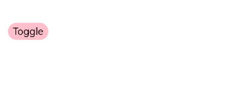

# Toggle组件设置拖动的同时如何屏蔽其本身的点击手势

更新时间：2026-03-10 06:16:35

来源：https://developer.huawei.com/consumer/cn/doc/harmonyos-faqs/faqs-arkui-303

通过isDragging状态变量区分拖动与点击操作，在拖动过程中屏蔽toggleIsOn的状态变更，示例代码如下：

```ts
import { hilog } from '@kit.PerformanceAnalysisKit';


@Entry
@Component
struct ToggleDrag {
@State offsetX: number = 0;
@State offsetY: number = 0;
@State positionX: number = 0;
@State positionY: number = 0;
@State toggleIsOn: boolean = true;
// Marks whether the current drag state is used to block click events
private isDragging: boolean = false;


build() {
Flex({ direction: FlexDirection.Column, alignItems: ItemAlign.Center }) {
Toggle({ type: ToggleType.Button, isOn: this.toggleIsOn }) {
Text('Toggle')
}
.selectedColor(Color.Pink)
// Onchange callback precedes onActionEnd
.onChange((isOn: boolean) => {
hilog.info(0x0000, 'TOGGLE_DRAG', 'xxx %{public}s', `onClick Toggle, isOn: ${isOn}`);
console.info('isDragging======' + this.isDragging);
if (isOn === this.toggleIsOn) {
return;
} else {
this.toggleIsOn = isOn;
}
if (this.isDragging) {
this.toggleIsOn = !this.toggleIsOn;
}
})
.translate({ x: this.offsetX, y: this.offsetY })
.gesture(
PanGesture()
.onActionStart(() => {
this.isDragging = true;
})
.onActionUpdate((event: GestureEvent) => {
this.offsetX = this.positionX + event.offsetX;
this.offsetY = this.positionY + event.offsetY;
})
.onActionEnd(() => {
this.positionX = this.offsetX;
this.positionY = this.offsetY;
this.isDragging = false;
})
)
}
}
}
```

效果图如下：



