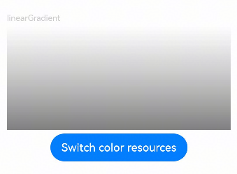

# 使用0x八位颜色设置渐变透明度为什么与#八位资源颜色值不同

更新时间：2026-03-10 06:16:35

来源：https://developer.huawei.com/consumer/cn/doc/harmonyos-faqs/faqs-arkui-245

HarmonyOS支持0x开头加八位或六位的写法。当透明度设为00时，前两位透明度不再借位，即0x00333333等于0x333333，相当于没有设置透明度，因此没有透明效果。建议使用rgba方式明确颜色。参考代码如下：

```ts
@Entry
@Component
struct ColorGradientExample {
@State transparent: number | string = '#00333333';
private bool: boolean = true;

build() {
Column({ space: 5 }) {
Text('linearGradient')
.fontSize(12)
.width('90%')
.fontColor(0xCCCCCC)
Row()
.width('90%')
.height(150)
.linearGradient({
direction: GradientDirection.Bottom,
colors: [[this.transparent, 0.0], [0x80000000, 1.0]]
})
Button('Switch color resources')
.onClick(() => {
if (this.bool) {
this.transparent = 0x00333333;
this.bool = false;
} else {
this.transparent = '#00333333';
this.bool = true;
}
})
}
.justifyContent(FlexAlign.Center)
.width('100%')
.height('100%')
.padding({ top: 5 })
}
}
```

效果如图所示：



