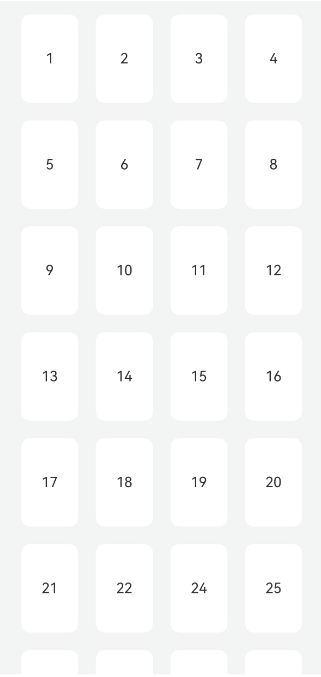

# 在长按拖拽排序的场景下，如何实现自定义长按拖拽onItemDragStart的开始触发时长

更新时间：2026-03-10 06:16:35

来源：https://developer.huawei.com/consumer/cn/doc/harmonyos-faqs/faqs-arkui-310

在Grid组件中，onItemDragStart事件的默认触发时长为170毫秒，但当前版本不支持直接修改该参数。可以通过自定义Grid，通过设置长按手势LongPressGesture中的duration参数，来实现自定义长按拖拽的开始触发时长，参考代码如下：

```ts
import { curves } from '@kit.ArkUI';

@Entry
@Component
struct ReplaceDefaultTimeSetPage {
// Element array
@State numbers: number[] = [];
@State row: number = 4;
// Index of the last element in the array
@State lastIndex: number = 0;
@State dragItem: number = -1;
@State scaleItem: number = -1;
@State item: number = -1;
@State offsetX: number = 0;
@State offsetY: number = 0;
// Set grid column count
private str: string = '';
// Records the offset of the drag starting position
private dragRefOffsetx: number = 0;
private dragRefOffsety: number = 0;
private FIX_VP_X: number = 108;
private FIX_VP_Y: number = 120;

aboutToAppear() {
for (let i = 1; i <= 110; i++) {
this.numbers.push(i);
}
this.lastIndex = this.numbers.length - 1;

// Multiple columns
for (let i = 0; i < this.row; i++) {
this.str = this.str + '1fr ';
}
}

itemMove(index: number, newIndex: number): void {
if (!this.isDraggable(newIndex)) {
return;
}
let tmp = this.numbers.splice(index, 1);
this.numbers.splice(newIndex, 0, tmp[0]);
}

// Slide down
down(index: number): void {
// Specify fixed GridItem does not respond to events
if (!this.isDraggable(index + this.row)) {
return;
}
this.offsetY -= this.FIX_VP_Y;
this.dragRefOffsety += this.FIX_VP_Y;
// Multiple columns
this.itemMove(index, index + this.row);
}

// Slide down (bottom right is empty)
down2(index: number): void {
if (!this.isDraggable(index + 3)) {
return;
}
this.offsetY -= this.FIX_VP_Y;
this.dragRefOffsety += this.FIX_VP_Y;
this.itemMove(index, index + 3);
}

// Slide up
up(index: number): void {
if (!this.isDraggable(index - this.row)) {
return;
}
this.offsetY += this.FIX_VP_Y;
this.dragRefOffsety -= this.FIX_VP_Y;
this.itemMove(index, index - this.row);
}

// Slide left
left(index: number): void {
if (!this.isDraggable(index - 1)) {
return;
}
this.offsetX += this.FIX_VP_X;
this.dragRefOffsetx -= this.FIX_VP_X;
this.itemMove(index, index - 1);
}

// Slide right
right(index: number): void {
if (!this.isDraggable(index + 1)) {
return;
}
this.offsetX -= this.FIX_VP_X;
this.dragRefOffsetx += this.FIX_VP_X;
this.itemMove(index, index + 1);
}

// Slide bottom right
lowerRight(index: number): void {
if (!this.isDraggable(index + this.row + 1)) {
return;
}
this.offsetX -= this.FIX_VP_X;
this.dragRefOffsetx += this.FIX_VP_X;
this.offsetY -= this.FIX_VP_Y;
this.dragRefOffsety += this.FIX_VP_Y;
this.itemMove(index, index + this.row + 1);
}

// Slide top right
upperRight(index: number): void {
if (!this.isDraggable(index - (this.row - 1))) {
return;
}
this.offsetX -= this.FIX_VP_X;
this.dragRefOffsetx += this.FIX_VP_X;
this.offsetY += this.FIX_VP_Y;
this.dragRefOffsety -= this.FIX_VP_Y;
this.itemMove(index, index - (this.row - 1));
}

// Slide bottom left
lowerLeft(index: number): void {
if (!this.isDraggable(index + (this.row - 1))) {
return;
}
this.offsetX += this.FIX_VP_X;
this.dragRefOffsetx -= this.FIX_VP_X;
this.offsetY -= this.FIX_VP_Y;
this.dragRefOffsety += this.FIX_VP_Y;
this.itemMove(index, index + (this.row - 1));
}

// Slide top left
upperLeft(index: number): void {
if (!this.isDraggable(index - (this.row + 1))) {
return;
}
this.offsetX += this.FIX_VP_X;
this.dragRefOffsetx -= this.FIX_VP_X;
this.offsetY += this.FIX_VP_Y;
this.dragRefOffsety -= this.FIX_VP_Y;
this.itemMove(index, index - (this.row + 1));
}

// Control whether the element can be moved and sorted by its index
isDraggable(index: number): boolean {
return index >= 0 && index < this.numbers.length;
}

build() {
Column() {
Grid() {
ForEach(this.numbers, (item: number) => {
GridItem() {
Text(item + '')
.fontSize(16)
.width('100%')
.textAlign(TextAlign.Center)
.height(100)
.borderRadius(10)
.backgroundColor(0xFFFFFF)
.shadow(this.scaleItem == item ? {
radius: 70,
color: '#15000000',
offsetX: 0,
offsetY: 0
} :
{
radius: 0,
color: '#15000000',
offsetX: 0,
offsetY: 0
})
.animation({
curve: Curve.Sharp,
duration: 300
})
}
.onAreaChange((_oldVal, newVal) => {
// Multiple columns
this.FIX_VP_X = Math.round(newVal.width as number);
this.FIX_VP_Y = Math.round(newVal.height as number);
})
// Specify fixed GridItem does not respond to events
.hitTestBehavior(this.isDraggable(this.numbers.indexOf(item)) ? HitTestMode.Default : HitTestMode.None)
.scale({ x: this.scaleItem === item ? 1.05 : 1, y: this.scaleItem === item ? 1.05 : 1 })
.zIndex(this.dragItem === item ? 1 : 0)
.translate(this.dragItem === item ? { x: this.offsetX, y: this.offsetY } : { x: 0, y: 0 })
.padding(10)
.gesture(
//The following combined gestures are recognized sequentially. If the long press gesture event is not triggered normally, the drag gesture event will not be triggered.
GestureGroup(GestureMode.Sequence,
LongPressGesture({
repeat: true,
duration: 50
})  // Control the duration of the long-press event that triggers dragging, defaulting to 500 milliseconds. Setting it to less than 0 reverts to the default value; here it is set to 50 milliseconds
.onAction((_event?: GestureEvent) => {
this.getUIContext().animateTo({
curve: Curve.Friction,
duration: 300
}, () => {
this.scaleItem = item;
});
})
.onActionEnd(() => {
this.getUIContext().animateTo({
curve: Curve.Friction,
duration: 300
}, () => {
this.scaleItem = -1;
});
}),
PanGesture({
fingers: 1,
direction: null,
distance: 0
})
.onActionStart(() => {
this.dragItem = item;
this.dragRefOffsetx = 0;
this.dragRefOffsety = 0;
})
.onActionUpdate((event: GestureEvent) => {
this.offsetY = event.offsetY - this.dragRefOffsety;
this.offsetX = event.offsetX - this.dragRefOffsetx;

this.getUIContext().animateTo({ curve: curves.interpolatingSpring(0, 1, 400, 38) }, () => {
let index = this.numbers.indexOf(this.dragItem);
if (this.offsetY >= this.FIX_VP_Y / 2 &&
(this.offsetX <= this.FIX_VP_X / 2 && this.offsetX >= -this.FIX_VP_X / 2)
&& (index + this.row <= this.lastIndex)) {
// Slide down
this.down(index);
} else if (this.offsetY <= -this.FIX_VP_Y / 2 &&
(this.offsetX <= this.FIX_VP_X / 2 && this.offsetX >= -this.FIX_VP_X / 2)
&& index - this.row >= 0) {
// Slide up
this.up(index);
} else if (this.offsetX >= this.FIX_VP_X / 2 &&
(this.offsetY <= this.FIX_VP_Y / 2 && this.offsetY >= -this.FIX_VP_Y / 2)
&& !(((index - (this.row - 1)) % this.row === 0) || index === this.lastIndex)) {
// ) {
// Slide right
this.right(index);
} else if (this.offsetX <= -this.FIX_VP_X / 2 &&
(this.offsetY <= this.FIX_VP_Y / 2 && this.offsetY >= -this.FIX_VP_Y / 2)
&& !(index % this.row === 0)) {
// Slide left
this.left(index);
} else if (this.offsetX >= this.FIX_VP_X / 2 && this.offsetY >= this.FIX_VP_Y / 2
&& ((index + this.row + 1 <= this.lastIndex && !((index - (this.row - 1)) % this.row === 0)) ||
!((index - (this.row - 1)) % this.row === 0))) {
// Slide bottom right
this.lowerRight(index);
} else if (this.offsetX >= this.FIX_VP_X / 2 && this.offsetY <= -this.FIX_VP_Y / 2
&& !((index - this.row < 0) || ((index - (this.row - 1)) % this.row === 0))) {
// Slide top right
this.upperRight(index);
} else if (this.offsetX <= -this.FIX_VP_X / 2 && this.offsetY >= this.FIX_VP_Y / 2
&& (!(index % this.row === 0) && (index + (this.row - 1) <= this.lastIndex))) {
// Slide bottom left
this.lowerLeft(index);
} else if (this.offsetX <= -this.FIX_VP_X / 2 && this.offsetY <= -this.FIX_VP_Y / 2
&& !((index <= this.row - 1) || (index % this.row === 0))) {
// Slide top left
this.upperLeft(index);
} else if (this.offsetX >= this.FIX_VP_X / 2 && this.offsetY >= this.FIX_VP_Y / 2
&& (index === this.lastIndex)) {
// Slide right down (bottom right is empty)
this.down2(index);
}
});
})
.onActionEnd(() => {
this.getUIContext().animateTo({
curve: curves.interpolatingSpring(0, 1, 400, 38)
}, () => {
this.dragItem = -1;
});
this.getUIContext().animateTo({
curve: curves.interpolatingSpring(14, 1, 170, 17),
delay: 150
}, () => {
this.scaleItem = -1;
});
})
)
.onCancel(() => {
this.getUIContext().animateTo({
curve: curves.interpolatingSpring(0, 1, 400, 38)
}, () => {
this.dragItem = -1;
});
this.getUIContext().animateTo({
curve: curves.interpolatingSpring(14, 1, 170, 17)
}, () => {
this.scaleItem = -1;
});
})
)
}, (item: number) => item.toString())
}
.width('90%')
.editMode(true)
.scrollBar(BarState.Off)
// Multiple columns
.columnsTemplate(this.str)
}
.width('100%')
.height('100%')
.backgroundColor('#0D182431')
.padding({ top: 5 })
}
}
```

效果图如下：



