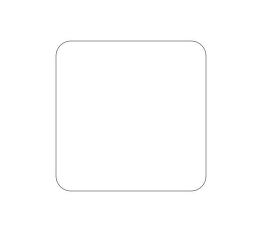

# 如何使用canvas绘制圆角矩形

更新时间：2026-03-10 06:16:35

来源：https://developer.huawei.com/consumer/cn/doc/harmonyos-faqs/faqs-arkui-313

利用[CanvasRenderingContext2D](https://developer.huawei.com/consumer/cn/doc/harmonyos-references/ts-canvasrenderingcontext2d)对象的arc绘制弧形路径，结合lineTo方法绘制直线，参考代码如下：
 
```ArkTS
@Entry
@Component
struct CanvasDrawRoundedRectangle {
  private readonly settings: RenderingContextSettings = new RenderingContextSettings(true);
  private readonly ctx: CanvasRenderingContext2D = new CanvasRenderingContext2D(this.settings);

  drawRoundRect(x: number, y: number, width: number, height: number, radius: number, strokeColor?: string,
    fillColor?: string, lineDash?: Array<number>) {
    if (width < 2 * radius || height < 2 * radius) {
      radius = Math.min(width, height) / 2;
    }
    strokeColor = strokeColor || '#333';
    lineDash = lineDash || [];
    this.ctx.beginPath();
    this.ctx.setLineDash(lineDash);
    // Draw the first arc path
    this.ctx.arc(x + radius, y + radius, radius, Math.PI, Math.PI * 3 / 2);
    // Draw the first straight path
    this.ctx.lineTo(width - radius + x, y);
    // Draw the second arc path
    this.ctx.arc(width - radius + x, radius + y, radius, Math.PI * 3 / 2, Math.PI * 2);
    // Draw the second straight path
    this.ctx.lineTo(width + x, height + y - radius);
    // Draw the third arc path
    this.ctx.arc(width - radius + x, height - radius + y, radius, 0, Math.PI / 2);
    // Draw the third straight path
    this.ctx.lineTo(radius + x, height + y);
    // Draw the fourth arc path
    this.ctx.arc(radius + x, height - radius + y, radius, Math.PI / 2, Math.PI);
    // Draw the fourth straight path
    this.ctx.lineTo(x, y + radius);
    // Set brush color
    this.ctx.strokeStyle = strokeColor;
    // Stroke drawing
    this.ctx.stroke();
    if (fillColor) {
      this.ctx.fillStyle = fillColor;
      this.ctx.fill();
    }
    this.ctx.closePath();
  }

  build() {
    Row() {
      Column() {
        Canvas(this.ctx)
          .width('100%')
          .height('100%')
          .onReady(() => {
            this.drawRoundRect(50, 50, 100, 100, 10);
          })
      }
      .width('100%')
    }
    .height('100%')
  }
}
```
 
实现效果图如下所示：
 


