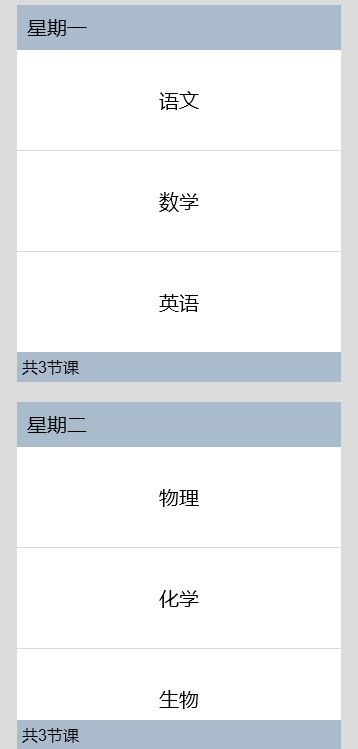

# 如何在List组件中分组展示不同种类的数据

更新时间：2026-03-10 06:16:35

来源：https://developer.huawei.com/consumer/cn/doc/harmonyos-faqs/faqs-arkui-101

问题现象

根据数据种类为ListItem设置不同样式。例如，标题和标题对应的子类等，应分别应用相应的样式。

解决措施

可以通过在List组件中使用ListItemGroup组件来展示ListItem分组，并单独设置ListItemGroup中的header参数以自定义每组的头部组件样式。参考代码如下：

```ts
// xxx.ets
@Entry
@Component
struct ListItemGroupExample {
private timetable: TimeTable[] = [
{
title: 'Monday',
projects: ['language', 'mathematics', 'English']
},
{
title: 'Tuesday',
projects: ['physics', 'chemistry', 'biology']
},
{
title: 'Wednesday',
projects: ['history', 'geography', 'politics']
},
{
title: 'Thursday',
projects: ['the fine arts', 'music', 'sport']
}
]

@Builder
itemHead(text: string) {
Text(text)
.fontSize(20)
.backgroundColor(0xAABBCC)
.width('100%')
.padding(10)
}

@Builder
itemFoot(num: number) {
Text('common' + num + 'period')
.fontSize(16)
.backgroundColor(0xAABBCC)
.width('100%')
.padding(5)
}

build() {
Column() {
List({ space: 20 }) {
ForEach(this.timetable, (item: TimeTable) => {
ListItemGroup({ header: this.itemHead(item.title), footer: this.itemFoot(item.projects.length) }) {
ForEach(item.projects, (project: string) => {
ListItem() {
Text(project)
.width('100%')
.height(100)
.fontSize(20)
.textAlign(TextAlign.Center)
.backgroundColor(0xFFFFFF)
}
}, (item: string) => item)
}
.divider({ strokeWidth: 1, color: Color.Blue }) // The boundary line between each row
})
}
.width('90%')
.height('100%')
.sticky(StickyStyle.Header | StickyStyle.Footer)
.scrollBar(BarState.Off)
}.width('100%').height('100%').backgroundColor(0xDCDCDC).padding({ top: 5 })
}
}

interface TimeTable {
title: string;
projects: string[];
}
```

效果如图所示：





参考链接

ListItemGroup
