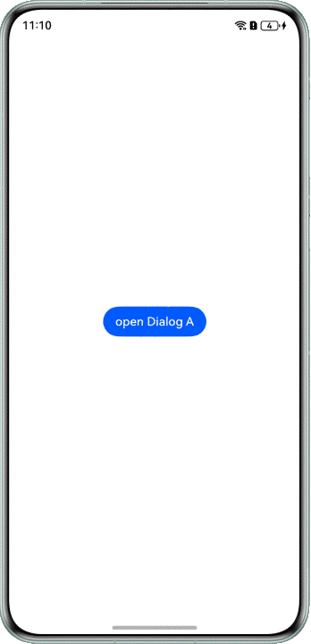

# 如何在自定义弹窗中再次弹窗

更新时间：2026-03-10 06:16:35

来源：https://developer.huawei.com/consumer/cn/doc/harmonyos-faqs/faqs-arkui-210

通过[openCustomDialog](https://developer.huawei.com/consumer/cn/doc/harmonyos-references/arkts-apis-uicontext-promptaction#opencustomdialog12)打开弹窗A，在弹窗A中点击按钮打开弹窗B。通过[getDialogController](https://developer.huawei.com/consumer/cn/doc/harmonyos-references/ts-custom-component-api#getdialogcontroller18)获取PromptActionDialogController实例对象并调用close()方法关闭当前弹窗。具体可参考示例代码：
 
```ArkTS
import { ComponentContent } from '@kit.ArkUI';

@Component
struct DialogAComponent {
  build() {
    Column() {
      Column() {
        Text('dialog A')
          .fontSize(20)
          .fontWeight(FontWeight.Bold)
      }
      .justifyContent(FlexAlign.Center)
      .height(120)

      Row() {
        Text('close')
          .fontColor('#0A59F7')
          .onClick(() => {
            // close self.
            this.getDialogController()?.close();
          })
          .width('50%')
          .height('100%')
          .textAlign(TextAlign.Center)

        Text('open dialog B')
          .fontColor('#0A59F7')
          .onClick(() => {
            // Open dialog B.
            let uiContext = this.getUIContext();
            let promptAction = uiContext.getPromptAction();
            promptAction.openCustomDialog(new ComponentContent(uiContext, wrapBuilder(dialogBBuilder)));
          })
          .width('50%')
          .height('100%')
          .textAlign(TextAlign.Center)
      }
      .height(50)
    }
    .width(360)
    .borderRadius(32)
    .backgroundColor(Color.White)
  }
}

@Builder
function dialogABuilder() {
  DialogAComponent()
}

@Component
struct DialogBComponent {
  build() {
    Column() {
      Column() {
        Text('dialog B')
          .fontSize(20)
          .fontWeight(FontWeight.Bold)
      }
      .justifyContent(FlexAlign.Center)
      .height(120)

      Row() {
        Text('close')
          .fontColor('#0A59F7')
          .onClick(() => {
            // close self.
            this.getDialogController()?.close();
          })
          .width('50%')
          .height('100%')
          .textAlign(TextAlign.Center)
      }
      .height(50)
    }
    .width(320)
    .borderRadius(32)
    .backgroundColor(Color.White)
  }
}

@Builder
function dialogBBuilder() {
  DialogBComponent()
}

@Entry
@Component
struct PopUpDialogAgainInCustomDialog {
  build() {
    Column() {
      Button('open Dialog A')
        .onClick(() => {
          // Open dialog A.
          let uiContext = this.getUIContext();
          let promptAction = uiContext.getPromptAction();
          promptAction.openCustomDialog(new ComponentContent(uiContext, wrapBuilder(dialogABuilder)));
        })
    }
    .width('100%')
    .height('100%')
    .alignItems(HorizontalAlign.Center)
    .justifyContent(FlexAlign.Center)
  }
}
```
 


