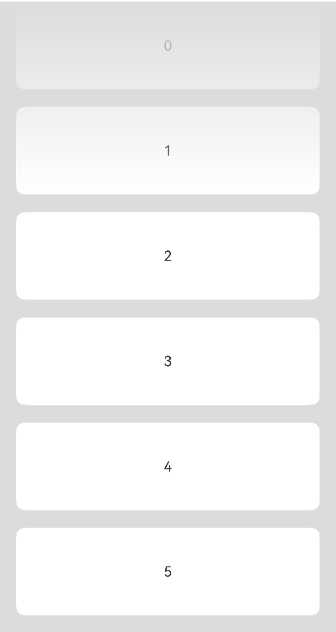

# 如何实现直播评论场景中顶部渐变遮罩效果

更新时间：2026-03-10 06:16:35

来源：https://developer.huawei.com/consumer/cn/doc/harmonyos-faqs/faqs-arkui-343

1. 开发者可使用overlay在当前组件上添加遮罩。
2. 通过linearGradient可设置颜色渐变效果。
3. 使用blendMode让当前浮层与List混合。
 
代码示例如下：
 
```ArkTS
@Entry
@Component
struct MaskDemo {
  private arr: number[] = [0, 1, 2, 3, 4, 5, 6, 7, 8, 9];

  @Builder
  createOverlayBuilder() {
    Stack()
      .height('100%')
      .width('100%')
      .linearGradient({
        direction: GradientDirection.Bottom, // Gradient direction
        colors: [['#00FFFFFF', 0.0], ['#FFFFFFFF',
          0.3]] // When the proportion of elements at the end of the array is less than 1, it satisfies the repeated shading effect
      })
      .blendMode(BlendMode.DST_IN, BlendApplyType.OFFSCREEN)// Implement a top gradient mask effect using the DST_IN blending mode.
      .hitTestBehavior(HitTestMode.None)
  }

  build() {
    Column() {
      List({ space: 20, initialIndex: 0 }) {
        ForEach(this.arr, (item: number) => {
          ListItem() {
            Text(item.toString())
              .width('100%')
              .height(100)
              .fontSize(16)
              .textAlign(TextAlign.Center)
              .borderRadius(10)
              .backgroundColor(0xFFFFFF)
          }
          .onClick(() => {
            console.log('is click');
          })
        }, (item: string) => item)
      }
      .width('90%')
      .height('100%')
      .scrollBar(BarState.Off)
      .overlay(this.createOverlayBuilder())
      .blendMode(BlendMode.SRC_OVER, BlendApplyType.OFFSCREEN)
    }
    .width('100%')
    .height('100%')
    .backgroundColor(0xDCDCDC)
  }
}
```
 
实现效果：
 


