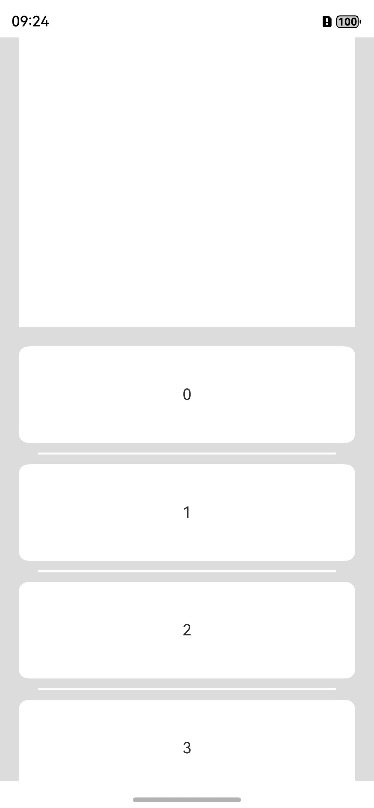

# 如何解决List组件在不设置高度的情况下滑动不到底的问题

更新时间：2026-03-10 06:16:35

来源：https://developer.huawei.com/consumer/cn/doc/harmonyos-faqs/faqs-arkui-26

**原因**
 
当List组件中的子项数量较多时，如果同级存在其他组件，会挤压List组件的布局空间，导致显示异常。
 
**解决措施**
 
给List组件设置layoutWeight()属性。layoutWeight()使子元素自适应占满父容器的剩余空间。当父容器尺寸确定时，设置了layoutWeight的子元素在主轴布局中的尺寸将按照权重分配，忽略其本身的尺寸设置。可参考如下代码：
 
```ArkTS
// xxx.ets
@Entry
@Component
struct ListExample {
  @State arr: string[] = ['0', '1', '2', '3', '4', '5', '6', '7', '8', '9', '10', '11', '12', '13', '14', '15'];
  scroller: Scroller = new Scroller();

  build() {
    Column() {
      RichText('')
        .width('90%')
        .height(300)
        .backgroundColor(0XBDDB69)
      List({ space: 22, initialIndex: 0, scroller: this.scroller }) {
        ForEach(this.arr, (item: string) => {
          ListItem() {
            Text(item)
              .width('100%')
              .height(100)
              .fontSize(16)
              .textAlign(TextAlign.Center)
              .borderRadius(10)
              .backgroundColor(0xFFFFFF)
          }
        }, (item: string) => item)
      }
      .layoutWeight(1) // Adaptive occupancy of remaining space
      .listDirection(Axis.Vertical) // Arrangement direction
      .divider({ strokeWidth: 2, color: 0xFFFFFF, startMargin: 20, endMargin: 20 }) // The boundary line between each row
      .edgeEffect(EdgeEffect.Spring) // Sliding to the edge has no effect
      .scrollBar(BarState.Off) // Set scrollbar
      .margin({ top: 20 })
      .width('90%')
    }
    .width('100%')
    .height('100%')
    .backgroundColor(0xDCDCDC)
  }
}
```
 
效果如图所示：
 


