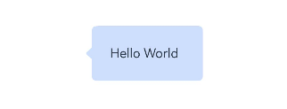
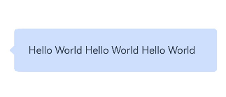
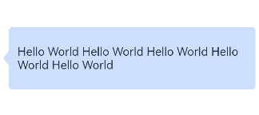

# 是否有处理"9图"（又称"draw9patch"、".9图"、"点9图"等）的平替方案

更新时间：2026-03-10 06:16:35

来源：https://developer.huawei.com/consumer/cn/doc/harmonyos-faqs/faqs-arkui-208

Image组件提供与点九图相同功能的API设置，通过设置resizable属性来配置ResizableOptions，即图像拉伸时的大小调整选项。ResizableOptions的参数slice包含top、left、bottom和right四个属性，分别表示图片在上下左右四个方向拉伸时保持不变的距离。

参考代码如下：

```text
@Entry
@Component
struct NineMapPrinciple {
build() {
Row() {
Image($r('app.media.startIcon'))
.resizable({ slice: { top: 10, left: 10, bottom: 50, right: 50 } })
}
.height('50%')
}
}
```

点九图的常见用法是实现聊天气泡的拉伸效果，参考代码如下：

```text
@Entry
@Component
struct ChatBubbleStretchDemo {
@State text: string = 'Hello World Hello World Hello World Hello World';
@State left: number = 10;
@State right: number = 10;
@State top: number = 10;
@State bottom: number = 10;
@State line: number = 2;
@State textSize: SizeOptions = this.getUIContext().getMeasureUtils().measureTextSize({
textContent: this.text
});

build() {
Column() {
Stack() {
Image($r('app.media.lightBluexhdpi'))
.width(this.getUIContext().px2vp(Number(`${this.textSize.width}`)) < 350 ? 60 + px2vp
(Number(`${this.textSize.width}`)) : 350)
.height(this.text.length < 40 ? 50 + px2vp(Number(`${this.textSize.height}`))
: 50 + (this.getUIContext().px2vp(Number(`${this.textSize.height}`)) * this.line))
// The reason for using the px unit is that the image itself is a physical pixel, and the segmentation algorithm is executed on the image itself. Therefore, these values are ultimately converted into physical pixel values.
// Therefore, these divided lines must not exceed the size of the picture itself.
.resizable({
slice: {
top: `${this.top}px`,
left: `${this.left}px`,
bottom: `${this.bottom}px`,
right: `${this.right}px`
}
})
Text(this.text)
}
.width(350)
.height(200)
}
.height('100%')
.width('100%')
}
}
```

效果如图所示。

正常大小





左右拉伸操作





支持多行上下左右拉伸





上述示例实现的是图片拉伸中间，四周保持不变。还有另一种拉伸方式，实现图片拉伸四周，中间保持不变，示例如下。

```text
import { drawing } from '@kit.ArkGraphics2D';

@Entry
@Component
struct DrawingLatticeResizeDemo {
// lattice grid definition
private xDivs: Array<number> = [40, 100, 120, 180];
private yDivs: Array<number> = [];
private fXCount: number = 4;
private fYCount: number = 0;
private drawingLatticeFirst: DrawingLattice =
drawing.Lattice.createImageLattice(this.xDivs, this.yDivs, this.fXCount, this.fYCount);
@State widthValue: number = 260;
@State heightValue: number = 260;

build() {
Scroll() {
Column({ space: 20 }) {
Text('Dynamic Resize by Lattice')
.fontSize(22)
.fontWeight(FontWeight.Bold)

// The picture shows
Image($r('app.media.lightBluexhdpi'))
.width(String(this.widthValue) + 'px')
.height(String(this.heightValue) + 'px')
.borderWidth(2)
.resizable({
lattice: this.drawingLatticeFirst
})

// Width adjustment
Column({ space: 5 }) {
Text(`Width: ${this.widthValue.toFixed(0)} px`)
Slider({
value: this.widthValue,
min: 100,
max: 400,
step: 10
})
.onChange(value => {
this.widthValue = value;
})
}

// Height adjustment
Column({ space: 5 }) {
Text(`Width: ${this.heightValue.toFixed(0)} px`)
Slider({
value: this.heightValue,
min: 78,
max: 400,
step: 10
})
.onChange(value => {
this.heightValue = value;
})
}
}
.width('100%')
.padding(20)
}
}
}
```

参考链接

ResizableOptions
