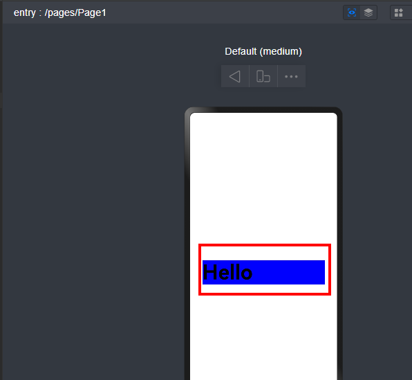

# 通用属性width是否支持设置变量

更新时间：2026-03-10 06:16:35

来源：https://developer.huawei.com/consumer/cn/doc/harmonyos-faqs/faqs-arkui-191

通用属性width支持设置变量。

```text
@Entry
@Component
struct Page1 {
@State message: string = 'Hello';
@State widthNum: number = 300;

build() {
Row() {
Column() {
Text(this.message)
.fontSize(50)
.fontWeight(FontWeight.Bold)
.width(this.widthNum)
.backgroundColor(Color.Blue)
}
.width('100%')
}
.height('100%')
}
}
```

效果如下所示：



