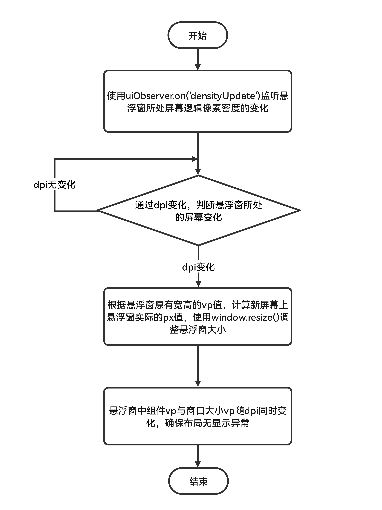

# 鸿蒙电脑拖拽悬浮窗至扩展显示器时，如何保证悬浮窗布局不出现异常

更新时间：2026-03-10 06:16:35

来源：https://developer.huawei.com/consumer/cn/doc/harmonyos-faqs/faqs-arkui-487

**问题原理**
 
vp与px转换公式：px = vp * 显示设备逻辑像素的密度。
 
ArkTS页面组件的尺寸单位通常会使用vp，当拖拽悬浮窗至扩展显示器时，组件的实际显示大小px会因为显示设备逻辑像素密度的改变而变化，此时如果不同步调整窗口大小，会导致悬浮窗布局出现异常。
 

 
**解决措施**
 
使用[on('densityUpdate')](https://developer.huawei.com/consumer/cn/doc/harmonyos-references/arkts-apis-uicontext-uiobserver#ondensityupdate12)监听悬浮窗所处屏幕逻辑像素密度的变化，当其改变时，根据窗口原有vp，通过[resize](https://developer.huawei.com/consumer/cn/doc/harmonyos-references/arkts-apis-window-window#resize9)接口调整悬浮窗实际大小（px），确保悬浮窗布局不出现异常。
 

