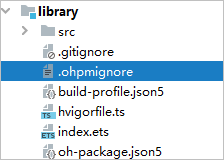

# 如何避免模块下文件打包进HAR包后，存在的不可预期的资料、配置或信息安全风险

更新时间：2026-03-10 06:16:35

来源：https://developer.huawei.com/consumer/cn/doc/harmonyos-faqs/faqs-package-structure-31

1. 配置ohpmignore文件：如果部分工程源文件无需构建到HAR包中，可在module目录下新建.ohpmignore文件，用于配置打包时要忽略的文件。将无需打包的文件或文件夹名称写入.ohpmignore文件中，DevEco Studio构建时将过滤掉这些文件目录。

 更改 .ohpmignore 配置后，需清空相应模块的 build 文件夹，或在DevEco Studio中选择 Build -> clean project，然后再进行打包。
2. 构建闭源HAR：DevEco Studio支持闭源HAR构建，通过对代码进行编译混淆，生成闭源HAR。在不共享源码的情况下，通过闭源HAR对外提供组件、资源等，可以实现多个模块或多个工程共享组件、资源等。具体实现方式可以参考：[以release模式构建](https://developer.huawei.com/consumer/cn/doc/harmonyos-guides/ide-hvigor-build-har#section19788284410)。
3. 可以通过开启混淆能力来保护代码资产。代码混淆的使用约束包括：仅支持Stage工程；在编译模式为release模式时生效；模块及其依赖的HAR和HSP均未关闭混淆。开启方式：在模块级build-profile.json5文件的“obfuscation”字段中配置混淆功能。
- "enable"：配置是否开启混淆。
- "files"：配置混淆规则文件路径。

 配置如下：
```json
{
  "apiType": "stageMode",
  "buildOption": {},
  "buildOptionSet": [
    {
      "name": "release",
      "arkOptions": {
        "obfuscation": {
          "ruleOptions": {
            "enable": true,
            "files": ["./obfuscation-rules.txt"]
          }
        }
      }
    }
  ]
  // ...
}
```
 具体内容可参考链接：[混淆加固](https://developer.huawei.com/consumer/cn/doc/harmonyos-guides/ide-build-obfuscation)。
