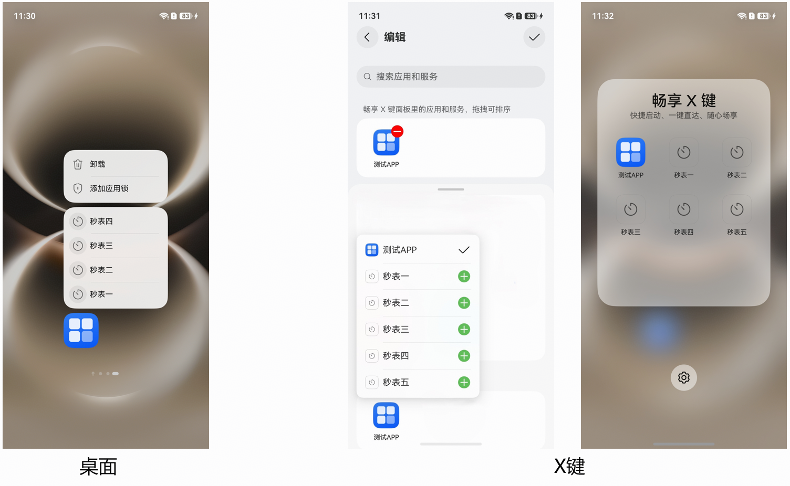

# 应用静态快捷方式如何接入X键

更新时间：2026-04-08 09:21:01

来源：https://developer.huawei.com/consumer/cn/doc/harmonyos-faqs/faqs-package-structure-71

现有机制：

X键当前已经支持将应用的静态快捷方式，添加至X键的九宫格面板，后续用户可以通过单击X键呼出九宫格面板后，点击已添加进来的静态快捷方式图标，快速启动，一键直达。注：当前X键九宫格面板对所有应用开放静态快捷方式，X键双击/长按列表中只对部分应用开放静态快捷方式。

适用场景：

应用的功能入口深，操作步骤复杂。

实现方案：

应用的静态快捷方式可以接入X键的前提是，应用需要创建自己的静态快捷方式，创建出来的静态快捷方式，在桌面长按应用图标，图标上方会显示静态快捷方式（注：桌面上最多显示4个静态快捷方式），另外X键编辑界面中也会显示（注：X键编辑界面暂不限制应用静态快捷方式的显示数量），并且可以点击快捷方式后面的

图标添加至X键九宫格面板，具体效果如下图：

参考链接：

创建应用静态快捷方式
