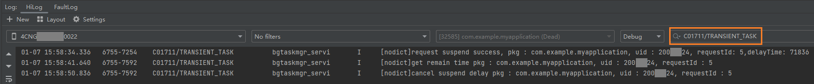

# 如何查询后台任务中短时任务/长时任务/延迟任务/后台代理提醒相关的系统日志

更新时间：2026-03-10 06:16:35

来源：https://developer.huawei.com/consumer/cn/doc/harmonyos-faqs/faqs-background-tasks-9

以后台任务中短时任务为例。可以在日志中通过过滤关键字“C01711/TRANSIENT_TASK”来查询短时任务的状态情况，包括查询申请短时任务状态、查询对应短时任务的剩余时间和取消短时任务状态等。

- “request suspend success ...”：表示短时任务申请成功。
- “get remain time pkg ...”：表示对应短时任务的剩余时间。
- “cancel suspend delay ...”：表示短时任务取消成功。

后台任务中添加更多日志标识：

> [!NOTE]
> 短时任务：TRANSIENT_TASK 长时任务：CONTINUOUS_TASK 延迟任务：WORK_SCHEDULER 后台代理提醒：ANS_REMINDER
