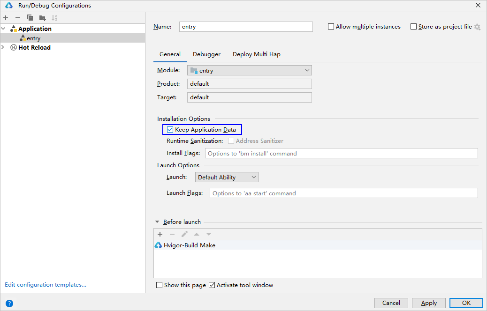

# 多Module应用通过startAbility()启动时报错

更新时间：2026-03-10 06:16:35

来源：https://developer.huawei.com/consumer/cn/doc/harmonyos-faqs/faqs-ability-20

**原因**
 
在同一个工程和设备中存在多个模块，并且这些模块之间存在调用关系，但并非所有HAP包都已安装到设备中。
 
**解决措施**
 
单击Run > Edit Configurations，设置指定模块的HAP安装方式，勾选“Keep Application Data”，表示采用覆盖安装方式，保留应用和服务的缓存数据。
 

 
**参考链接**
 
[设置HAP安装方式](https://developer.huawei.com/consumer/cn/doc/harmonyos-guides/ide-run-debug-configurations#section531811771410)
 
[module.json5配置文件](https://developer.huawei.com/consumer/cn/doc/harmonyos-guides/module-configuration-file)
