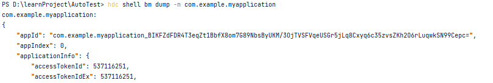

# 如何查看应用是否为系统应用

更新时间：2026-03-10 06:16:35

来源：https://developer.huawei.com/consumer/cn/doc/harmonyos-faqs/faqs-performance-analysis-kit-18

1. 连接设备。
2. 执行以下命令打印日志（Bundle Name获取参考：[bundleManager.getBundleInfoForSelf](https://developer.huawei.com/consumer/cn/doc/harmonyos-references/js-apis-bundlemanager#bundlemanagergetbundleinfoforself)）：
```bash
hdc shell bm dump -n <Bundle Name>
```

3. 当isSystemApp字段返回值为true时，表示当前应用是系统应用。返回的部分结果如下图所示：

  



  

