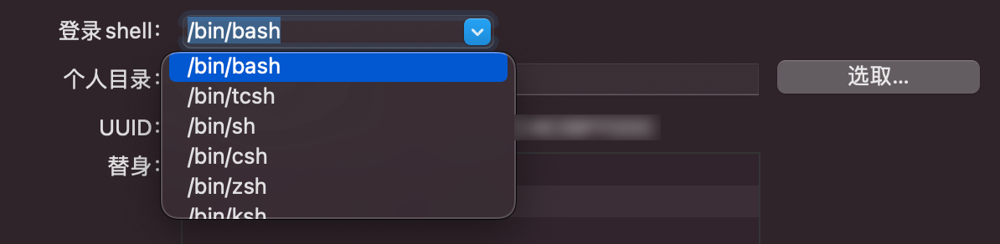

# 如何解决Mac电脑不能识别hdc命令的问题

更新时间：2026-03-10 06:16:35

来源：https://developer.huawei.com/consumer/cn/doc/harmonyos-faqs/faqs-performance-analysis-kit-42

1. 环境变量因素的解决方法参考如下：点击屏幕左上角的苹果图标，转到系统设置中的“用户与群组”。
2. 按住Ctrl键，点击左侧窗格中的用户账户名称，然后选择“高级选项”。
3. 点击"Login Shell"下拉框，然后选择"/bin/bash"以将Bash作为默认shell。

 非环境变量因素的解决方法参见：
1. 打开终端，输入 cd ~。
2. 使用 sudo vim .bash_profile 命令编辑文件。
3. 在文档底部输入：export PATH=\${PATH}:Sdk/default/base/toolchains 按下Esc键退出，然后在下方输入:wq保存并退出。
4. 运行 source .bash_profile 命令以加载环境变量。
5. 输入 hdc -v，显示版本信息即表示可用。

参考链接：

常见问题
