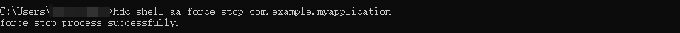

# 如何通过hdc命令关闭整个应用

更新时间：2026-03-17 00:56:02

来源：https://developer.huawei.com/consumer/cn/doc/harmonyos-faqs/faqs-performance-analysis-kit-47

可以通过以下命令结束应用：

```bash
hdc shell aa force-stop <bundleName>
```

返回“force stop process successfully”，表示应用已成功结束。

示例如下：

```bash
hdc shell aa force-stop com.example.myapplication
```





参考链接

aa工具
