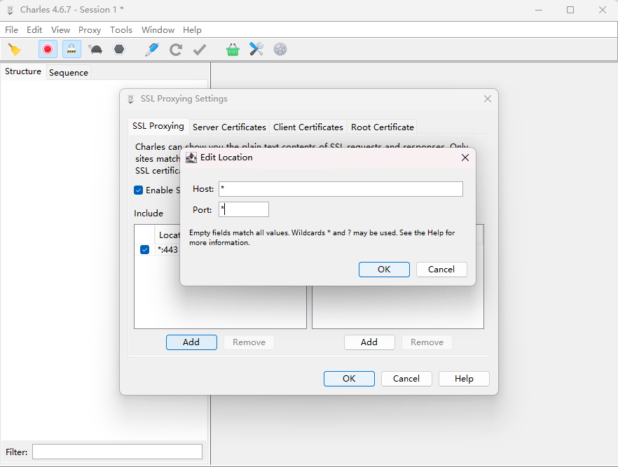
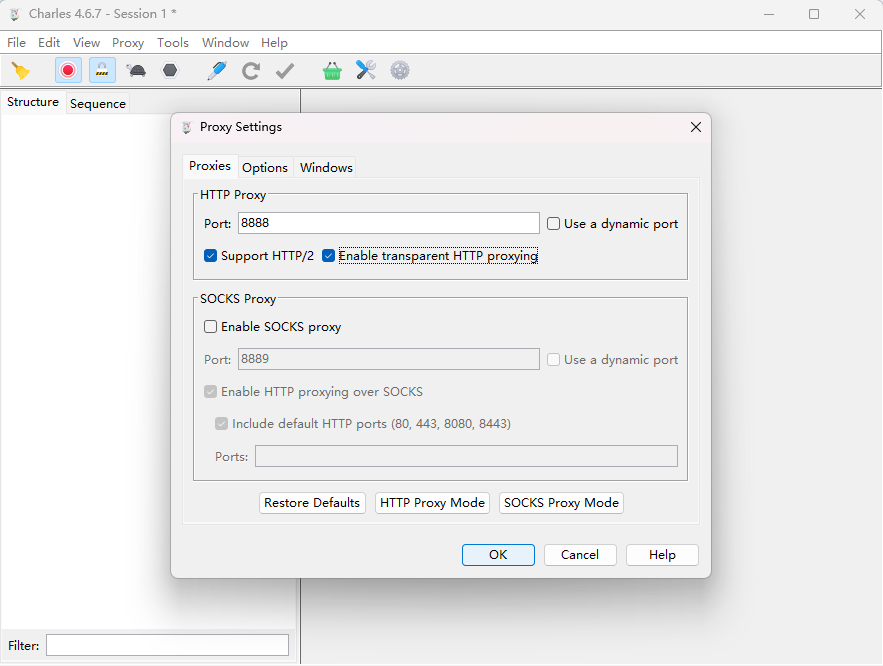
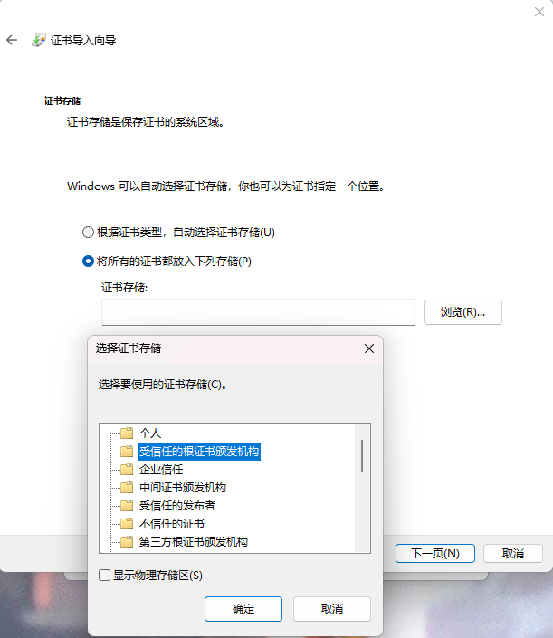
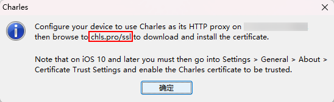
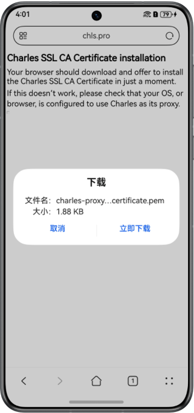
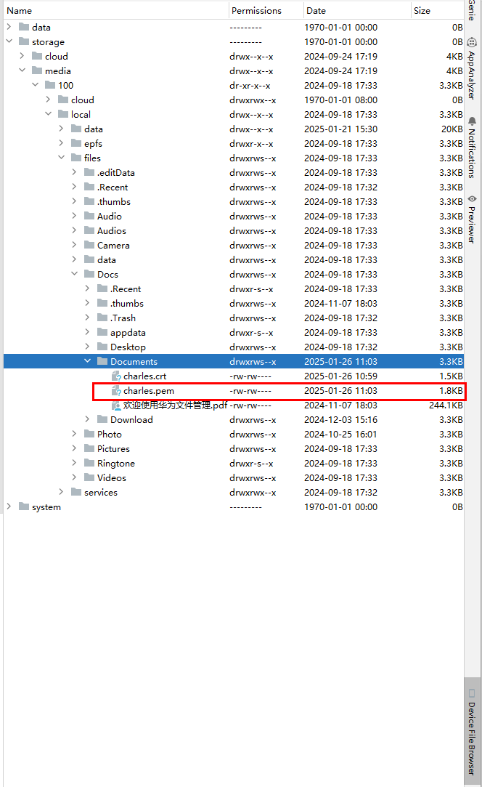
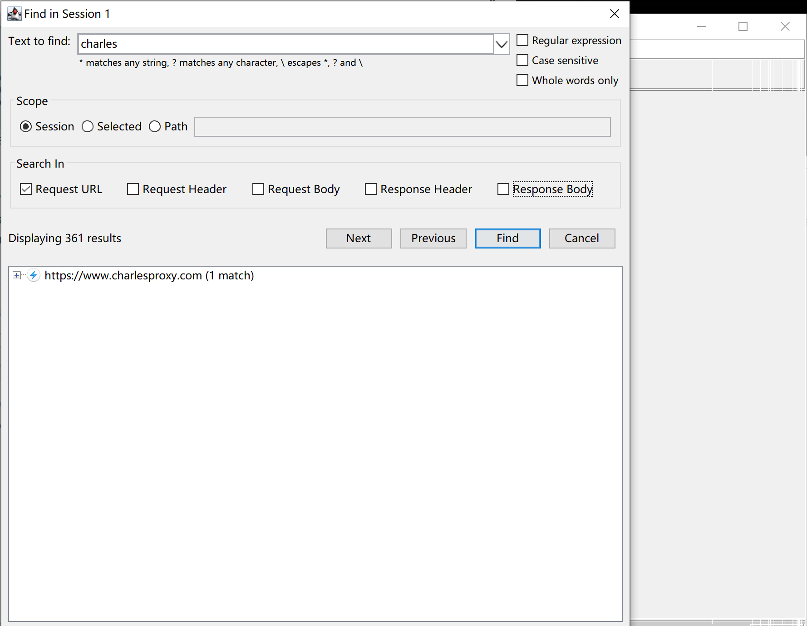
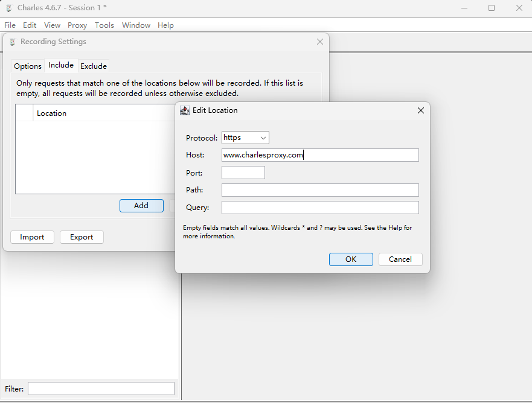

# 如何使用Charles工具抓包

更新时间：2026-03-10 06:16:35

来源：https://developer.huawei.com/consumer/cn/doc/harmonyos-faqs/faqs-network-55

> [!NOTE]
> 配置环境时，在Charles弹出的窗口中选择Allow，以确保与手机连接。不支持安装crt格式证书，需转换为pem格式。上传下载@ohos.request模块接口均不支持Charles抓包。

Charles是一款网络调试和分析代理工具，可用于拦截和查看设备与服务器之间的通信。它支持监视应用程序的网络流量、修改请求和响应，以及模拟不同网络条件。主要功能包括：

- 截取http和https网络封包。
- 支持重发网络请求，方便后端调试。
- 支持修改网络请求参数。
- 支持网络请求的截获并动态修改。
- 支持模拟慢速网络。

使用时，需设置应用的请求通过Charles客户端代理转发至服务器，以便在Charles客户端进行抓包。启动Charles后，它会自动与浏览器设置为代理，无需额外配置。通过浏览器发送网络请求时，Charles将直接抓取请求和响应信息。

Charles抓包不仅可以抓取电脑端的HTTP请求，还能抓取App的HTTP请求。手机抓包需要在电脑端配置，并确保手机和电脑在同一网络下，完成设备代理设置。对于HTTPS协议的报文，需安装SSL证书后才能抓取，具体步骤包括Charles证书下载与证书安装。

Charles具体使用步骤如下：

1. 安装Charles。
2. 设备代理设置：查看Charles的IP地址，通常与PC主机的IP地址相同。
- Charles的IP地址查看方式：点击Help -> Local IP Address查看。
- 电脑IP地址查看方式：打开“运行”（快捷键：win+R键或者在任务栏的“搜索”按钮中查找并点击“运行”），输入“cmd”后进入命令行窗口，在命令行窗口中输入“ipconfig”命令查看IP。
3. 设置Charles的调试端口号。
- 点击“Proxy” -> SSL Proxy Settings -> 在Include栏下点击“Add” -> 添加“:”，即Host输入“*”，Port输入“*”，再添加“*:443”，即Host输入“*”，Port输入“443” -> 点击“确定”。

- 点击“Proxy” -> Proxy Settings -> 设置“HTTP Proxy”下的Port（即Charles监听的端口，默认为8888）-> 勾选“Enable transparent HTTP proxying” -> 最后点击“OK”。

4. 手机与PC连接同一局域网，Wi-Fi设置为手动代理，服务器主机名和端口为Charles的IP地址和监听端口。点击需要连接的Wi-Fi进入密码输入页面。在输入密码前，点击“代理”，选择“手动”，设置“代理的服务器主机名”为Charles的IP地址，“服务器端口”为Charles监听的端口，即设置为8888。最后输入密码，连接Wi-Fi。

 Charles证书下载。
1. 安装Charles根证书到PC信任目录。点击顶部菜单栏“Help” -> 选择“SSL Proxying” -> 点击“Install Charles Root Certificate” -> 点击“安装证书” -> 设置存储位置（可选择当前用户或本地计算机）后，点击“下一步” -> 选择“将所有证书都放入下列存储” -> 点击“浏览” -> 设置证书存储路径为“受信任的根证书颁发机构”。

2. 导入系统根证书到手机。方式一：点击 Charles 顶部菜单栏“Help” -> 选择“SSL Proxying” -> 点击“Install Charles Root Certificate on a Mobile Device or Remote Browser” -> 在手机的自带浏览器中访问  -> 点击“立即下载”，将证书下载至手机内存中。

 方式二：在PC端，点击“Help”->点击“SSL Proxying”->选择“Save Charles Root Certificate...”，将证书保存到本地，格式为pem。将手机连接到电脑，通过DevEco将刚保存的pem文件上传到手机中（鼠标右键点击目标文件夹，选择“Upload...”，然后选择刚保存的pem文件），即可进行后续的证书安装步骤。

 证书安装。
证书在手机上的安装步骤如下：

在手机端点击“设置” -> 隐私和安全 -> 下滑点击“高级” -> 选择“证书与凭据” -> 进入证书安装选项 -> 选择“从存储设备安装” -> 点击“CA证书” -> 点击“继续” -> 选择“浏览” -> 找到下载的证书位置 -> 点击证书 -> 弹出“安装证书成功”的提示，则安装成功。

| 选择【从存储设备安装】 | 点击【CA证书】 |
| --- | --- |
|  |  |

 过滤网络请求。
需要对网络请求进行过滤，只监控指定目录服务器上发送的请求。对于这种需求，有两种方法：

1. 在主界面中部点击Ctrl+F打开搜索栏，填入过滤关键字。例如监听www.charlesproxy.com，填入或勾选信息后点击Find。

2. 在Charles的菜单栏中选择“Proxy” -> “Recording Settings” -> 选择“Include”栏 -> 点击“Add”添加一个项目 -> 按需填入需要监控的协议，重新监听即可只截取目标网站。

