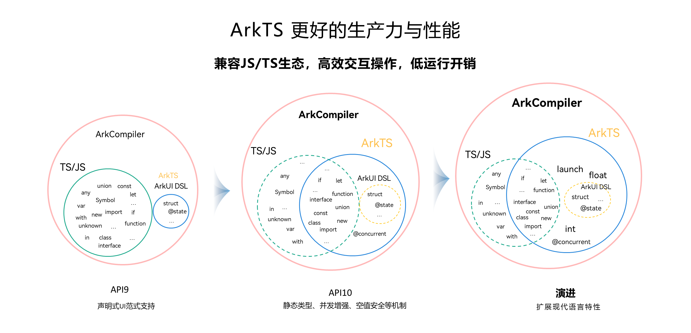

# 初识ArkTS语言

更新时间：2026-03-09 02:50:43

来源：https://developer.huawei.com/consumer/cn/doc/harmonyos-guides/arkts-get-started

ArkTS是HarmonyOS应用的默认开发语言，在[TypeScript](https://www.typescriptlang.org/)（简称TS）生态基础上做了扩展，保持TS的基本风格。通过规范定义，从而强化了开发期的静态检查和分析，提升了程序执行的稳定性和性能。

深入学习请看[ArkTS学习路线](https://developer.huawei.com/consumer/cn/arkts/)和[ArkTS视频课程](https://developer.huawei.com/consumer/cn/training/course/slightMooc/C101717496870909384?pathId=101667550095504391)。

自API version 10起，ArkTS进一步通过规范强化静态检查和分析，其主要特性及标准TS的差异包括[从TypeScript到ArkTS的适配规则](https://developer.huawei.com/consumer/cn/doc/harmonyos-guides/typescript-to-arkts-migration-guide)：

ArkTS兼容TS/JavaScript（简称JS）生态，开发者可以使用TS/JS进行开发或复用已有代码。HarmonyOS系统对TS/JS支持的详细情况见[兼容TS/JS的约束](https://developer.huawei.com/consumer/cn/doc/harmonyos-guides/arkts-migration-background#方舟运行时兼容tsjs)。

未来，ArkTS会结合应用开发/运行的需求持续演进，逐步增强并行和并发能力、扩展系统类型，以及引入分布式开发范式等更多特性。

如需深入了解ArkTS语言，可参考[ArkTS具体指南](https://developer.huawei.com/consumer/cn/doc/harmonyos-guides/arkts-overview)。
