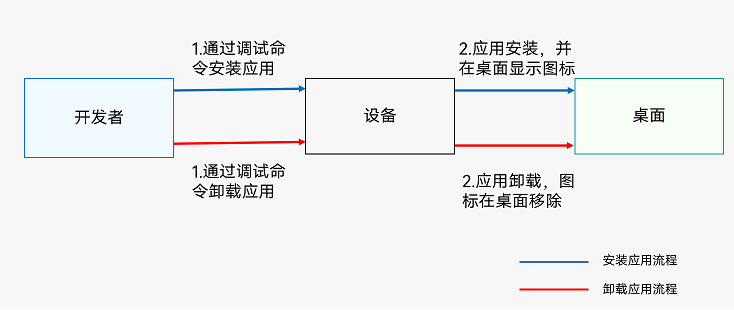
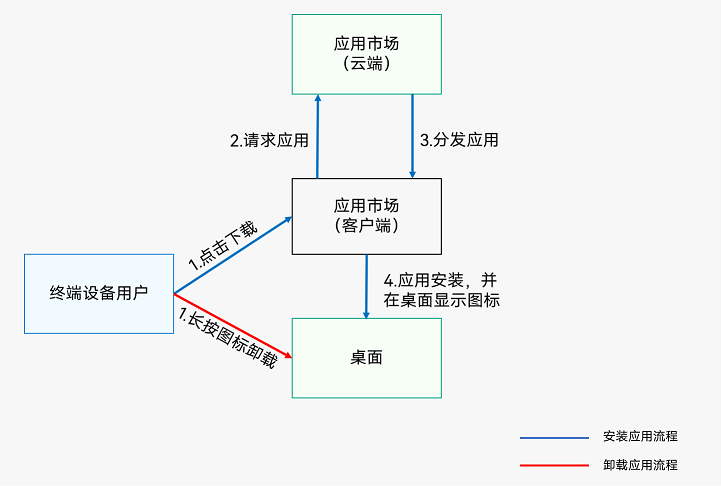

# 应用安装卸载与更新开发指导

更新时间：2026-04-29 07:35:50

来源：https://developer.huawei.com/consumer/cn/doc/harmonyos-guides/application-package-install-uninstall

本章节介绍应用程序包的安装卸载流程和两种更新方式。

#### 应用程序包的安装卸载

开发者可以通过调试命令安装和卸载应用，安装应用命令参考bm工具中的[install](https://developer.huawei.com/consumer/cn/doc/harmonyos-guides/bm-tool#安装命令install)，卸载应用命令参考bm工具中的[uninstall](https://developer.huawei.com/consumer/cn/doc/harmonyos-guides/bm-tool#卸载命令uninstall)，详情参见[编译发布与上架部署流程图](https://developer.huawei.com/consumer/cn/doc/harmonyos-guides/application-package-structure-stage#发布态包结构)。

**图1** 应用程序包安装和卸载流程（开发者）

应用上架应用市场后，终端设备用户可在设备上通过应用市场安装应用。

**图2** 应用程序包安装和卸载流程（终端设备用户）

#### 应用程序包的更新

对于开发者，应用程序包的更新，首先需要更新[app.json5配置文件](https://developer.huawei.com/consumer/cn/doc/harmonyos-guides/app-configuration-file)中的versionCode版本号字段，通过DevEco Studio打包后在应用市场发布，发布流程与首次发布一致。对于终端设备用户，新版本发布后，可以通过以下两种方式更新应用程序包。

 - 应用市场内更新：应用市场通知用户该应用有新版本，用户根据通知到应用市场（客户端）进行升级。
 - 应用内检测升级：开发者根据[检测应用新版本](https://developer.huawei.com/consumer/cn/doc/harmonyos-guides/store-update#检测应用新版本)实现版本更新提醒功能，应用启动完成或用户在应用中主动检查新版本时，会弹出升级对话框，用户根据对话框提示升级。
