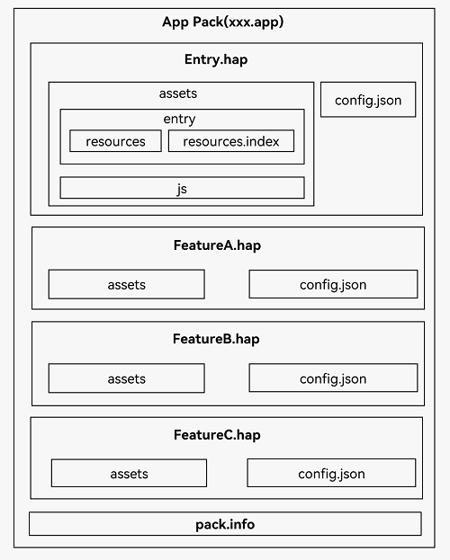

# FA模型应用程序包结构

更新时间：2026-03-12 09:39:20

来源：https://developer.huawei.com/consumer/cn/doc/harmonyos-guides/application-package-structure-fa

基于[FA模型](https://developer.huawei.com/consumer/cn/doc/harmonyos-guides/application-configuration-file-overview-fa)开发的应用，其应用程序包结构如下图应用程序包结构（FA模型）所示。开发者需要熟悉应用程序包结构相关的基本概念。

> [!NOTE]
> API version 8及更早的版本支持的应用模型，FA模型已经不再主流。建议使用新的Stage模型进行开发。

 FA模型与Stage模型的内部文件的存放位置不同。FA模型中，所有资源文件、库文件和代码文件都存放在assets文件夹中，并在文件夹内部进一步区分，Stage模型的内部文件的存放位置请参考[Stage模型应用程序包结构](https://developer.huawei.com/consumer/cn/doc/harmonyos-guides/application-package-structure-stage)。

 **图1** 应用程序包结构（FA模型）

 
