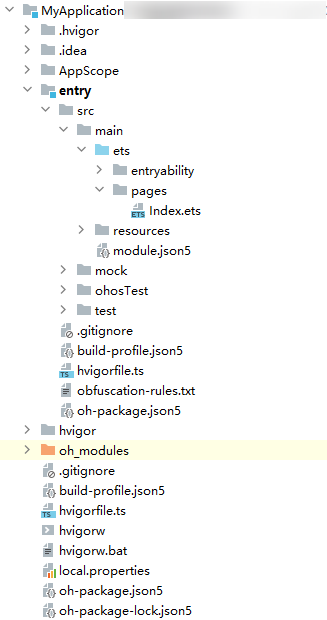
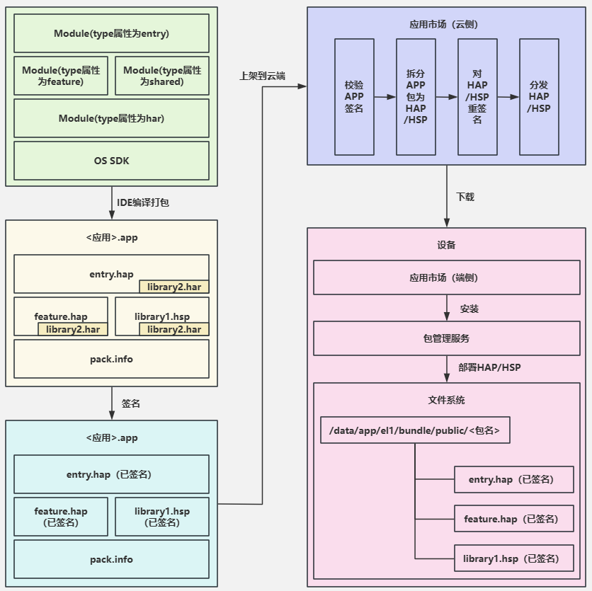

# Stage模型应用程序包结构

更新时间：2026-04-10 09:55:20

来源：https://developer.huawei.com/consumer/cn/doc/harmonyos-guides/application-package-structure-stage

为了让开发者能对应用程序包在不同阶段的形态有更加清晰的认知，分别对开发态、编译态、发布态的应用程序结构展开介绍。
  

##### 开发态包结构

在DevEco Studio上创建项目工程，并尝试创建多个不同类型的Module。根据实际工程中的目录对照本章节进行学习，有助于理解开发态的应用程序结构。
 
**图1** 项目工程结构示意图（以实际为准）
 

 
> [!TIP]
> AppScope目录由DevEco Studio自动生成，该目录名称更改会导致当前目录下配置文件和资源加载失败，导致编译报错问题，因此该目录名称请勿修改。 Module目录名称可以由DevEco Studio自动生成（比如entry、library等），也可以自定义。为了便于说明，下表中统一采用ModuleName表示。

 
工程结构主要包含的文件类型及用途如下：
  
| 文件类型 | 说明 |
| --- | --- |
| 配置文件 | 包括应用级配置信息、以及Module级配置信息： - AppScope > app.json5：app.json5配置文件，用于声明应用的全局配置信息，比如应用Bundle名称、应用名称、应用图标、应用版本号等。 - ModuleName > src > main > module.json5：module.json5配置文件，用于声明Module基本信息、支持的设备类型、所含的组件信息、运行所需申请的权限等。 |
| ArkTS源码文件 | ModuleName > src > main > ets：用于存放Module的ArkTS源码文件（.ets文件）。 |
| 资源文件 | 包括应用级资源文件、以及Module级资源文件，支持图形、多媒体、字符串、布局文件等，详见资源分类与访问。 - AppScope > resources ：用于存放应用需要用到的资源文件。 - ModuleName > src > main > resources ：用于存放该Module需要用到的资源文件。 |
| 其他配置文件 | 用于编译构建，包括构建配置文件、编译构建任务脚本、混淆规则文件、依赖的共享包信息等。 - build-profile.json5：工程级或Module级的构建配置文件，包括应用签名、产品配置等。 - hvigorfile.ts：工程级或Module级的编译构建任务脚本，开发者可以自定义编译构建工具版本、控制构建行为的配置参数。 - obfuscation-rules.txt：混淆规则文件。混淆开启后，在使用Release模式进行编译时，会对代码进行编译、混淆及压缩处理，保护代码资产。 - oh-package.json5：用于存放依赖库的信息，包括所依赖的三方库和共享包。 |
 
 
  

##### 编译态包结构

不同类型的Module编译后会生成对应的HAP、HAR、HSP等文件，编译后可通过DevEco Studio或打包工具打包成APP包，用于上架应用市场。编译HAP和HSP时，会把它们所依赖的HAR直接编译到HAP和HSP中，因此打包成APP包后，编译打包视图中只有.hap和.hsp文件，没有.har文件。开发态视图与编译态视图的对照关系如下：
 
**图2** 开发态与编译态的工程结构视图
 

 
从开发态到编译态，Module文件变更如下：
 
- **ets目录**：ArkTS源码编译生成.abc文件。
- **resources目录**：AppScope目录下的资源文件会合入到Module下面资源目录中，如果两个目录下存在重名文件，编译打包后只会保留AppScope目录下的资源文件。
- **module配置文件**：AppScope目录下的app.json5文件字段会合入到Module下面的module.json5文件之中，编译后生成HAP或HSP最终的module.json文件。

 
  

##### 发布态包结构

每个应用中至少包含一个.hap文件，可能包含若干个.hsp文件、也可能不含，一个应用中的所有.hap与.hsp文件合在一起称为**Bundle**，其对应的bundleName是应用的唯一标识（详见[app.json5配置文件](https://developer.huawei.com/consumer/cn/doc/harmonyos-guides/app-configuration-file)中的bundleName标签）。
 
当应用发布上架到应用市场时，需要将Bundle打包为一个.app后缀的文件用于上架，这个.app文件称为**App Pack**（Application Package），与此同时，DevEco Studio工具会自动生成一个**pack.info**文件。**pack.info**文件描述了App Pack中每个HAP和HSP的属性，包含APP中的bundleName和versionCode信息、以及Module中的name、type和abilities等信息。
 
> [!NOTE]
> App Pack是发布上架到应用市场的基本单元。 在 应用签名 时，是以HAP/HSP/APP为单位进行签名的；在云端分发、端侧安装时，是以HAP/HSP为单位进行分发和安装的。

 
**图3** 编译发布与上架部署流程图
 

