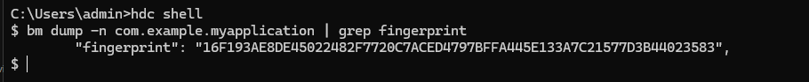
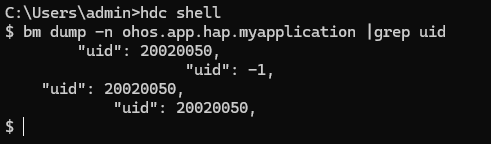

# 应用程序包常见问题

更新时间：2026-04-30 02:41:24

来源：https://developer.huawei.com/consumer/cn/doc/harmonyos-guides/common-problem-of-application

## 如何获取签名信息中的指纹信息

通过调用接口获取。 可以调用[bundleManager.getBundleInfoForSelf](https://developer.huawei.com/consumer/cn/doc/harmonyos-references/js-apis-bundlemanager#bundlemanagergetbundleinfoforself)获取自身的BundleInfo应用包信息，应用包信息中包含signatureInfo签名信息，签名信息中包含指纹信息，使用哈希算法SHA-256生成。
```text
import { bundleManager } from '@kit.AbilityKit';
import { BusinessError } from '@kit.BasicServicesKit';

let bundleFlags = bundleManager.BundleFlag.GET_BUNDLE_INFO_WITH_APPLICATION |
  bundleManager.BundleFlag.GET_BUNDLE_INFO_WITH_SIGNATURE_INFO;
try {
  bundleManager.getBundleInfoForSelf(bundleFlags).then((bundleInfo:bundleManager.BundleInfo) => {
    console.info('testTag', 'getBundleInfoForSelf successfully. fingerprint: ', bundleInfo.signatureInfo.fingerprint);
  }).catch((err: BusinessError) => {
    console.error('testTag', 'getBundleInfoForSelf failed. Cause: ', err.message);
  });
} catch (err) {
  let message = (err as BusinessError).message;
  console.error('testTag', 'getBundleInfoForSelf failed: %{public}s', message);
}
```

通过[bm工具](https://developer.huawei.com/consumer/cn/doc/harmonyos-guides/bm-tool)获取指纹信息，使用哈希算法SHA-256生成。
```text
hdc shell
# 需将com.example.myapplication替换为实际应用的包名
bm dump -n com.example.myapplication | grep fingerprint
```


通过.cer证书文件获取，可以参考[APP备案FAQ](https://developer.huawei.com/consumer/cn/doc/app/50130)中HarmonyOS应用/元服务如何获取公钥和签名信息，指纹信息使用哈希算法SHA-1生成。 通过keytool工具获取，详情参考[生成签名证书指纹](https://developer.huawei.com/consumer/cn/doc/AppGallery-connect-Guides/appgallerykit-preparation-game-0000001055356911#section147011294331)，使用哈希算法SHA-256生成。

## 什么是appIdentifier

appIdentifier是[Profile文件](https://developer.huawei.com/consumer/cn/doc/app/agc-help-release-profile-0000002248341090)中的一个字段，为应用的唯一标识，在应用签名时生成，其中： 通过DevEco Studio工具[自动签名](https://developer.huawei.com/consumer/cn/doc/harmonyos-guides/ide-signing#section18815157237)生成，此时的appIdentifier字段是随机生成的，在不同的设备上签名、或者重新签名均会导致appIdentifier字段不一致。 采用手动签名，并通过AppGallery Connect平台申请证书，此时申请[调试Profile](https://developer.huawei.com/consumer/cn/doc/app/agc-help-debug-profile-0000002248181278)或者[发布Profile](https://developer.huawei.com/consumer/cn/doc/app/agc-help-release-profile-0000002248341090)中的appIdentifier字段是固定的，该字段来源于AppGallery Connect创建应用时生成的[APP ID](https://developer.huawei.com/consumer/cn/doc/app/agc-help-create-app-0000002247955506#section16423184171915)，由云端统一分配。此时的appIdentifier字段在应用全生命周期中不会发生变化，包括版本升级、证书变更、开发者公私钥变更、应用转移等。 因此，在跨设备调试、跨应用交互调试、或者多用户共同开发且需要共享密钥等要求appIdentifier不变的场景下，推荐使用手动签名，具体场景请参考[使用场景说明](https://developer.huawei.com/consumer/cn/doc/harmonyos-guides/ide-signing#section54361623194519)。

## 如何获取应用信息中的appIdentifier

可以调用[bundleManager.getBundleInfoForSelf](https://developer.huawei.com/consumer/cn/doc/harmonyos-references/js-apis-bundlemanager#bundlemanagergetbundleinfoforself)获取自身的BundleInfo应用包信息，应用包信息中包含signatureInfo签名信息，签名信息中包含appIdentifier信息。
```text
import { bundleManager } from '@kit.AbilityKit';
import { BusinessError } from '@kit.BasicServicesKit';

let bundleFlags = bundleManager.BundleFlag.GET_BUNDLE_INFO_WITH_APPLICATION |
  bundleManager.BundleFlag.GET_BUNDLE_INFO_WITH_SIGNATURE_INFO;
try {
  bundleManager.getBundleInfoForSelf(bundleFlags).then((bundleInfo:bundleManager.BundleInfo) => {
    console.info('testTag', 'getBundleInfoForSelf successfully. appIdentifier:', bundleInfo.signatureInfo.appIdentifier);
  }).catch((err: BusinessError) => {
    console.error('testTag', 'getBundleInfoForSelf failed. Cause:', err.message);
  });
} catch (err) {
  let message = (err as BusinessError).message;
  console.error('testTag', 'getBundleInfoForSelf failed:', message);
}
```

通过[bm工具](https://developer.huawei.com/consumer/cn/doc/harmonyos-guides/bm-tool)获取。
```text
hdc shell
# 需将com.example.myapplication替换为实际应用的包名
bm dump -n com.example.myapplication | grep appIdentifier
```


## 什么是appId

appId是应用的唯一标识，由包名、下划线和证书公钥的Base64编码组成。由于appId和签名信息相关，如果签名证书的公钥更换，appId也会跟随变化，所以应用的唯一标识推荐使用[appIdentifier](#什么是appidentifier)。

## 如何获取应用信息中的appId

可以调用[bundleManager.getBundleInfoForSelf](https://developer.huawei.com/consumer/cn/doc/harmonyos-references/js-apis-bundlemanager#bundlemanagergetbundleinfoforself)获取自身的BundleInfo应用包信息，应用包信息中包含signatureInfo签名信息，签名信息中包含appId信息。
```text
import { bundleManager } from '@kit.AbilityKit';
import { BusinessError } from '@kit.BasicServicesKit';

let bundleFlags = bundleManager.BundleFlag.GET_BUNDLE_INFO_WITH_APPLICATION |
  bundleManager.BundleFlag.GET_BUNDLE_INFO_WITH_SIGNATURE_INFO;
try {
  bundleManager.getBundleInfoForSelf(bundleFlags).then((bundleInfo:bundleManager.BundleInfo) => {
    console.info('testTag', 'getBundleInfoForSelf successfully. appId:', bundleInfo.signatureInfo.appId);
  }).catch((err: BusinessError) => {
    console.error('testTag', 'getBundleInfoForSelf failed. Cause:', err.message);
  });
} catch (err) {
  let message = (err as BusinessError).message;
  console.error('testTag', 'getBundleInfoForSelf failed:', message);
}
```

通过[bm工具](https://developer.huawei.com/consumer/cn/doc/harmonyos-guides/bm-tool)获取。
```text
hdc shell
# 需将ohos.app.hap.myapplication替换为实际应用的包名
bm dump -n ohos.app.hap.myapplication |grep '"appId":'
```


## 应用的uid

uid是系统中用于[应用沙箱](https://developer.huawei.com/consumer/cn/doc/harmonyos-guides/access-token-overview#应用沙箱)隔离的唯一标识符，它分配给每个应用进程，确保应用在运行时相互隔离（如文件系统，内存空间等）。 uid的生成算法为：uid = userId * 200000 + (bundleId % 200000)。其中%表示取模运算，计算bundleId除以200000的余数。userId表示应用需要安装的用户编号，可以通过[getOsAccountLocalId接口](https://developer.huawei.com/consumer/cn/doc/harmonyos-references/js-apis-osaccount#getosaccountlocalid9)获取。bundleId表示应用的唯一编号，取值范围为10000到65535的整数，仅系统内部使用，可以通过uid和userId反算获取。

## 如何获取应用的uid

通过[bm工具](https://developer.huawei.com/consumer/cn/doc/harmonyos-guides/bm-tool)获取。
```text
hdc shell
# 需将ohos.app.hap.myapplication替换为实际应用的包名
bm dump -n ohos.app.hap.myapplication |grep uid
```


可以调用[bundleManager.getBundleInfoForSelf](https://developer.huawei.com/consumer/cn/doc/harmonyos-references/js-apis-bundlemanager#bundlemanagergetbundleinfoforself)获取自身的BundleInfo应用包信息，示例代码可以参考[如何获取应用信息中的appId](#如何获取应用信息中的appid)，取值方式为bundleInfo.appInfo.uid。
