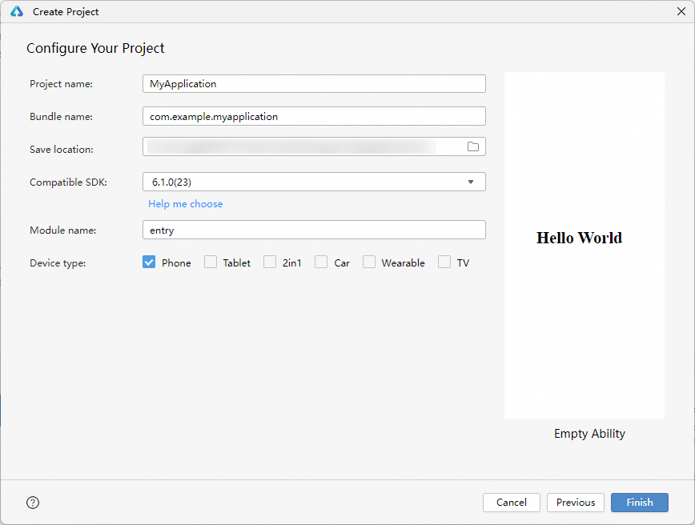
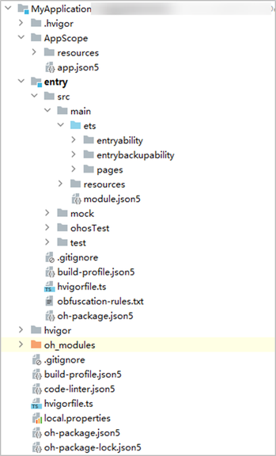
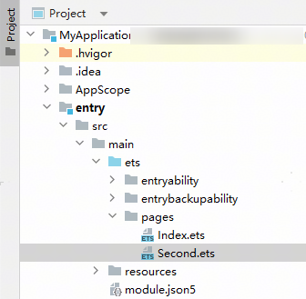
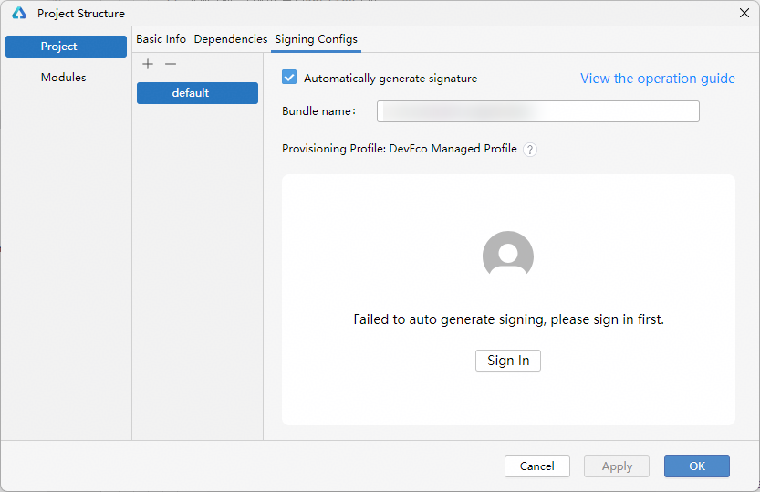
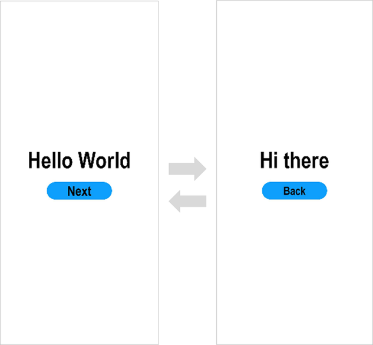

# 构建第一个HarmonyOS应用（ArkTS）

更新时间：2026-04-29 07:35:50

来源：https://developer.huawei.com/consumer/cn/doc/harmonyos-guides/start-with-ets-stage

> [!NOTE]
> 为确保运行效果，本文以使用 DevEco Studio 6.1.0 Release版本 为例。

  

##### 创建ArkTS工程
1. 若首次打开**DevEco Studio**，请单击**Create Project**创建工程。如果已经打开了一个工程，请在菜单栏选择**File** > **New** > **Create Project**来创建一个新工程。
2. 选择**Application**应用开发（本文以应用开发为例，[Atomic Service](https://developer.huawei.com/consumer/cn/doc/harmonyos-guides/glossary#atomic-service元服务)对应为元服务开发），选择模板**Empty Ability**，单击**Next**进行下一步配置。

  若开发者需要进行Native相关工程的开发，请选择**Native C++** 模板，更多模板的使用和说明请见[工程模板介绍](https://developer.huawei.com/consumer/cn/doc/harmonyos-guides/ide-template)。

  


3. 进入配置工程界面，**Compatible SDK**表示兼容的最低API Version，此处以选择**6.1.0(23)** 为例，其他参数保持默认设置即可。

  


4. 单击**Finish**，工具会自动生成示例代码和相关资源，等待工程创建完成。
 
  

##### ArkTS工程目录结构（Stage模型）


 
- **AppScope > app.json5**：应用的全局配置信息，详见[app.json5配置文件](https://developer.huawei.com/consumer/cn/doc/harmonyos-guides/app-configuration-file)。
- **entry**：HarmonyOS工程模块，编译构建生成一个[HAP](https://developer.huawei.com/consumer/cn/doc/harmonyos-guides/application-package-glossary#hap)包。

  
**src > main > ets**：用于存放ArkTS源码。
- **src > main > ets > entryability**：应用/服务的入口。
- **src > main > ets > entrybackupability**：应用提供扩展的备份恢复能力。
- **src > main > ets > pages**：应用/服务包含的页面。
- **src > main > resources**：用于存放应用/服务所用到的资源文件，如图形、多媒体、字符串、布局文件等。关于资源文件，详见[资源分类与访问](https://developer.huawei.com/consumer/cn/doc/harmonyos-guides/resource-categories-and-access)。
- **src > main > module.json5**：[模块](https://developer.huawei.com/consumer/cn/doc/harmonyos-guides/application-package-glossary#module)配置文件。主要包含HAP包的配置信息、应用/服务在具体设备上的配置信息以及应用/服务的全局配置信息。具体的配置文件说明，详见[module.json5配置文件](https://developer.huawei.com/consumer/cn/doc/harmonyos-guides/module-configuration-file)。
- **build-profile.json5**：当前的模块信息 、编译信息配置项，包括buildOption、targets配置等。
- **hvigorfile.ts**：模块级编译构建任务脚本。
- **obfuscation-rules.txt**：混淆规则文件。混淆开启后，在使用Release模式进行编译时，会对代码进行编译、混淆及压缩处理，保护代码资产。详见[开启代码混淆](https://developer.huawei.com/consumer/cn/doc/harmonyos-guides/ide-build-obfuscation)。
- **oh-package.json5**：用来描述包名、版本、入口文件（类型声明文件）和依赖项等信息。

  - **oh_modules**：用于存放三方库依赖信息。
- **build-profile.json5**：工程级配置信息，包括签名signingConfigs、产品配置products等。其中products中可配置当前运行环境，默认为HarmonyOS。
- **hvigorfile.ts**：工程级编译构建任务脚本。
- **oh-package.json5**：主要用来描述全局配置，如：依赖覆盖（overrides）、依赖关系重写（overrideDependencyMap）和参数化配置（parameterFile）等。

 
  

##### 构建第一个页面
1. 使用文本组件。

  工程同步完成后，在**Project**窗口，单击**entry > src > main > ets > pages**，打开**Index.ets**文件，将页面从RelativeContainer相对布局修改成Row/Column线性布局。

  针对本文中使用文本/按钮来实现页面跳转/返回的应用场景，页面均使用[Row](https://developer.huawei.com/consumer/cn/doc/harmonyos-references/ts-container-row)和[Column](https://developer.huawei.com/consumer/cn/doc/harmonyos-references/ts-container-column)组件来组建布局。对于更多复杂元素对齐的场景，可选择使用[RelativeContainer](https://developer.huawei.com/consumer/cn/doc/harmonyos-references/ts-container-relativecontainer)组件进行布局。更多关于UI布局的选择和使用，可见[如何选择布局](https://developer.huawei.com/consumer/cn/doc/harmonyos-guides/arkts-layout-development-overview#如何选择布局)。

  **Index.ets**文件的示例如下：

  
```ArkTS
// Index.ets
@Entry
@Component
struct Index {
  @State message: string = 'Hello World';

  build() {
    Row() {
      Column() {
        Text(this.message)
          .fontSize(50)
          .fontWeight(FontWeight.Bold)
      }
      .width('100%')
    }
    .height('100%')
  }
}
```

2. 添加按钮。

  在默认页面基础上，我们添加一个Button组件，作为按钮响应用户onClick事件，从而实现跳转到另一个页面。**Index.ets**文件的示例如下：

  
```ArkTS
// Index.ets
@Entry
@Component
struct Index {
  @State message: string = 'Hello World';

  build() {
    Row() {
      Column() {
        Text(this.message)
          .fontSize(50)
          .fontWeight(FontWeight.Bold)
        // 添加按钮，以响应用户onClick事件
        Button() {
          Text('Next')
            .fontSize(30)
            .fontWeight(FontWeight.Bold)
        }
        .type(ButtonType.Capsule)
        .margin({
          top: 20
        })
        .backgroundColor('#0D9FFB')
        .width('40%')
        .height('5%')
      }
      .width('100%')
    }
    .height('100%')
  }
}
```

3. 在编辑窗口**右上角**的侧边工具栏，单击**Previewer**，打开预览器。第一个页面效果如下图所示：

  


 
  

##### 构建第二个页面
1. 创建第二个页面。

  
新建第二个页面文件。在**Project**窗口，打开**entry > src > main > ets**，右键单击**pages**文件夹，选择**New > ArkTS File**，命名为**Second**，单击**回车键**。可以看到文件目录结构如下：

  


  
> [!NOTE]
> 开发者也可以在右键单击 pages 文件夹时，选择 New > Page > Empty Page ，命名为 Second ，单击 Finish 完成第二个页面的创建。使用此种方式则无需再进行下文中第二个页面路由的手动配置。

2. 配置第二个页面的路由。在**Project**窗口，打开**entry > src > main > resources > base > profile**，在main_pages.json文件中的"src"下配置第二个页面的路由"pages/Second"。示例如下：

  
```json
{
  "src": [
    "pages/Index",
    "pages/Second"
  ]
}
```

3. 添加文本及按钮。

  参照第一个页面，在第二个页面添加Text组件、Button组件等，并设置其样式。**Second.ets**文件的示例如下：

  
```ArkTS
// Second.ets
@Entry
@Component
struct Second {
  @State message: string = 'Hi there';

  build() {
    Row() {
      Column() {
        Text(this.message)
          .fontSize(50)
          .fontWeight(FontWeight.Bold)
        Button() {
          Text('Back')
            .fontSize(30)
            .fontWeight(FontWeight.Bold)
        }
        .type(ButtonType.Capsule)
        .margin({
          top: 20
        })
        .backgroundColor('#0D9FFB')
        .width('40%')
        .height('5%')
      }
      .width('100%')
    }
    .height('100%')
  }
}
```

 
  

##### 实现页面间的跳转

页面间的导航可以通过[页面路由router](https://developer.huawei.com/consumer/cn/doc/harmonyos-references/arkts-apis-uicontext-router)来实现。页面路由router根据页面url找到目标页面，从而实现跳转。
 
如果需要实现更好的转场动效，推荐使用[Navigation](https://developer.huawei.com/consumer/cn/doc/harmonyos-guides/arkts-navigation-navigation)。
 1. 第一个页面跳转到第二个页面。

  在第一个页面中，跳转按钮绑定onClick事件，单击按钮时跳转到第二页。**Index.ets**文件的示例如下：

  
```ArkTS
// Index.ets
import { BusinessError } from '@kit.BasicServicesKit';

@Entry
@Component
struct Index {
  @State message: string = 'Hello World';

  build() {
    Row() {
      Column() {
        Text(this.message)
          .fontSize(50)
          .fontWeight(FontWeight.Bold)
        // 添加按钮，以响应用户onClick事件
        Button() {
          Text('Next')
            .fontSize(30)
            .fontWeight(FontWeight.Bold)
        }
        .type(ButtonType.Capsule)
        .margin({
          top: 20
        })
        .backgroundColor('#0D9FFB')
        .width('40%')
        .height('5%')
        // 跳转按钮绑定onClick事件，单击时跳转到第二页
        .onClick(() => {
          console.info(`Succeeded in clicking the 'Next' button.`)
          // 获取UIContext
          let uiContext: UIContext = this.getUIContext();
          let router = uiContext.getRouter();
          // 跳转到第二页
          router.pushUrl({ url: 'pages/Second' }).then(() => {
            console.info('Succeeded in jumping to the second page.')

          }).catch((err: BusinessError) => {
            console.error(`Failed to jump to the second page. Code is ${err.code}, message is ${err.message}`)
          })
        })
      }
      .width('100%')
    }
    .height('100%')
  }
}
```

2. 第二个页面返回到第一个页面。

  在第二个页面中，返回按钮绑定onClick事件，单击按钮时返回到第一页。**Second.ets**文件的示例如下：

  
```ArkTS
// Second.ets
import { BusinessError } from '@kit.BasicServicesKit';

@Entry
@Component
struct Second {
  @State message: string = 'Hi there';

  build() {
    Row() {
      Column() {
        Text(this.message)
          .fontSize(50)
          .fontWeight(FontWeight.Bold)
        Button() {
          Text('Back')
            .fontSize(30)
            .fontWeight(FontWeight.Bold)
        }
        .type(ButtonType.Capsule)
        .margin({
          top: 20
        })
        .backgroundColor('#0D9FFB')
        .width('40%')
        .height('5%')
        // 返回按钮绑定onClick事件，单击按钮时返回到第一页
        .onClick(() => {
          console.info(`Succeeded in clicking the 'Back' button.`)
          // 获取UIContext
          let uiContext: UIContext = this.getUIContext();
          let router = uiContext.getRouter();
          try {
            // 返回第一页
            router.back()
            console.info('Succeeded in returning to the first page.')
          } catch (err) {
            let code = (err as BusinessError).code;
            let message = (err as BusinessError).message;
            console.error(`Failed to return to the first page. Code is ${code}, message is ${message}`)
          }
        })
      }
      .width('100%')
    }
    .height('100%')
  }
}
```

3. 打开**Index.ets**文件，单击预览器中的

按钮进行刷新。效果如下图所示：

  


 
  

##### 使用真机运行应用
1. 将搭载HarmonyOS系统的真机与电脑连接。具体指导及要求，可查看[使用本地真机运行应用/服务](https://developer.huawei.com/consumer/cn/doc/harmonyos-guides/ide-run-device)。
2. 进入**File > Project Structure... > Project > Signing Configs**界面，勾选“**Automatically generate signature**”，即可完成签名。如果未登录，请先单击**Sign In**进行登录，然后自动完成签名。具体请见[配置调试签名](https://developer.huawei.com/consumer/cn/doc/harmonyos-guides/ide-signing#section151231211105010)。如下图所示：

  


3. 在编辑窗口右上角的工具栏，单击

按钮运行。效果如下图所示：

  


 
恭喜您已经基于ArkTS语言构建完成第一个HarmonyOS应用，快来探索更多的HarmonyOS功能吧。
