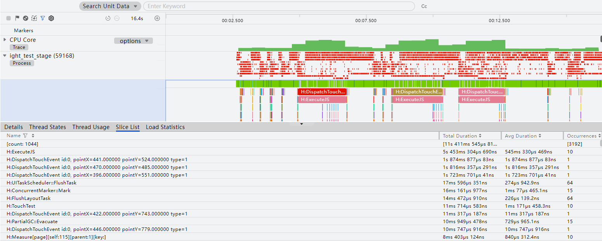
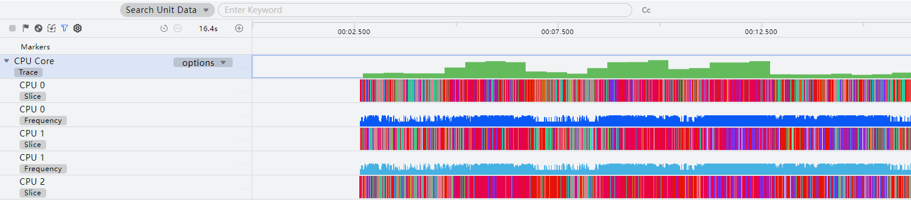
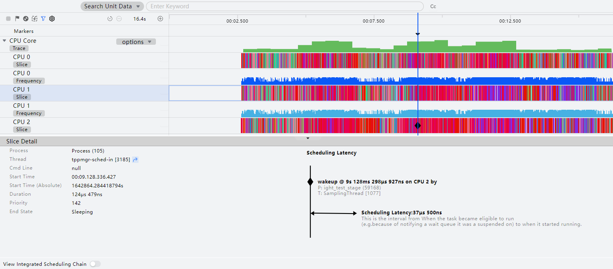
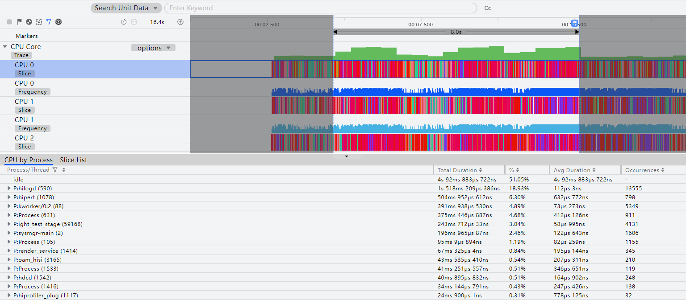
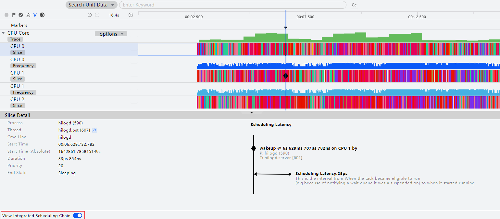
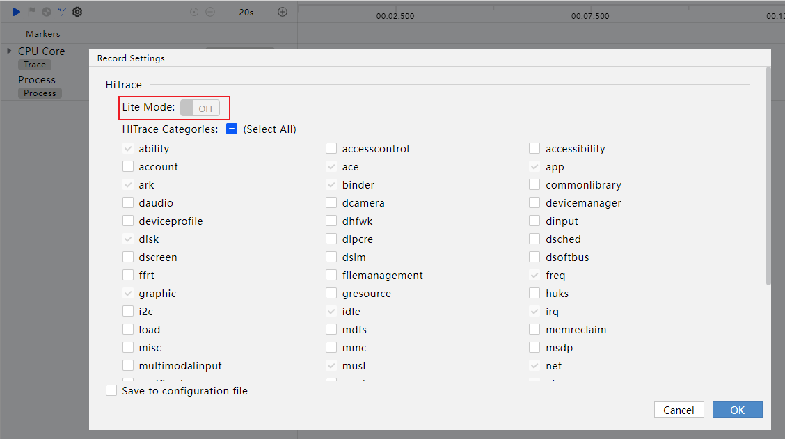
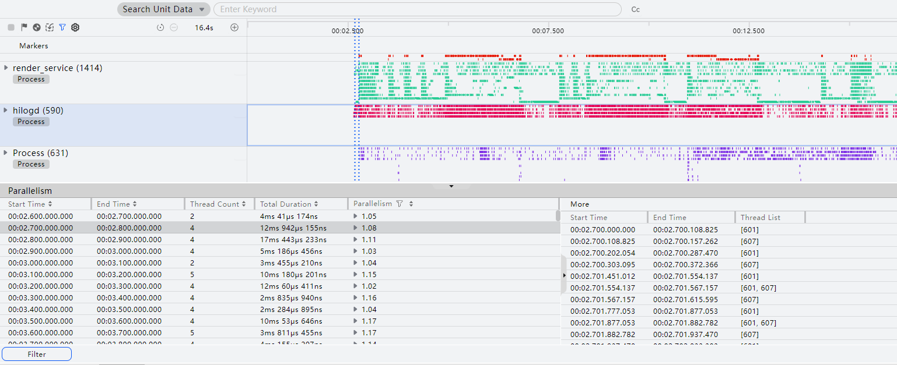

# CPU活动分析

更新时间：2026-06-12 06:54:33

来源：https://developer.huawei.com/consumer/cn/doc/harmonyos-guides/ide-insight-session-cpu

#### 功能介绍

 
开发者可使用DevEco Profiler的CPU场景调优分析，在应用或元服务运行时，实时显示CPU使用率和线程的运行状态，了解指定时间段内的CPU资源消耗情况，查看系统的关键打点（例如图形系统打点、应用服务框架打点等），进行更具针对性的优化。
 
CPU模板支持的泳道包括：Energy、CPU Core、Process。本文介绍CPU Core、Process泳道，Energy泳道的详细信息请参考[能耗诊断：Energy分析](https://developer.huawei.com/consumer/cn/doc/harmonyos-guides/ide-profiler-energy)。
 
> [!NOTE]
> 任务分析前，需创建CPU分析任务并录制相关数据，操作方法可参考 性能问题定位：深度录制 ，或在会话区选择 Open File ，导入历史数据。

 

#### 查看各CPU使用情况
1. **CPU Core**泳道显示当前选择调优应用或元服务的CPU的使用率，在泳道右侧**options**下拉列表中选择显示内容：

  
- Slice and Frequency：每个子泳道包含时间片和频率两部分，时间片显示占用该CPU核心的进程、线程。

2. Usage and Frequency：每个子泳道包含CPU核心使用率和频率两部分。

3. 将其展开，子泳道显示各CPU核心调度信息、各CPU核心频率信息以及各CPU核心使用率信息。

  
> [!NOTE]
> 将鼠标悬浮在某时间片上时，能够置灰非同进程时间片，通过此方法可以确定时间片的关联性。

  

4. 指定时间片，查看统计信息。

  
单击某个运行状态的时间片，可查询这个时间片的基本运行信息及调度时延信息。

5. 框选多个时间片，则可查询多时间片的进程维度统计信息以及所有时间片的数据统计信息。

6. 开启"View Integrated Scheduling Chain"后，点击CPU时间片泳道的节点可以查看某一个CPU运行线程的完整唤醒调度链。

  

  #### 查询进程详情

  单击工具控制栏中的

按钮，可以设置是否为精简模式。精简模式下，trace数据量将大幅减少，主要采集当前进程、大桌面进程和render_service进程的trace数据。

  

  进程泳道显示进程对各CPU核心的占用情况。展开进程泳道，显示进程下的线程列表以及线程的运行状态。
单击运行状态的时间片，显示线程在该片段的运行详情，包括起始时间、持续时长、运行状态、频率、线程优先级、所属进程、所属线程、上一运行状态、下一运行状态、唤醒线程，支持跳转到上个或者下个线程运行状态，支持跳转到唤醒线程状态等。

- 框选Thread泳道中多个运行状态的时间片，可查看此时间段内的不同运行状态的线程的统计信息，包括总耗时时长、最大耗时、最小耗时、平均耗时、处于当前状态的线程数量以及线程中的中载和重载数据统计。
> [!NOTE]
> 中载、重载数据每100ms做一次统计，24ms < Running时长 ≤ 48ms 记为中载，Running时长大于48ms记为重载。

  

- 框选应用进程Process主泳道，可查看此时间段内该进程下的线程并行度统计信息。并行度数据每100ms做一次统计，可以查看100ms内运行的总线程数量、各线程并行的总时间和并行度。点选某一行，可以查看对应线程编号和运行时间段。
> [!NOTE]
> 并行度（Parallelism）取值范围是[1,CPU核数]，数值越小代表并行度越低。

  

 
 
 

#### 查看Trace详情

当存在Trace任务时，可在对应的线程泳道查看到当前线程已触发的Trace任务层叠图。选择待查询的Trace。
- 点选泳道中的Trace片段，可查看单个Trace详情，包括名称、所属进程、所属线程、起始时间、持续时长、深度等。
> [!NOTE]
> 如果用户对线程进行了自定义打点，在此处亦可查看到对应的User Trace打点信息。 从所在线程名称可分辨当前Trace的类型，系统Trace对应的线程名称为“线程名+线程号”，User Trace对应的线程名称为“打点任务名”。

  

- 框选多个Trace片段，可查看到Trace统计信息列表，包括Trace名称、此类Trace的总耗时、单个Trace的平均耗时、以及该时间段内该类Trace的触发次数等。

