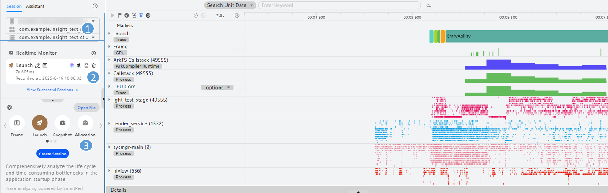

# 会话区

更新时间：2026-04-30 02:42:31

来源：https://developer.huawei.com/consumer/cn/doc/harmonyos-guides/ide-profiler-session

DevEco Profiler左侧为会话区，可以分为三个部分：

① 调优目标选择区域：选择设备及要分析的应用和进程。

选定被调优的设备、应用包及应用进程作为后续调优会话的分析对象。依次点击设备、应用、进程列表完成选择。

② 会话列表区域：列出当前已创建的调优分析会话。

单击列表中的会话后，界面右侧数据区将显示其数据内容。选择设备、应用和进程后，此处默认显示“Realtime Monitor”任务。

会话区将记录当前所有的会话。每一个会话都会包含：会话的名称（图例中的"Launch"）、会话当前状态（图例中的"Recorded"）、会话对应的录制时长信息（图例中的"7s 605ms"）。会话支持拖拽方式调整顺序。

**录制/删除会话**：通过鼠标悬停在名称后方的信息图标

上，会话所要观测的调优对象的基本信息将会以Tooltip的形式展示。点击会话的右侧的

/

按钮，开启/停止会话录制，此时工具开始抓取性能数据，开发者可以操作应用复现性能劣化场景；点击

将删除该会话。

> [!NOTE]
> 会话区存在两种会话类型：活跃会话和历史会话。活跃会话可在此区域内直接看到，历史会话需要点击界面下方View Successful Sessions前往查看。开发者主动选择新的调优目标后，活跃会话会清空，相关会话进入历史会话。 历史会话中支持删除会话和数据导出。 仅成功录制或导入的session可长期存留在任务列表中；录制失败或未启动录制的session，在设备/应用切换时自动从任务列表中清除。 会话录制完成出现图标，表示数据处于解析状态，请耐心等待解析完成。 支持的最大会话个数（活跃会话个数+历史会话个数总和，重复不计入）为15个。

**数据导出**：待数据解析完成后，会话便会进入数据展示状态，将数据可视化展示到右侧的数据区中。此时可以点击会话面板中出现的数据导出按钮

，将录制到的数据导出到本地进行保存，借助这个能力，开发者可以方便的在团队内共享录制到的性能数据，也可以防止采集到的性能数据丢失。

**智慧调优**：提供[智慧调优](https://developer.huawei.com/consumer/cn/doc/harmonyos-guides/ide-ai-profiler)功能

，支持通过自然语言交互，分析并解释当前实例或项目中存在的性能问题，帮助开发者快速定位影响性能的具体原因，目前支持对Launch、Frame、Allocation、Snapshot模板进行智慧调优分析。

③ 场景化模板选择区域：新建会话的入口，DevEco Profiler提供[Frame](https://developer.huawei.com/consumer/cn/doc/harmonyos-guides/ide-insight-session-frame)、[Launch](https://developer.huawei.com/consumer/cn/doc/harmonyos-guides/ide-launch-overview)、[Snapshot](https://developer.huawei.com/consumer/cn/doc/harmonyos-guides/ide-insight-session-snapshot)、[Allocation](https://developer.huawei.com/consumer/cn/doc/harmonyos-guides/ide-insight-session-allocations)、[ArkUI](https://developer.huawei.com/consumer/cn/doc/harmonyos-guides/ide-arkui-analysis)、[ComMemory](https://developer.huawei.com/consumer/cn/doc/harmonyos-guides/ide-commemory)、[Energy](https://developer.huawei.com/consumer/cn/doc/harmonyos-guides/ide-profiler-energy)、[ArkWeb](https://developer.huawei.com/consumer/cn/doc/harmonyos-guides/ide-profiler-arkweb)、[Network](https://developer.huawei.com/consumer/cn/doc/harmonyos-guides/ide-profiler-network)、[Concurrency](https://developer.huawei.com/consumer/cn/doc/harmonyos-guides/ide-parallel-concurrency-analysis)、[GPU](https://developer.huawei.com/consumer/cn/doc/harmonyos-guides/ide-profiler-gpu)、[Time](https://developer.huawei.com/consumer/cn/doc/harmonyos-guides/ide-insight-session-time)、[CPU](https://developer.huawei.com/consumer/cn/doc/harmonyos-guides/ide-insight-session-cpu)等场景化分析模板，提供对不同性能问题场景的数据分析方案。

：Frame卡顿丢帧场景化模板。

：Launch冷启动场景化模板。

：Snapshot ArkTS内存泄漏场景化模板。

：Allocation Native内存泄漏场景化模板。

：ArkUI卡顿丢帧场景化模板。

：ComMemory UI组件内存泄漏场景化模板。

：Energy能耗诊断场景化模板。

：ArkWeb加载丢帧场景化模板。

：Network网络诊断场景化模板。

：Concurrency并行并发场景化模板。

：GPU活动场景化模板。

：Time函数耗时场景化模板。

：CPU调度场景化模板。

选中任意模板图标，点击下方**Create Session**按钮，即可创建出一个全新的会话。

**数据导入**：在③场景化模板选择区域，点击**Open File**按钮，即可选择数据进行导入。当前支持.insight，.htrace， .ftrace，.heapsnapshot，.rawheap, .sys，.perfdata，.data，.nas（包含Native Allocation数据的文件），.txt（包含Native Allocation数据的文件），.acm文件的导入。

**配置Profiler缓存路径**：在③场景化模板选择区域，点击左上方

设置按钮，会弹出文件选择器，设置Profiler缓存文件的保存路径。

