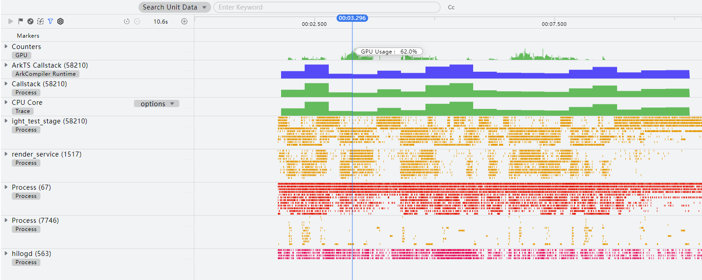
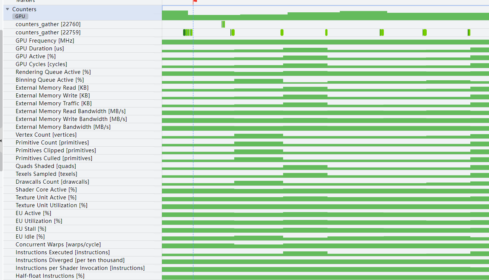
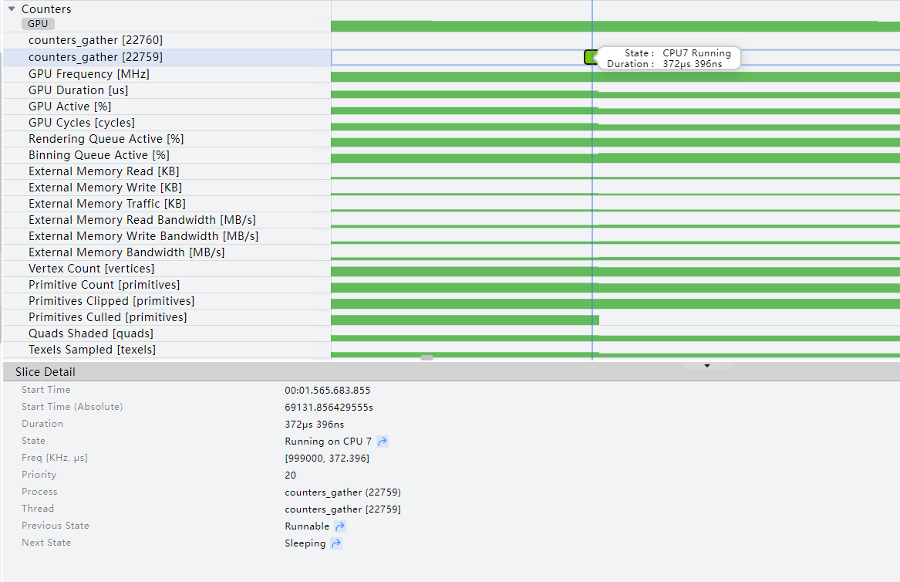
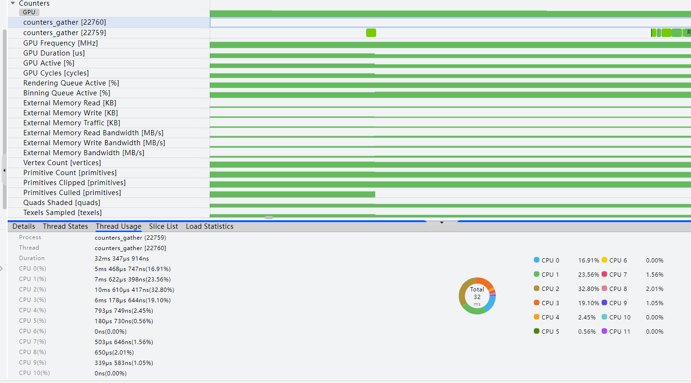

# GPU活动分析

更新时间：2026-04-30 02:42:31

来源：https://developer.huawei.com/consumer/cn/doc/harmonyos-guides/ide-profiler-gpu

从DevEco Studio 6.0.0 Beta3版本开始，DevEco Profiler提供GPU模板展示不同GPU硬件模块利用率的详细信息，这些信息可用于识别GPU利用率低、执行图形和计算工作负载性能瓶颈的根本原因。
 

#### 约束与限制

- 该功能仅支持中国境内（香港特别行政区、澳门特别行政区、中国台湾除外）。
- 仅支持Phone设备。

 
 

#### 操作步骤
1. 创建GPU分析任务并录制相关数据，操作方法可参考[性能问题定位：深度录制](https://developer.huawei.com/consumer/cn/doc/harmonyos-guides/deep-recording)。

  GPU分析任务支持在录制前单击

指定要录制的泳道。单击工具控制栏中的

按钮，可以设置采样时间间隔（Sampling Interval），可设置范围为1ms~1000ms，默认为10ms。
2. “Counters”泳道显示当前设备GPU的使用率，“ArkTS Callstack”、“Callstack”、“CPU Core”等泳道信息请参考[基础耗时：Time分析](https://developer.huawei.com/consumer/cn/doc/harmonyos-guides/ide-insight-session-time)和[CPU活动分析](https://developer.huawei.com/consumer/cn/doc/harmonyos-guides/ide-insight-session-cpu)。

  

3. 将“Counters”泳道展开，子泳道显示GPU各项活动信息，包括counters_gather、GPU执行命令的频率、GPU执行命令的持续时间等。除counters_gather外，其他子泳道信息可参考[GPU Counters](https://developer.huawei.com/consumer/cn/doc/Tools-Guides/gpu-counters-0000001886127538)。

  

4. counters_gather泳道显示线程对各CPU核心的占用情况。单击运行状态的时间片段，显示线程在该时间片段的起始时间、持续时长、运行状态、频率、线程优先级、所属进程、所属线程、上一运行状态、下一运行状态，并且支持跳转到上个或者下个线程运行状态。

  

5. 框选counters_gather泳道，可查看此时间段内的统计信息，包括线程状态统计信息、CPU单线程使用情况、线程中的中载重载数据统计。

  

