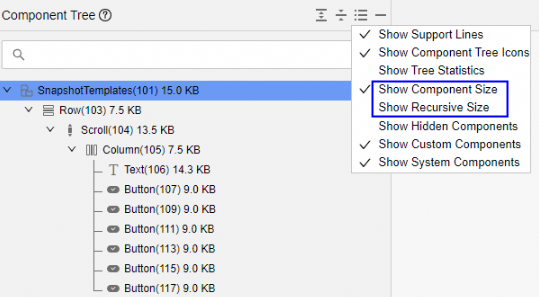
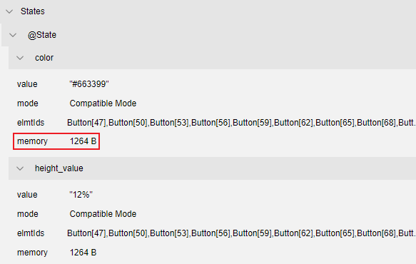

# UI组件内存：ComMemory分析

更新时间：2026-05-21 06:15:30

来源：https://developer.huawei.com/consumer/cn/doc/harmonyos-guides/ide-commemory

从DevEco Studio 6.1.1 Beta1版本开始，DevEco Profiler新增ComMemory模板，可以分析UI界面各组件内存的分配情况，帮助定位UI组件内存泄漏问题。

##### 操作步骤

1. 创建ComMemory分析任务并录制相关数据，操作方法可参考[性能问题定位：深度录制](https://developer.huawei.com/consumer/cn/doc/harmonyos-guides/deep-recording)，在录制前单击

指定要录制的泳道；或者在[会话区](https://developer.huawei.com/consumer/cn/doc/harmonyos-guides/ide-profiler-session)选择**Open File**，导入历史数据。

  

2. 开始录制后可观察Memory泳道的内存使用情况，在需要定位的时刻单击

启动一次快照，“ArkUI Snapshot”泳道的紫色区块表示一次快照完成。

  在“Details”页签中显示当前快照的详细信息；点击Open按钮，将在[ArkUI Inspector](https://developer.huawei.com/consumer/cn/doc/harmonyos-guides/ide-arkui-inspector)中打开相应的.arkli文件。

  

3. 在ArkUI Inspector中查看组件树。

  默认勾选“Show Component Size”，显示各组件的内存占用情况。点击

，可勾选“Show Recursive Size”，显示各组件为根的子树的内存占用情况。

  

4. 在ArkUI Inspector的**Memory** >**Statistics**中，查看组件的内存统计信息。

  
Current：当前组件ArkTS内存和Native内存的占用情况。
5. ArkTS：当前组件对应的ArkTS堆快照对象的[Retained Size](https://developer.huawei.com/consumer/cn/doc/harmonyos-guides/ide-snapshot-basic-operations#li19851458524)。
6. Native：当前组件新增占用的Native内存。
7. Subtree：当前组件及其子组件的Current内存之和。
8. nativeCount：当前组件存活的Native分配内存个数。
9. arktsCount：当前组件的ArkTS堆快照对象个数。
10. recursive：递归统计信息。
11. 在ArkUI Inspector的**Memory** > **Details**中，点击Details中任一项后，打开DevEco Profiler查看显示组件的详情。

  
ShowAllocationDetail：显示当前组件的Allocation详情。
12. ShowSnapshotDetail：显示当前组件的Snapshot详情，系统组件不显示该项。
13. ShowRecursiveAllocationDetail：显示当前组件及其子组件的Allocation详情。
14. ShowRecursiveSnapshotDetail：显示当前组件及其子组件的Snapshot详情。
15. 在ArkUI Inspector的**Memory** >** State****s**中，查看UI组件的状态变量内存。memory字段表示该状态变量在对应组件的ArkTS堆快照中的Retained Size，更多请参考[查看UI组件的状态变量](https://developer.huawei.com/consumer/cn/doc/harmonyos-guides/ide-arkui-inspector#section19923158103412)。

  

16. 在中间栏点击

可以将包含内存信息的组件树快照导出到本地。
