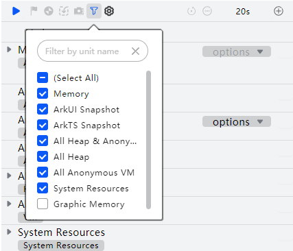
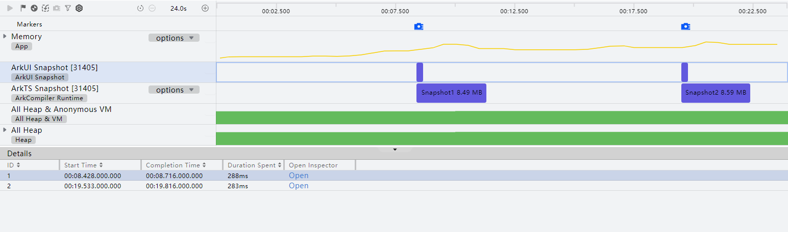
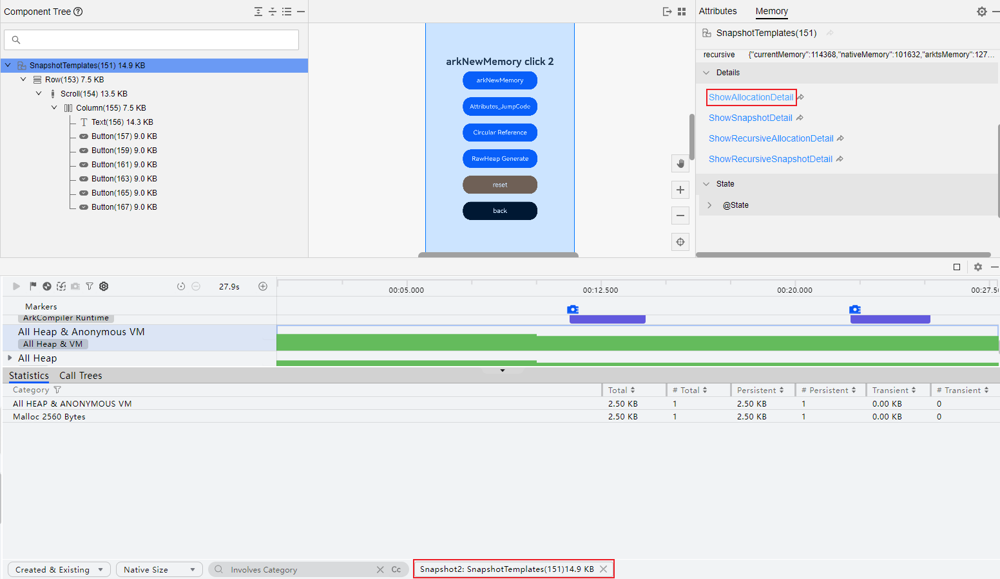
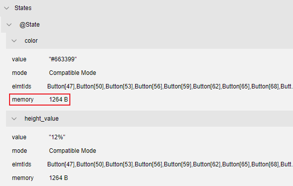

# UI组件内存：ComMemory分析

更新时间：2026-06-12 06:54:33

来源：https://developer.huawei.com/consumer/cn/doc/harmonyos-guides/ide-commemory

#### 功能介绍

从DevEco Studio 6.1.1 Beta1版本开始，DevEco Profiler新增ComMemory模板，可以分析UI界面各组件内存的分配情况，帮助定位UI组件内存泄漏问题。

ComMemory模板支持的泳道包括：Memory、ArkUI Snapshot、ArkTS Snapshot、All Heap & Anonymous VM、All Heap、All Anonymous VM、System Resources、Graphic Memory。本文介绍ArkUI Snapshot泳道，其他泳道的详细信息请参考对应模板内容。

 - Memory、All Heap & Anonymous VM、All Heap、All Anonymous VM、System Resources、Graphic Memory泳道的介绍请参考[基础内存：Allocation分析](https://developer.huawei.com/consumer/cn/doc/harmonyos-guides/ide-insight-session-allocations)。
 - ArkTS Snapshot泳道的介绍请参考[内存泄漏：Snapshot分析](https://developer.huawei.com/consumer/cn/doc/harmonyos-guides/ide-insight-session-snapshot)。

> [!NOTE]
> 任务分析前，需创建ComMemory分析任务并录制相关数据，操作方法可参考 性能问题定位：深度录制 ，或在 会话区 选择 Open File ，导入历史数据。

#### 查看组件树和组件信息
1. 开始录制后观察**Memory**泳道的内存使用情况，在需要定位的时刻单击任务左上角的

启动一次快照，一次快照完成后会在**ArkUI Snapshot**泳道出现紫色区块。

  **Details**区域显示当前快照的详细信息，点击**Open**，将在[ArkUI Inspector](https://developer.huawei.com/consumer/cn/doc/harmonyos-guides/ide-arkui-inspector)中打开相应的.arkli文件。

  

2. 在ArkUI Inspector中查看组件树。26.0.0 Beta1版本新增Show Free-Node Components。

  默认勾选**Show Component Size**和**Show Free-Node Components**，Show Component Size显示各组件的内存占用情况，Show Free-Node Components显示游离组件（未在组件树上的组件）。点击

，勾选**Show Recursive Size**，显示各组件为根的子树的内存占用情况。

  

3. 在ArkUI Inspector中查看组件的信息。

  
在ArkUI Inspector的**Memory** >**Statistics**中，查看组件的内存统计信息。         
Current：当前组件ArkTS内存和Native内存的占用情况。
4. ArkTS：当前组件对应的ArkTS堆快照对象的[Retained Size](https://developer.huawei.com/consumer/cn/doc/harmonyos-guides/ide-snapshot-basic-operations#li1323381634912)。
5. Native：当前组件新增占用的Native内存。
6. Subtree：当前组件及其子组件的Current内存之和。
7. nativeCount：当前组件存活的Native分配内存个数。
8. arktsCount：当前组件的ArkTS堆快照对象个数。
9. recursive：递归统计信息。
10. 在ArkUI Inspector的**Memory** > **Details**中，点击Details中任一项后，打开DevEco Profiler查看显示组件的详情。         
ShowAllocationDetail：显示当前组件的Allocation详情。
11. ShowSnapshotDetail：显示当前组件的Snapshot详情，系统组件不显示该项。
12. ShowRecursiveAllocationDetail：显示当前组件及其子组件的Allocation详情。
13. ShowRecursiveSnapshotDetail：显示当前组件及其子组件的Snapshot详情。
14. 在ArkUI Inspector的**Memory** >** State****s**中，查看UI组件的状态变量内存。         memory字段表示该状态变量在对应组件的ArkTS堆快照中的Retained Size，更多请参考[查看UI组件的状态变量](https://developer.huawei.com/consumer/cn/doc/harmonyos-guides/ide-arkui-inspector#section19923158103412)。

  

15. 在中间栏点击

可以将包含内存信息的组件树快照导出到本地。

#### .arkli文件对比

从26.0.0 Beta1版本开始，支持对比.arkli文件，通过对比快速定位异常增多的组件。

1. 开始录制后观察**Memory**泳道的内存使用情况，在需要定位的时刻单击任务左上角的

启动一次快照，一次快照完成后会在**ArkUI Snapshot**泳道出现紫色区块。

  **Details**区域显示当前快照的详细信息，点击**Open**，将在[ArkUI Inspector](https://developer.huawei.com/consumer/cn/doc/harmonyos-guides/ide-arkui-inspector)中打开相应的.arkli文件。

  

2. 当前打开的.arkli文件作为base文件，在Component Tree下拉框选择的.arkli文件作为Target文件，查看两个.arkli文件的比较结果，从比较结果可查看：新增组件（绿色，如Column）、删除组件（红色，如NavBar）、游离组件（灰色，如JsView），及其子组件新增（绿色，如+1576）和删除个数（红色，如-8）。点击异常增多的组件，在右侧属性面板展示组件所在代码文件，点击可跳转至具体代码。

  
> [!NOTE]
> Target文件需要先点击 Open 按钮在ArkUI Inspector中打开，否则在下拉框中选不到。

  

