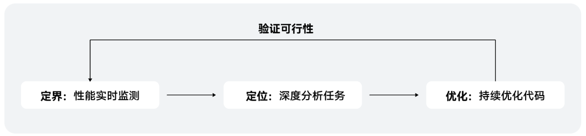

# 性能优化过程简介

更新时间：2026-04-30 02:42:31

来源：https://developer.huawei.com/consumer/cn/doc/harmonyos-guides/ide-profiler-process

在开发应用时，开发者会对应用的运行情况有一个预期的指标，当应用在某些方面不能满足预期的指标或者表现不佳时，意味着您的应用可能存在性能问题，需要对应用进行性能优化以达到您的预期。应用的性能优化是一个不断持续的周期性的过程，您需要在应用开发过程中观察应用的运行表现来识别性能瓶颈，通过运行时数据定位性能问题，定位根因后修复代码并验证优化措施的可行性，循环往复直到应用满足您的性能指标。

 DevEco Profiler也遵循以上流程，在使用DevEco Profiler进行性能优化时，您可以参考以下过程：

1. 通过实时监控（Realtime Monitor）检测各项资源使用情况，识别并定界潜在的性能瓶颈及热点区域，例如CPU占用超过预期、内存异常增大等；
2. 通过深度录制，详细分析应用运行时数据，例如函数调用、内存对象等信息，来分析并定位性能问题出现的根因；
3. 根据性能分析的结果优化代码；
4. 再次使用“Realtime Monitor”查看各项资源的使用情况是否符合预期，来验证代码修改的可行性。

 
