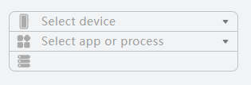
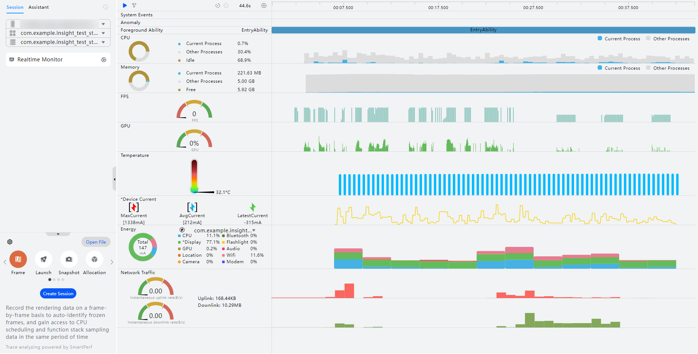
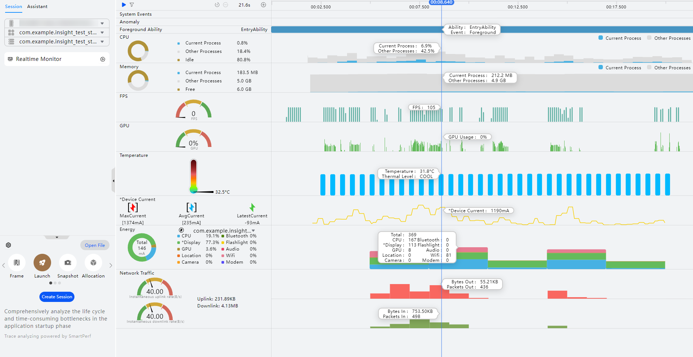

# 性能问题定界：实时监控

更新时间：2026-04-30 02:42:31

来源：https://developer.huawei.com/consumer/cn/doc/harmonyos-guides/realtime-monitor

解决性能问题，首先对当前应用的运行情况以及设备的资源消耗进行监测，以初步确定可能存在的性能问题以及问题出现的位置。
 
DevEco Profiler提供实时监控（Realtime Monitor）能力，可以实时监控系统事件、异常事件、CPU占用、内存占用、实时帧率、GPU使用率、温度、电流、能耗以及网络流量消耗等多维度数据，帮助开发者了解到当前应用具体运行情况和可能出现性能问题的热点区域。
 

##### 配置并确认设备环境

为了能够正确地监测您的设备资源，首先您需要使用USB或无线调试连接方式完成设备连接，然后通过DevEco Studio将您开发的应用安装到设备上。随后您可以通过如下步骤来查看应用的实时资源使用情况。
 1. [使用USB连接方式](https://developer.huawei.com/consumer/cn/doc/harmonyos-guides/ide-run-device#section171436512424)或[使用无线连接方式](https://developer.huawei.com/consumer/cn/doc/harmonyos-guides/ide-run-device#section9315596477)，将真机设备与PC连接。无线方式从DevEco Studio 6.1.0 Beta1开始支持。
2. 可以通过如下三种方式打开DevEco Profiler：

  
- 在DevEco Studio顶部菜单栏中选择“View > Tool Windows > Profiler”。

3. 在DevEco Studio底部工具栏中单击“Profiler”。

4. 使用“Ctrl+Shift+A”（macOS中为双击“Shift”）打开搜索功能，搜索“Profiler”。

5. 在设备上启动您想要监测的应用。

6. 在DevEco Profiler界面左上角选择调优设备、应用、进程。如果您的应用不止有一个主进程（还存在Extension或者Render进程），那么您需要再手动选择一个您想要监控的进程。

  

  

  ##### 实时监控应用，多维度对比识别性能热区

  在实时监控界面，设备各项资源的使用情况均以泳道图的形式在时间维度展示，提供系统事件、CPU占用等多维度信息，帮助您识别性能热区。

  

  ##### 面板整体介绍

  
界面左侧为实时数据展示区域，该区域的数据显示了每一项监测内容的瞬时值，并通过饼图或者仪表盘的形式让您更加直观地观察到各项数据的使用占比以及具体数值。
- 界面右侧为各项数据随着时间推移的变化趋势，通过不同的图像形式（直方图、柱状图、折线图等）来更加清晰的展示某一项资源在一段时间范围内的变化趋势，以帮助您快速判断性能热点区域。

 
整个实时监控页面从上到下，依次展示了系统事件、异常事件、前台应用、CPU占用、内存占用、帧率、GPU使用率、温度、电流、能耗以及网络流量消耗等各个维度的数据，帮助您从多个维度来对比识别当前应用的性能热区。下面为您依次介绍每一条泳道的数据内容。
 

 
 

##### 泳道简介
1. System Events泳道：该泳道展示了时间窗内系统事件的起始、终止等状态的统计情况。泳道内存在三种形状的标识：
- 菱形：表示事件开始。

2. 正方形：表示事件结束。

3. 圆形：表示当前时间点事件，无持续时间。

4. Anomaly泳道：用于展示设备侧上报的各种异常事件。

1. Foreground Ability泳道：用于展示应用/元服务的Ability状态。当Ability在前台运行时，会在此时间段内显示该Ability的名称；若当前无前台运行的Ability，则此时间段内显示“Background”。

2. CPU泳道：左侧饼图展示了当前时刻应用/元服务的CPU使用率、其他进程的CPU使用率以及空闲情况。右侧的泳道图则展示了时间窗内的整体CPU使用情况，其中灰色的部分代表系统中其他进程的CPU占用，蓝色部分则展示了当前应用/元服务的CPU占用情况。

1. Memory泳道：左侧饼图展示了当前时刻应用/元服务的内存占用、其他进程的内存占用以及未使用的内存。右侧的泳道图则展示了时间窗内的整体内存使用情况，其中灰色的部分代表系统中其他进程的内存占用，蓝色部分则展示了当前应用/元服务的内存占用情况。
Current Process：当前时刻应用/元服务的内存占用。

2. Other Processes：其他进程的内存占用。在5.1 Release版本之前，cached缓存空间（内存会被系统自动回收）占用的内存被计入Other Processes内存中。

3. Free：未使用的内存。在5.1 Release版本及以后，cached缓存空间占用的内存被计入Free内存中。
> [!NOTE]
> 当前应用内存展示的是应用的PSS值，如需内存详细信息请参考 基础内存：Allocation分析 。此处的PSS值比hidumper略大，原因是hidumper计算过程中会执行取整操作，计算值偏小。

4. FPS泳道：左侧仪表盘展示了当前设备屏幕的帧率瞬时值，红色、黄色、绿色区域则代表当前屏幕帧率是否达到理想状态。右侧柱状图则展示了每一次采集设备帧率时的数值。该泳道仅支持在配备硬件屏幕的设备上进行数据采集。

1. GPU泳道：左侧仪表盘展示了当前设备GPU使用率的瞬时值，右侧泳道则展示了时间窗内的整体GPU使用率。

2. Temperature泳道：左侧温度计显示了当前设备温度信息，右侧泳道的数据采集周期为3秒，展示了时间窗内的设备温度信息以及温度等级。该泳道暂不支持在TV/2in1/Car设备上进行应用性能分析。

1. *Device Current泳道：左侧展示了当前设备最大电流、平均电流以及最新的电流值，右侧泳道则展示了时间窗内的设备电流信息。该泳道统计电池的电流会由于充放电导致电流为非准确的消耗值，使用*Device Current进行区分，若需要准确的消耗电流，可以在设备侧打开"关闭充电"，操作方式为**设置 > 系统 > 开发者选项**。该泳道暂不支持在TV设备上进行应用性能分析。

2. Energy泳道：该泳道包含了各项部件（包括CPU、*Display、GPU、Location、Camera、Bluetooth、Flashlight、Audio、Wifi、Modem）的周期内平均功耗占比。通过图例上方的下拉多选框则可以勾选您想要监控的功耗使用情况的应用，选择多个应用后，该泳道会展示所有您所选择应用的功耗总和。右侧区域柱状图则展示了时间窗内各部件资源的实时使用情况，柱状图的颜色代表每种部件的功耗占比。Display指标只能测量不同亮度的屏幕电流，无法精确测量不同明暗色的显示电流，为提示开发者，使用*Display来突出该差异。该泳道暂不支持在TV设备上进行应用性能分析。暂不支持展示Wearable设备GPU、Location、Camera、Flashlight的功耗占比情况。2in1设备暂不支持展示Location的功耗占比情况。

1. Network Traffic泳道：左侧区域内仪表盘展示了当前设备网络上行瞬时速率和下行瞬时速率，仪表盘右边展示了时间窗内上行总流量和下行总流量。右侧泳道柱状图则展示了时间窗内网络流量消耗的实时情况。

  
> [!NOTE]
> FPS、GPU、Temperature、*Device Current泳道显示的是所使用设备的实时信息，而非当前调优应用/元服务的信息。

  

  ##### 实时监控页面的常用操作交互方式

  实时监控页面除了展示各个维度数据的瞬时值以及时间窗内的变化趋势之外，还提供了多种交互方式以供您更加便捷、快速、细致地分析您的数据。

  
启停控制点击会话区“Realtime Monitor”页签上的

、

按钮或工具控制栏上的 

、

来即时控制实时监控界面的录制状态。
- 泳道筛选点击工具控制栏上的

按钮，可以选择泳道进行筛选。筛选无需录制的泳道，可以降低数据采集本身的开销，但同时会造成数据分析维度的减少。
- 详细数据展示将鼠标悬浮于所关心的泳道数据上时，界面上会出现当前时间点的时间标线以及含有当前时间点上泳道详细数据的Tooltips。更进一步，当您将鼠标悬浮于时间轴上时，实时监控页面内的所有泳道均会以Tooltips展示出该时刻的数据。

  

 
- 图例选择实时监控界面部分泳道内的图例均支持选择/反选来增加/去除泳道内这一数据的展示，能够更加专注地分析所关心的数据。

 
通过分析实时监控的多维度数据，可以了解到当前应用的具体运行情况以及可能出现性能问题的热点区域。通过深度录制详细的应用运行数据来更加详细地分析应用可能存在的性能问题。
