# 案例：ArkTS内存泄漏分析

更新时间：2026-07-28 12:07:32

来源：https://developer.huawei.com/consumer/cn/doc/harmonyos-guides/ide-arkts-memory-leak-analysis

本案例介绍如何判断应用存在ArkTS内存泄漏，以及如何通过快照对比找出ArkTS内存泄漏的原因。
 

#### 初步识别内存问题
1. 使用[实时监控功能](https://developer.huawei.com/consumer/cn/doc/harmonyos-guides/realtime-monitor)对应用的内存资源进行监控。正常操作应用，观察运行过程中Memory泳道的变化。

  当在一段时间内应用内存没有明显增加或者在内存上涨后又逐渐回落至正常水平，则基本可以排除应用存在内存问题；反之，在一段时间内不断上涨且无回落或者内存占用明显增长超出预期，那么则可初步判断应用可能存在内存问题。

  
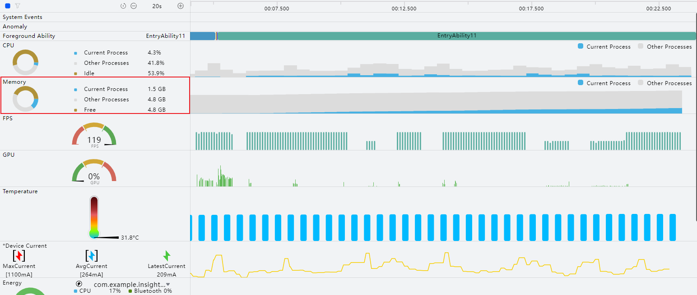

2. 当从实时监控页面初步判断应用可能存在内存问题后，通过[深度录制](https://developer.huawei.com/consumer/cn/doc/harmonyos-guides/deep-recording)抓取应用内存在问题场景下的详细数据，初步定界问题出现的位置。Memory泳道存在Allocation或Snapshot模板中，使用Allocation或Snapshot模板录制均可。
3. 以Allocation模板为例，创建模板后，将模板中的其余泳道去除勾选，仅录制Memory泳道的数据。

  
> [!NOTE]
> 其余泳道会抓取内存分配、内存对象等数据，为避免额外开销和影响分析，建议先排除录制。


  
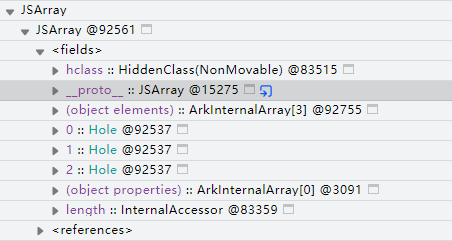

4. 点击三角按钮
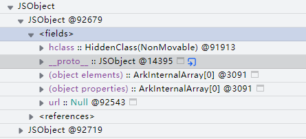
即开始录制。
5. 录制过程中，不断操作应用在问题场景的功能，将问题放大，便于快速定界问题点。
6. 点击下图中方块按钮或者左侧停止按钮结束录制。

  
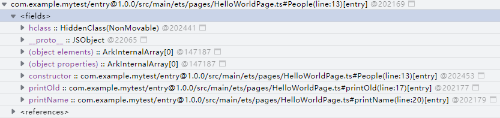

7. 录制完成后，展开Memory泳道，其中ArkTS Heap表示方舟虚拟机内存，这部分内存受到方舟虚拟机的管控。当ArkTS Heap有明显的上涨，说明在方舟虚拟机内的堆内存上可能存在内存泄漏，可以使用Snapshot模板进行下一步分析。

  
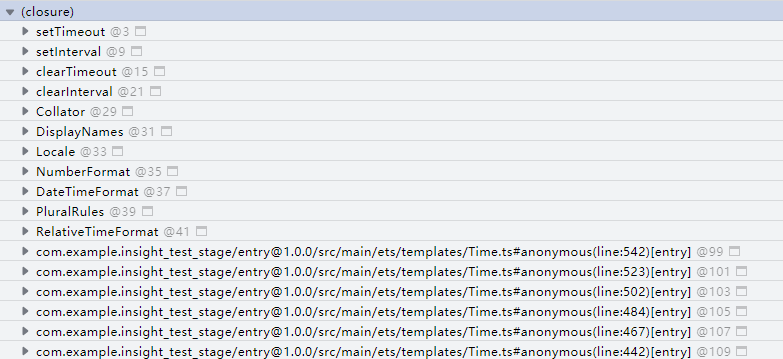

 
 

#### 使用Snapshot模板分析ArkTS内存问题

分析内存泄漏问题步骤如下：
 1. 使用Snapshot模板录制数据；
2. 在问题场景前拍摄快照；
3. 触发问题场景后，再次拍摄快照；
4. 对比两次快照的数据，可快速找到泄漏对象并做进一步分析；
5. 当有多个对象在比较视图都存在时，可以重复多次触发问题场景后拍摄快照，分别和问题场景前拍摄的快照进行对比，观察是否有对象出现明显的线性变化趋势，进一步缩小泄漏对象的范围。
 
 

#### 录制模板数据

1. 连接设备后启动应用，点击应用选择框选择需要录制的应用，选择**Snapshot**模板，点击Create Session或双击Snapshot图标即可创建一个Snapshot的录制模板。
2. 创建模板后，点击三角按钮即开始录制。

  
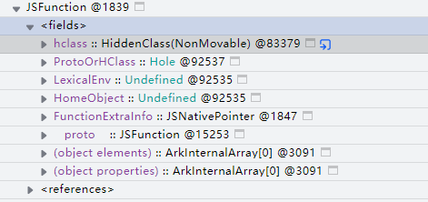

3. 待右侧泳道全部显示recording后则表明正在录制中。

  
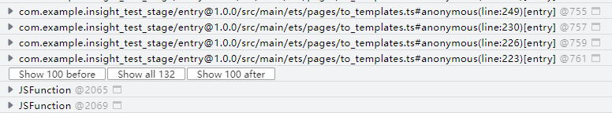

4. 拍摄第一次堆快照作为基准（点击图中①处拍摄按钮，待②处显示出紫色条块表示快照拍摄完成）。

  
> [!NOTE]
> 方舟虚拟机提供了在获取快照前自动GC（Garbage Collection，对堆内存进行垃圾回收）的能力，因此拍摄快照之前不用主动触发GC。


  
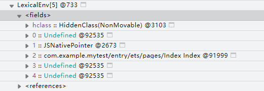

5. 多次触发内存泄漏操作。可以操作5，7，11等这种特殊的次数。比如操作了5次对比两个快照发现有很多创建了5次没释放的场景，则可能存在内存泄漏，再操作7次，如果创建了7次那就可以确认发生了泄漏。
6. 拍摄第二次堆快照。
7. 点击下图中方块按钮或者左侧停止按钮结束录制。

  


 

#### 分析ArkTS Heap

1. 在每次拍摄堆快照之前，虚拟机都会触发GC，所以理论上堆快照内存在的对象都是当前虚拟机已经无法GC掉的对象。我们可以将两个堆快照进行比较，来查看哪些对象是在触发问题场景时新增了且不能释放的。切换到窗口下方详情区域的**Comparison**区域，将两次快照进行对比。图中数据的含义是以Snapshot2作为基准，Snapshot2对比Snapshot1的数据变化量。

  
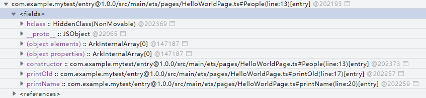

2. 优先寻找与触发内存泄漏操作次数强相关、与业务代码强相关的Constructor，首先来分析这些对象是否正常。主要是按照Distance逐渐减小的方式找引用链，可以从references里面一层层去寻找，排查引用链上的可疑对象（一般指与业务代码关联的对象）。

  
> [!NOTE]
> 选择一个实例节点，系统会计算从GC Roots到选定对象的最短路径，并在右侧Shortest Paths页签实时切换和展示。

 

#### 分析Snapshot数据

 

#### 常见对象介绍

**JSArray**
 
目前所有JSArray展开后为数组里的各个元素：
 

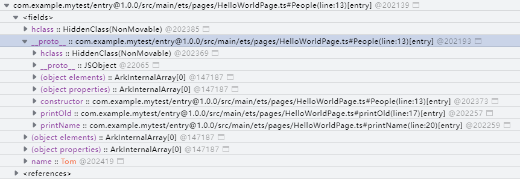

 
其中__proto__：原型对象，所有数组的__proto__应该是一致的；length：内置属性访问器，可以访问数组长度。
 
**TaggedDict**
 
位于（array）标签中，一般为虚拟机内部创建的字典，ArkTS代码层面不可见。
 
**TaggedArray**
 
位于（array）标签中，一般为虚拟机内部创建的数组，ArkTS代码层面不可见。
 
**COWArray**
 
位于（array）标签中，一般为虚拟机内部创建的数组，ArkTS代码层面不可见。
 
**JSObject**
 
JSObject展开后为内部的各个属性如下：
 

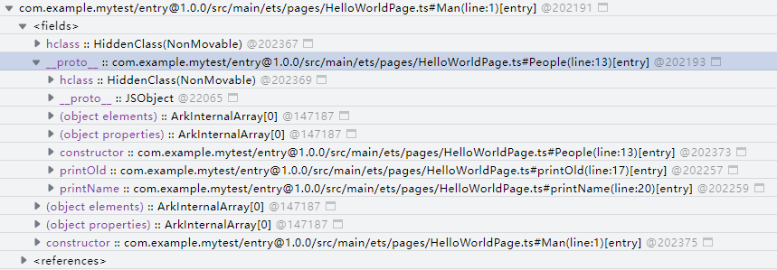

 
以下通过具体代码来介绍下实例化对象、声明对象、构造函数间的关系：
 
```ArkTS
// HelloWorldPage.ets
class People {
  old: number
  name: string
  constructor(old: number, name: string) {
    this.old = old;
    this.name = name;
  }
  printOld() {
    console.log("old = ", this.old);
  }
  printName() {
    console.log("name = ", this.name);
  }
}

@Entry
@Component
struct HelloWorldPage {
  @State message: string = 'Hello World';
  private people: People = new People(20, "Tom");

  build() {
    Row() {
      Column() {
        Text(this.message)
          .fontSize(50)
          .fontWeight(FontWeight.Bold)
      }
      .width('100%')
    }
    .height('100%')
  }
}
```
 
采集到的snapshot数据如下：
 

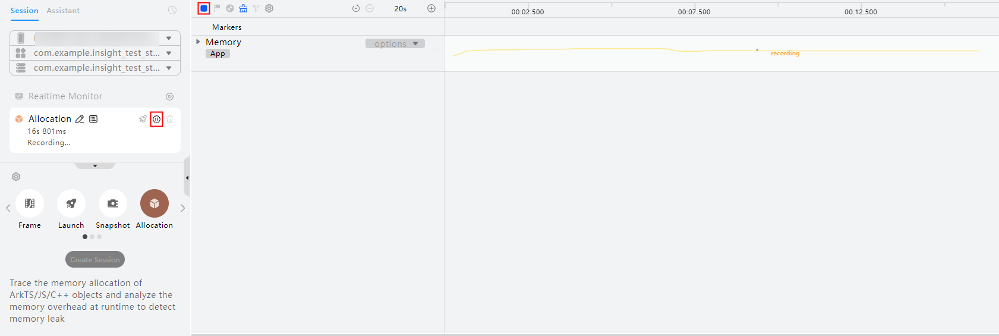

 
202169对象对应的是People，其主要声明了对象的属性和方法。
 
实例化对象的__proto__属性指向声明时的对象，声明对象里则会有constructor构造函数。当实例化多个对象时，实例化对象会有多个，但是声明对象和构造函数只有一个。
 
**JSFunction**
 
目前所有JSFunction都在（closure）标签中，展开即可看到所有JSFunction：
 

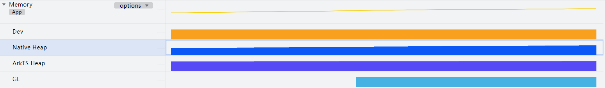

 
每个函数展开后为函数内的各个属性：
 

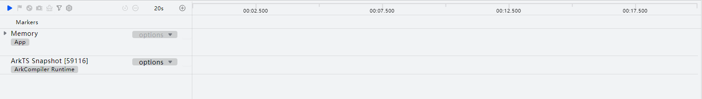

 
其中HomeObject表示父类对象，即该方法属于哪个对象；_proto_表示原型对象；LexicalEnv表示该函数的闭包上下文；name是内置属性访问器，可获取函数名；FunctionExtraInfo表示额外信息，比如一些napi接口会在这里记录函数地址；ProtoOrHClass表示原型或者隐藏类。
 
如果函数显示为anonymous()，则表示为匿名函数；如果函数显示为JSFunction()，则表示该函数可能为框架层函数，创建函数的时候未设置函数名。对于这两种函数名不可见的情况，可以通过查看其引用来间接确认其名称：
 

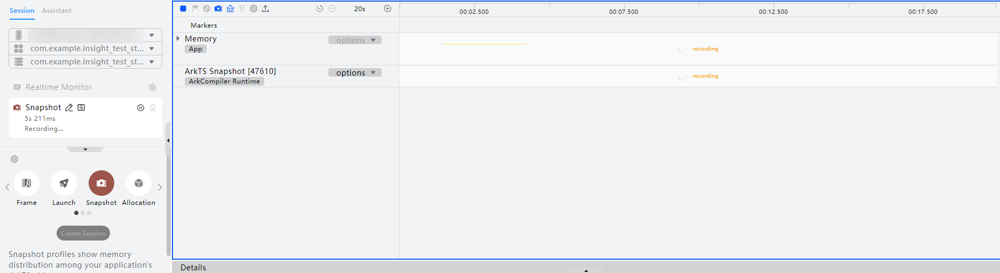

 
**ArkInternalConstantPool**
 
虚拟机创建的常量池，ArkTS代码层面不可见，涉及到的字符串常量会在（array）标签中展示：
 

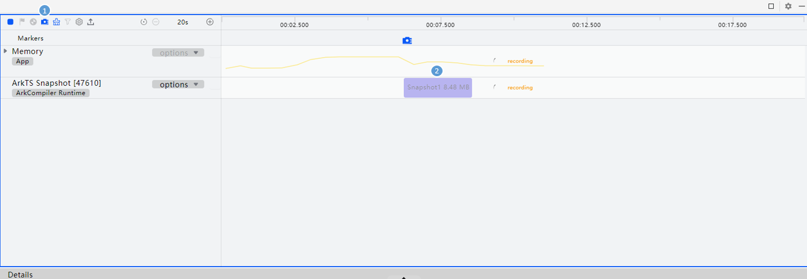

 
**LexicalEnv**
 
闭包变量上下文；闭包是一个链状结构，如下所示：
 

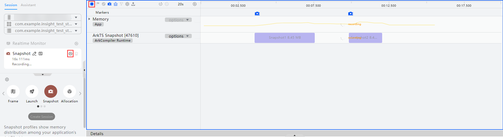

 
733这个节点本身是一个闭包数组，其中0号元素是调用者（或者再往上的调用者，以此类推）的闭包；1号元素存储的是调试信息；2号及以后的元素存储的就是闭包传递的变量，上例传递了一个变量。
 
**InternalAccessor**
 
内置属性访问器，会有getter和setter方法，通过getter、setter可以获取、设置该属性。
 
**LocalHandleRoot**
 
DevEco Studio 6.1.0 Release版本新增，位于（handle）标签中，用于管理JS对象生命周期的引用句柄（napi_value）。
 

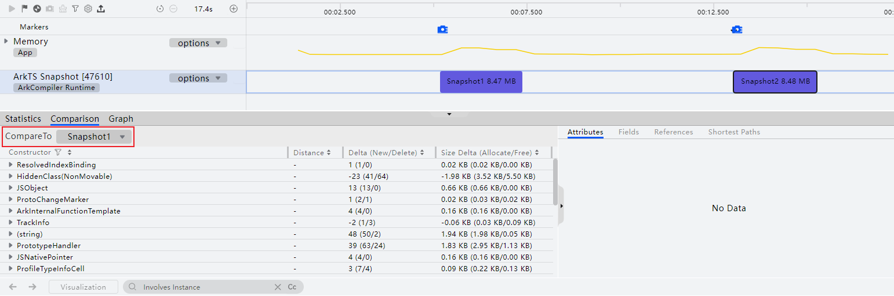

 
**GlobalHandleRoot**
 
DevEco Studio 6.1.0 Release版本新增，位于（handle）标签中，允许用户管理ArkTS/JS值的生命周期的引用句柄（napi_ref），默认情况下不记录napi_ref地址。
 
**GlobalHandleObject**
 
26.0.0 Beta2版本新增，位于（handle）标签中，用于记录napi_ref地址，并建立napi_ref和ArkTS对象的引用关系。该功能需要先调用[@util.ArkTSVM.setTrackGlobalRef](https://developer.huawei.com/consumer/cn/doc/harmonyos-references/js-apis-util#settrackglobalref)接口使能 ，使能后会在快照导出过程中记录napi_ref地址和引用关系。开发者可根据快照中napi_ref相关信息，分析跨语言导致的内存泄漏。
 
如下图，ReferenceAddress:0x5b0b560160是napi_ref地址，子节点是napi_ref关联的ArkTS对象。
 


 
> [!NOTE]
> GlobalHandleObject中记录了存在napi_ref的ArkTS对象，对象是GlobalHandleRoot对象子集。

 
**VMRoot**
 
26.0.0 Beta1版本新增，位于（handle）标签中，表示虚拟机层面的根节点。
 
**FrameRoot**
 
26.0.0 Beta1版本新增，位于（handle）标签中，表示函数调用栈帧在GC遍历过程中的根节点。
 
**SourceTextModule**
 
SourceTextModule为虚拟机创建的对象，当应用使用export暴露对象后会被SourceTextModule对象持有。
 
属性EcmaModuleRecordName表示export对象所在的文件名，属性EcmaModuleFileName表示export对象文件所在的abc文件名，这两个属性名在26.0.0 Beta1版本新增。如果快照用TRIM_LEVEL_2级别裁剪生成的.rawheap文件转换成的.heapsnapshot文件则不显示这两个属性名。
 
**Proxy-&lt;对象实例名称&gt;**
 
26.0.0 Beta1版本新增，被@Observed装饰的class实例，或被状态管理V1装饰器（如@State）装饰的对象实例，系统会自动在Proxy后带上对象实例名称。
 
> [!NOTE]
> 若开启进程级堆快照转储以后，是由子线程触发的进程级堆快照转储将不会展示对象实例名称。

 
 

#### 常见属性介绍
 
| 属性 | 含义 |
| --- | --- |
| __proto__ | 原型对象 |
| (object elements) | 对象元素 |
| (object properties) | 对象属性 |
| hclass | 隐藏类 |
| ArkInternalHash | ArkTS运行时内部的哈希值 |
| ProtoOrHClass | 原型或隐藏类指针 |
| RawProfileTypeInfo | 运行时类型剖析信息 |
| HomeObject | 父类对象 |
| FunctionKind | 函数类型标识 |
| FunctionExtraInfo | 函数附加信息 |
| prototype | 构造函数或类对象关联的原型对象 |
| Inlineproperty | 内联属性 |
 
 
 

#### 分析方法

**查看对象名称**
 
对于声明对象，可以通过constructor属性来确定对象名称。
 


 
对于实例化对象，一般没有constructor，则需要展开__proto__属性后查找constructor；
 


 
若对象里有一些标志性属性，可以通过在代码里搜索属性名称来找到具体是哪个对象。
 
如果对象间有继承关系，则可以继续展开__proto__：
 


 
如上图则表明Man对象继承自People对象。
