# 案例：应用冷启动首帧完成时延问题分析

更新时间：2026-04-30 02:42:31

来源：https://developer.huawei.com/consumer/cn/doc/harmonyos-guides/ide-profiler-launch-case

应用冷启动首帧完成时延是指从用户点击桌面应用图标离手开始，到应用进程首帧绘制结束的时间。本案例介绍如何找到应用冷启动首帧完成时延起止点，以及如何通过调用栈和trace信息分析应用运行逻辑，定位应用冷启动首帧完成时延超预期的原因。

 应用冷启动分析基础功能请参考[Launch模板基本操作](https://developer.huawei.com/consumer/cn/doc/harmonyos-guides/ide-insight-session-launch)。

## 分析步骤

 分析冷启动首帧完成时延类问题步骤如下： 确认应用冷启动首帧完成时延起止点。框选应用冷启动首帧完成时延起止点位置，查看耗时是否超预期。若超过预期，根据调用栈和trace信息进一步确认问题点。

## 录制Launch模板数据

连接设备后，点击应用选择框选择需要录制的应用，选择**Launch**模板，点击**Create Session**或双击Launch图标即可创建一个Launch的录制模板。创建模板后，点击

切换启动模式为

手动启动。在工具控制栏中点击齿轮图标

后勾选Hitrace > multimodalinput。用于采集多模子系统的trace信息，这部分信息会包含硬件传递过来的离屏信号，即多模子系统收到点击离手事件。
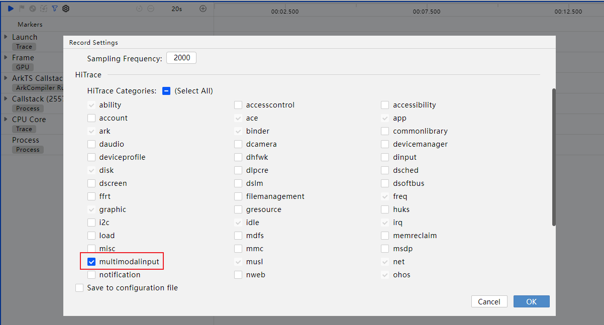
点击三角按钮

即开始录制。等待界面出现弹窗提示启动应用后，需要手动点击设备上的应用图标启动应用。
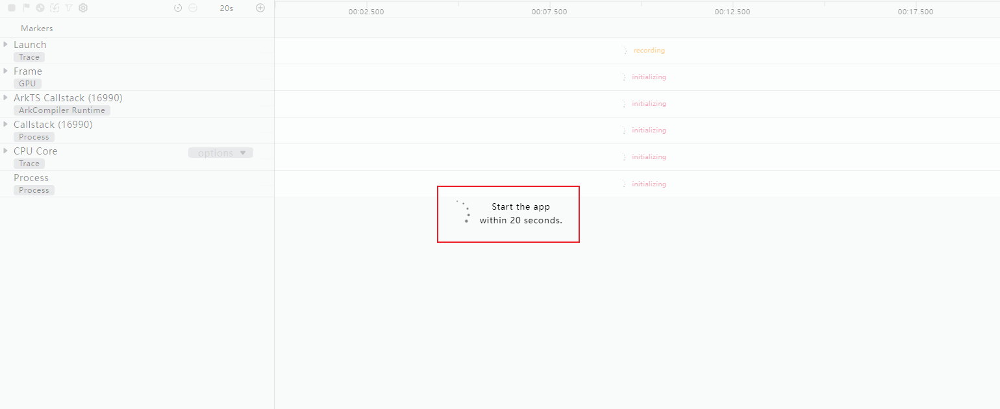
待右侧泳道全部显示recording则表明正在录制中，等待应用冷启动结束后可以点击下图中方块按钮或者左侧停止按钮结束录制。
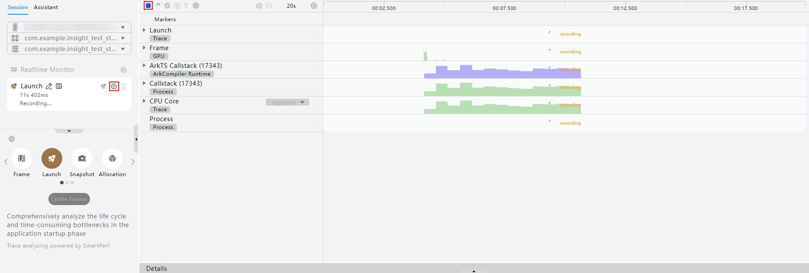

## 分析Launch数据

## 确认首帧完成时延起止点

**冷启动首帧完成时延起点确认：**  首帧完成时延起点是用户点击桌面应用图标离手的时刻，即多模子系统收到硬件传递过来的离屏信号的时刻。 由于离屏信号对应的trace点耗时较短且不方便记忆。因此，需要优先找到桌面进程收到点击离手事件的trace点（H:DispatchTouchEvent）来辅助定位首帧完成时延的起点位置。具体步骤如下： 找到桌面进程收到点击离手事件的trace点（H:DispatchTouchEvent）。在Profiler面板点击搜索框选项区选择**Search Unit Data**搜索泳道数据，在搜索框中输入H:DispatchTouchEvent后回车，通过点击

或者

按钮切换搜索结果，找到桌面进程泳道（ohos.sceneboard）中type=1（0：手指按下；1：手指抬起；2：滑动）的H:DispatchTouchEvent点并添加标记，为方便后续查找，可以通过双击标记，在弹出的标记属性框中修改标记描述为点击离手事件。该trace点就代表桌面进程收到点击离手事件。
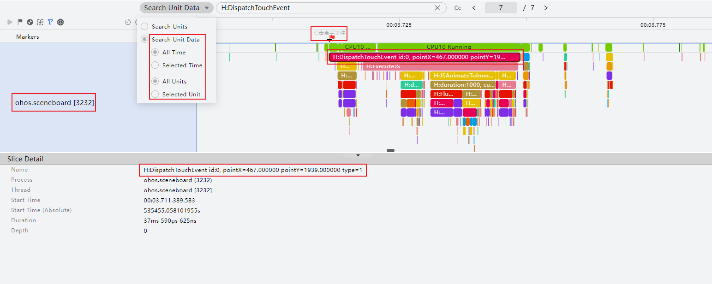
搜索多模子系统泳道（mmi_service）。点击搜索框选项区选择**Search Units搜索泳道**，在输入框中输入mmi_service后回车，该泳道可能有多条，需要通过点击

或者

按钮切换搜索结果，找到包含trace片段的mmi_service泳道。
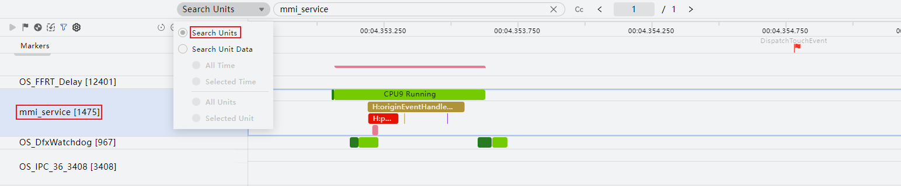
借助桌面进程收到点击离手事件trace点，继续定位多模子系统收到点击离手事件的trace点。在mmi_service泳道中找到位于点击离手事件标记位置前方的CPU Running条块（此段时间表示多模子系统正在运行），在该条块下方找到H:service report touchId:{id}, type: up（或H:service report pointerId:{id}, type: button-up）的trace点并添加标记，然后修改标记描述为首帧完成时延起点。该trace点代表的是多模子系统收到点击离手事件，即冷启动首帧完成时延的起点。
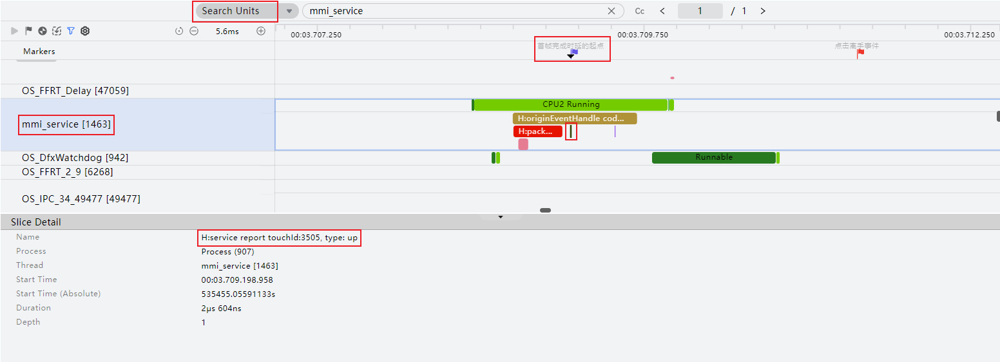
**冷启动****首帧完成****时延止点确认：** 首帧完成时延止点是应用进程启动后收到的首个硬件垂直同步信号的时间点，即Render Service（统一渲染服务进程）将应用首帧渲染结果呈现到屏幕上的结束点。定位首帧完成时延止点具体步骤如下： 找到应用进程启动后的首个垂直同步信号trace点H:ReceiveVsync，这个trace点代表应用的首帧开始绘制。选择应用进程子泳道，点击搜索框选项区选择**Search Unit Data**搜索泳道数据，在输入框中输入H:ReceiveVsync后回车，找到第一个H:ReceiveVsync点。
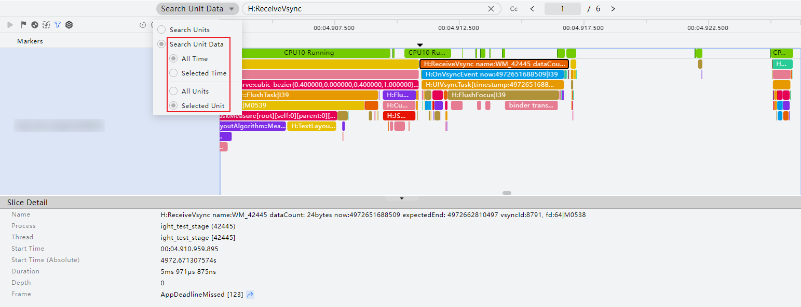
应用进程启动后收到首个垂直同步信号时，会通知Render Service进程进行图形渲染，因此需要优先找到应用进程通知Render Service进程进行图形渲染的三个trace（H:FlushMessages > H:SendCommands > H:MarshRSTransactionData）。由于这三个trace耗时较短，不便查看，因此需要使用搜索功能来确定。框选H:ReceiveVsync trace点，点击搜索框选项区选择**Search Units Data**搜索泳道数据，在输入框中输入FlushMessages后回车。
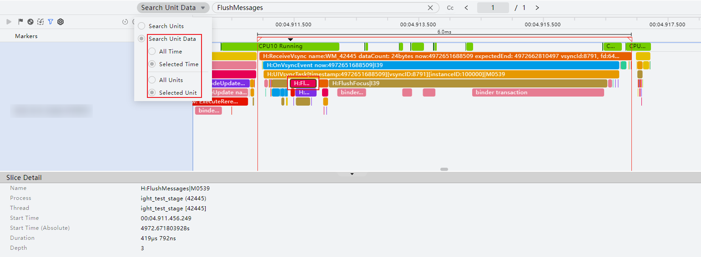
找到trace点H:FlushMessages（代表绘制消息） 后，继续在该trace点下方逐层分析，先找到trace点H:SendCommands（代表发送绘制指令给Render Service进程进行图形渲染），在下方再找到trace点H:MarshRSTransactionData（代表发送了绘制指令），这3个trace点就代表应用进程通知Render Service进程进行图形渲染的流程。
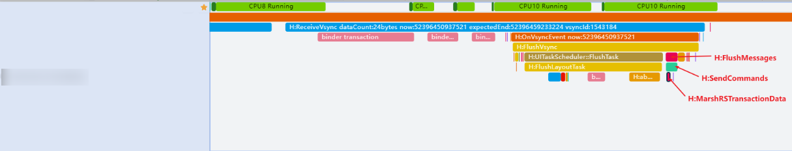
接着需要找Render Service进程收到应用进程首帧渲染通知的trace点，点击H:MarshRSTransactionData条块，“Slice Detail”区域可以查看该trace详情，包括trace名称、所属进程等。点击“Slice Detail”区域中Name后方跳转按钮

跳转到render_service泳道的H:RSMainThread::ProcessCommandUni trace点并添加标记，然后修改标记描述为收到渲染通知。该trace点就代表Render Service进程收到应用进程首帧渲染通知。
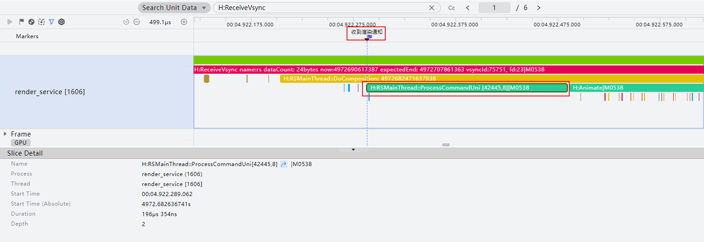
接着找到Render Service将应用首帧提交硬件上屏的trace点，该操作在Render Service送显线程（CompThread）中完成。点击搜索框选项区选择**Search Units**搜索泳道，在输入框中输入CompThread后回车，查找位于收到渲染通知标记位置后方的第一个H:CommitLayers并添加标记，然后修改标记描述为提交硬件上屏。该trace点代表Render Service将应用首帧提交硬件上屏。
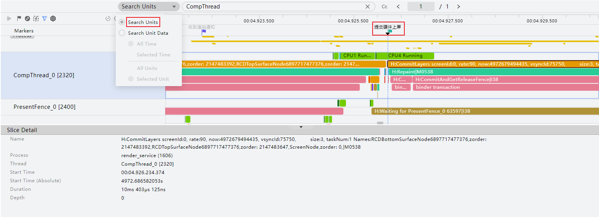
最后找到Render Service将应用首帧渲染结果呈现到屏幕上的trace点，该操作在PresentFence中完成。点击搜索框选项区选择**Search Units**搜索泳道，在输入框中输入PresentFence后回车，查找位于提交硬件上屏标记位置后方的第一个H:Waiting for PresentFence，该trace点代表Render Service将应用首帧渲染结果呈现到屏幕上，trace点的结束位置就是冷启动首帧完成时延的止点，在此处添加标记并修改标记描述为首帧完成时延止点。
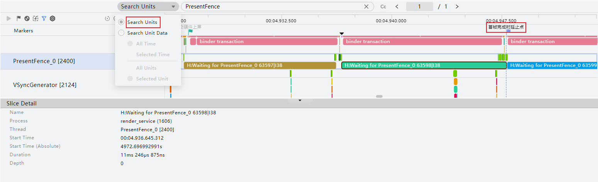

## 案例：应用首页加载耗时较长导致应用冷启动首帧完成时延不达标

> [!NOTE]
> 本案例基于应用进程启动过程中，在Ability的生命周期回调函数中做了耗时操作。预期冷启动首帧完成时延不超过600ms。

框选应用冷启动首帧完成时延起止点位置，通过框选区间的时间长度看出，冷启动首帧完成时延超过800ms，比预期的600ms长。 切换到应用进程Process泳道，查看主线程（线程号与进程号一致）的trace。
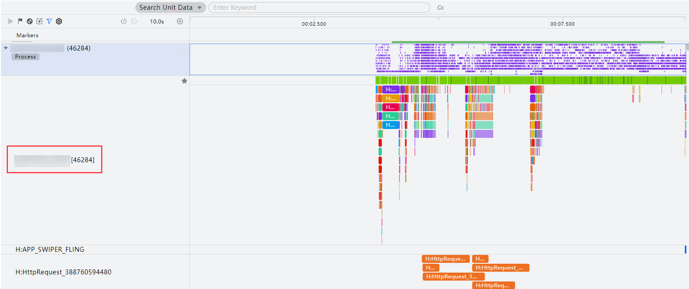
下方详情区展示Details信息，包括trace名称、起始时间、持续时长。将持续时间（Duration）降序排序，可以看到主要耗时在H:void OHOS::AbilityRuntime::UIAbilityThread::HandleAbilityTransaction，该阶段主要是AbilityStage/Ability的启动生命周期在执行相应的回调。从这里可以看出，是因为AbilityStage/Ability启动生命周期的回调执行时间较长。接下来需要分析调用栈，通过调用栈分析回调执行时间长的原因。
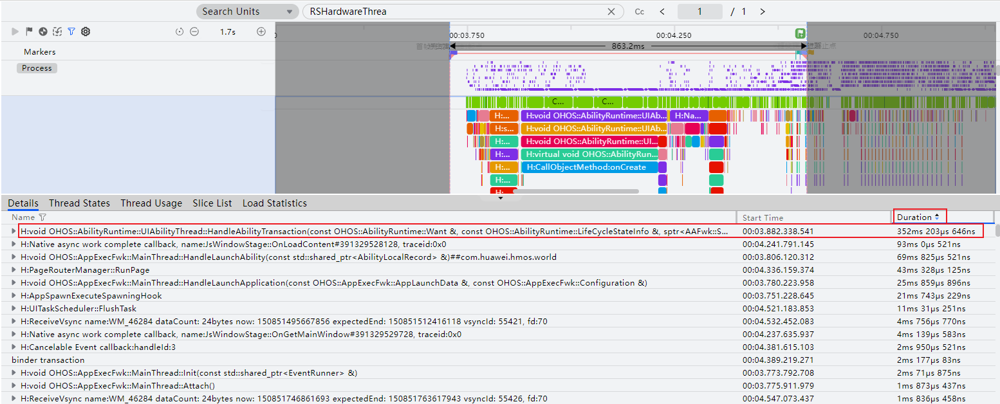
接着切换到ArkTS Callstack泳道分析ArkTS侧耗时函数。优先查看线程号与进程号一致的ArkVM子泳道（该泳道为主线程调用栈），可以看到ArkTS侧一些方法的耗时。从下图中可以看到ArkTS侧无函数执行，需要切换到Callstack泳道看ArkTS和Native混合函数调用栈。
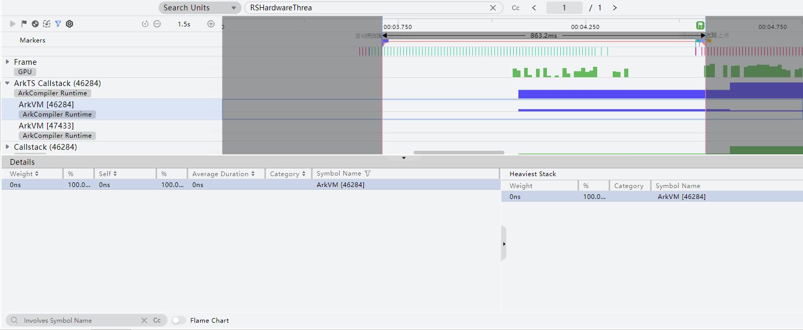
最后切换到Callstack泳道，查看Callstack泳道的主线程（线程号与进程号一致）子泳道，查看下方Heaviest Stack区域，滑动观察权重占比最大的函数调用栈，定位到耗时主要是EntryAbility.ets文件下第79行代码引起，双击该栈帧可以直接跳转到源码文件的对应位置上。
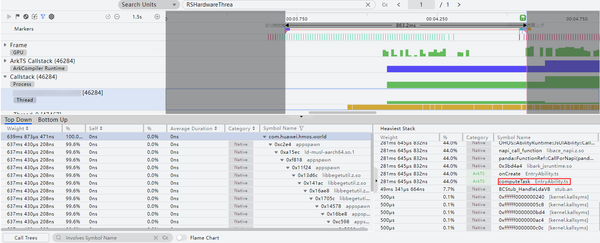
结合业务代码查看，可以看到是因为在EntryAbility.ets文件下onCreate()中做了耗时操作。耗时操作建议通过异步任务延迟处理或者放到其他线程执行，以降低主线程负载，缩短应用冷启动首帧完成时延。
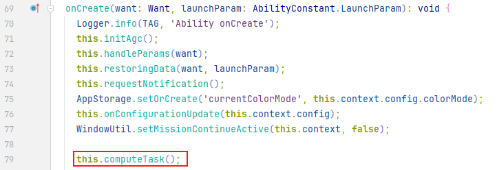
更多应用冷启动优化方案，请参考[应用冷启动时延优化](https://developer.huawei.com/consumer/cn/doc/best-practices/bpta-application-cold-start-optimization)。
