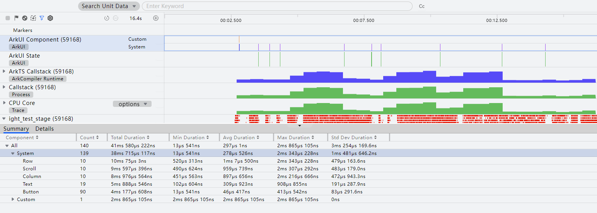
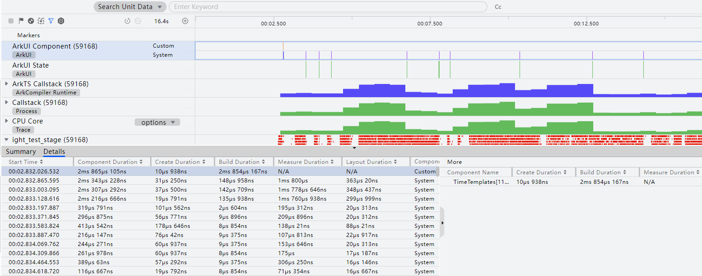
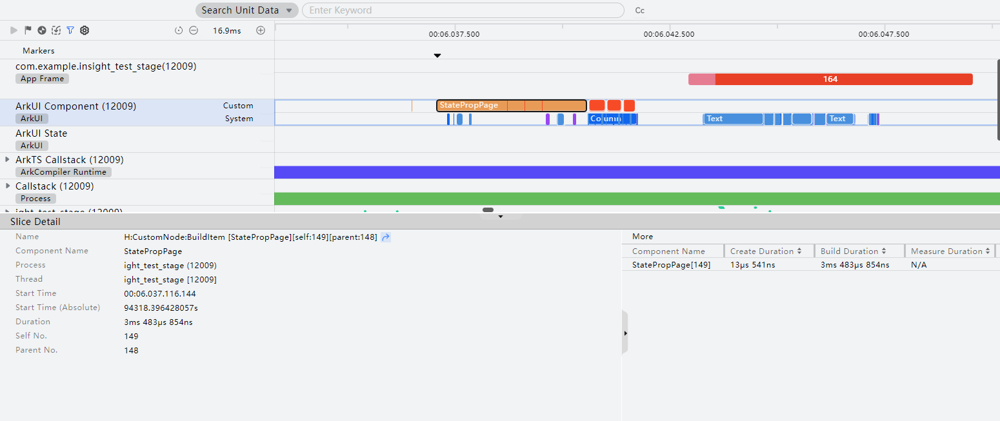
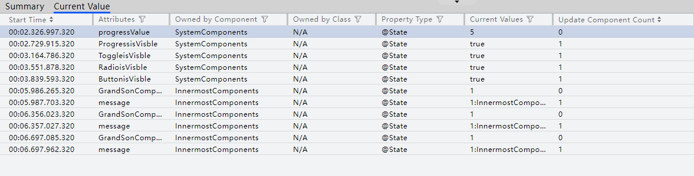
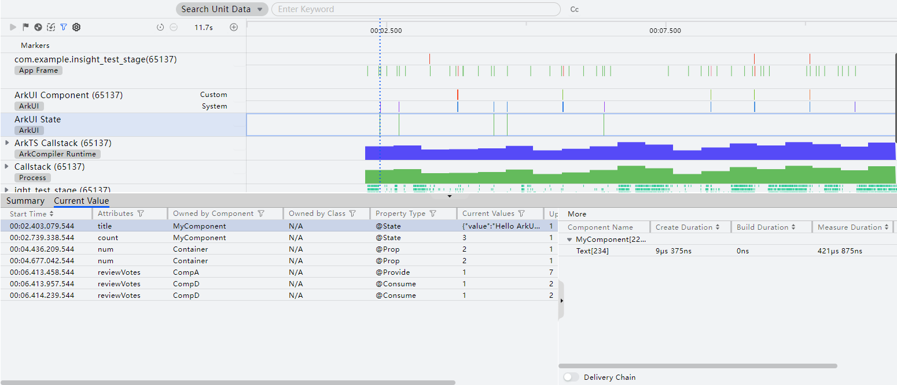
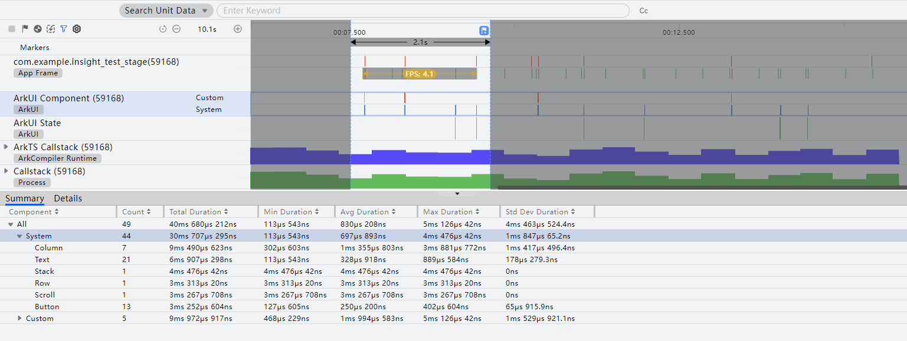

# ArkUI分析

更新时间：2026-03-11 08:49:31

来源：https://developer.huawei.com/consumer/cn/doc/harmonyos-guides/ide-arkui-analysis

ArkUI分析用于定位由于组件耗时、页面布局、状态变量更新导致的卡顿问题。常见场景包含：
 
场景1：布局嵌套过多引起的性能问题；
 
场景2：数据结构设计不合理，应用使用一个较大的Object，在更新时，只更新某些属性，导致其他没变化的属性也会更新，产生冗余刷新；
 
场景3：父组件中的子组件重复绑定同一个状态变量进行更新；
 
场景4：未正确使用装饰器，如错误使用@Prop传递一个大的对象进行深度拷贝。
 

##### ArkUI Component 泳道：查看组件绘制耗时

开发者通过ArkUI Component泳道可以直观感知组件绘制频率、耗时等统计情况。
 1. 在时间轴上拖拽鼠标选定要查看的时间段。
2. 详情区Summary列表给出录制时段内定制组件以及系统组件的绘制统计情况，包括绘制次数、总耗时、最小耗时、平均耗时、最大耗时、耗时标准差。

  

3. 详情区Details列表可以查看按照时间线排序的组件详情，同时more区域展示以该组件为根节点的组件树信息。

  

4. 点选ArkUI Component泳道中的条块，展示Slice Detail数据，Slice Detail中的Name支持跳转至对应Process子泳道并选中trace信息，同时more区域展示以该组件为根节点的组件树信息。

  

  
> [!NOTE]
> 由于隐私安全政策，已上架应用市场的应用不支持录制ArkUI Component泳道。

 
 

##### ArkUI State 泳道分析
1. 点击ArkUI模板创建session并启动录制，录制过程中触发组件刷新。
2. 录制结束等待处理数据完成。点击ArkUI State泳道，可在下方数据区查看录制过程中发生的状态变量变化。Summary区域可查看状态变量名称，变化次数，状态变量类型、所属组件和所属类。

  

  Current Value以时间顺序展示状态变量变化，Current Values列展示变化后的值。

  

3. 选择Current Value中某一个数据，泳道区域将以虚线展示其时间位置。同时，右侧More区域展示该状态变量影响的组件关联关系。打开页面下方的**Delivery Chain**开关，该状态变量影响的组件关联关系将以图形展示。

  

4. 定位到可能造成卡顿的状态变量变化时间点，框选对应时间段，选择ArkUI Component泳道查看对应组件刷新时间。

  

 
 
> [!NOTE]
> 如需查看其他泳道信息，请参考 Frame分析 。 由于隐私安全政策，已上架应用市场的应用不支持录制ArkUI State泳道。
