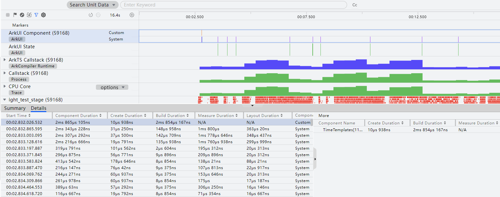
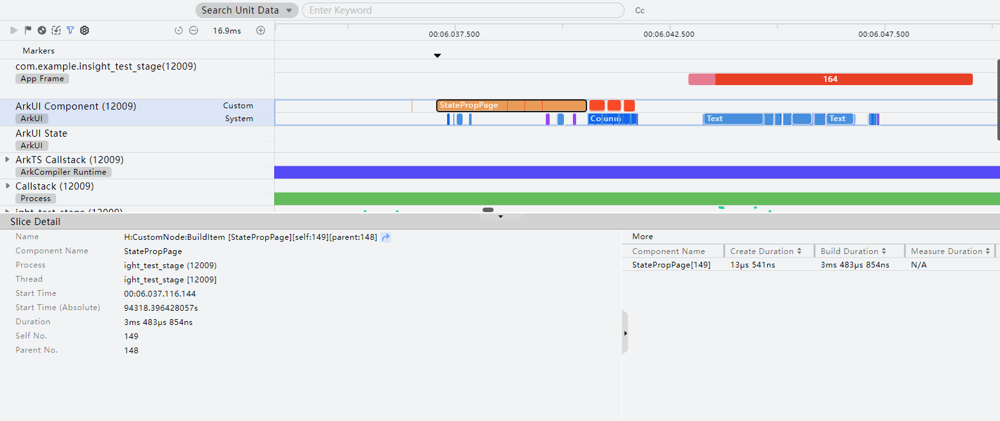
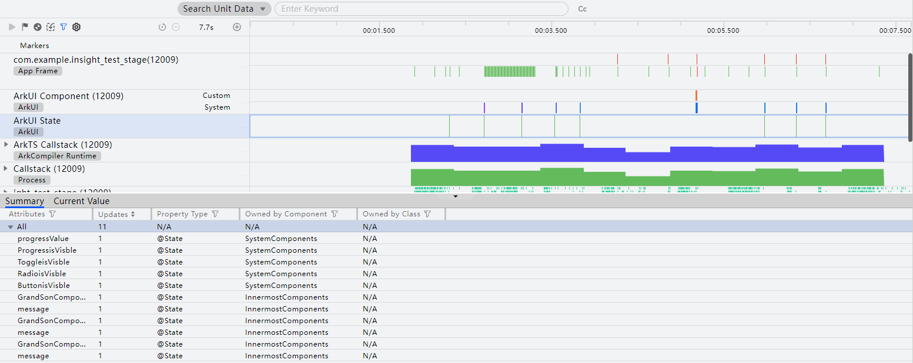
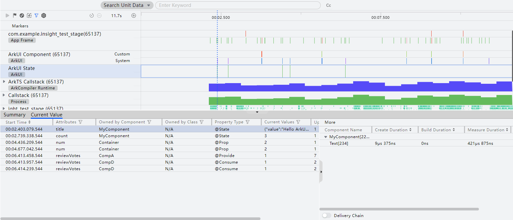
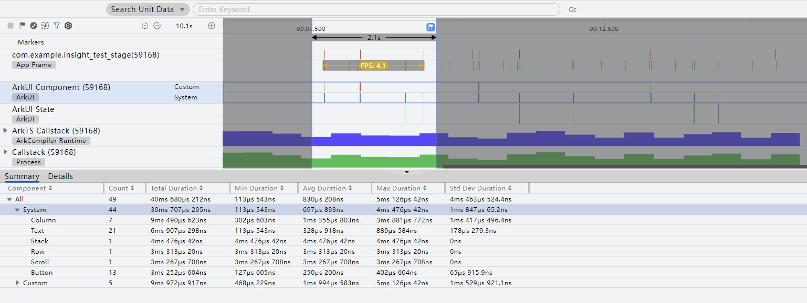

# ArkUI分析

更新时间：2026-06-12 06:54:33

来源：https://developer.huawei.com/consumer/cn/doc/harmonyos-guides/ide-arkui-analysis

#### 功能介绍

ArkUI模板用于定位由于组件耗时、页面布局、状态变量更新导致的卡顿问题。常见场景包含：布局嵌套过多引起的性能问题；数据结构设计不合理，应用使用一个较大的Object，在更新时，只更新某些属性，导致其他没变化的属性也会更新，产生冗余刷新；父组件中的子组件重复绑定同一个状态变量进行更新；未正确使用装饰器，如错误使用@Prop传递一个大的对象进行深度拷贝等。
 
ArkUI模板支持的泳道包括：APP Frame、ArkUI Component、ArkUI State、ArkTS Callstack、Callstack、CPU Core、Process。本文介绍ArkUI Component、ArkUI State泳道，其他泳道的详细信息请参考对应模板内容。
 
- APP Frame泳道的介绍请参考[Frame分析](https://developer.huawei.com/consumer/cn/doc/harmonyos-guides/ide-insight-session-frame)。
- ArkTS Callstack、Callstack泳道的介绍请参考[基础耗时：Time分析](https://developer.huawei.com/consumer/cn/doc/harmonyos-guides/ide-insight-session-time)。
- CPU Core、Process泳道的介绍请参考[CPU活动分析](https://developer.huawei.com/consumer/cn/doc/harmonyos-guides/ide-insight-session-cpu)。

 
> [!NOTE]
> 任务分析前，需创建ArkUI分析任务并录制相关数据，操作方法可参考 性能问题定位：深度录制 ，或在 会话区 选择 Open File ，导入历史数据。

 
 

#### 查看组件绘制耗时

开发者通过**ArkUI Component**泳道可以直观感知组件绘制频率、耗时等统计情况。
 1. 在时间轴上拖拽鼠标选定要查看的时间段。
2. **Summary**区域展示录制时段内自定义组件以及系统组件的绘制统计情况，包括绘制次数、总耗时、最小耗时、平均耗时、最大耗时、耗时标准差。

  

3. **Details**详情区域可以查看按照时间线排序的组件详情，同时**More**区域展示以该组件为根节点的组件树信息。

  

4. 点选ArkUI Component泳道中的条块，会打开**Slice Detail**区域，点击Slice Detail中的Name支持跳转至对应Process子泳道并选中trace信息，**More**区域展示以该组件为根节点的组件树信息。

  

  
> [!NOTE]
> 由于隐私安全政策，已上架应用市场的应用不支持录制ArkUI Component泳道。

 
 

#### 查看状态变量变化
1. 点击**ArkUI State**泳道，可在下方数据区查看录制过程中发生的状态变量变化。

  
**Summary**区域可查看状态变量名称、变化次数、状态变量类型、所属组件和所属类。

2. **Current Value**区域以时间顺序展示状态变量变化，**Current Values**列展示变化后的值。选择**Current Value**中某一个数据，泳道区域将以虚线展示其时间位置，右侧**More**区域展示该状态变量影响的组件关联关系。打开页面下方的**Delivery Chain**开关，该状态变量影响的组件关联关系将以图形展示。

3. 定位到可能造成卡顿的状态变量变化时间点，框选对应时间段，选择**ArkUI Component**泳道查看对应组件刷新时间。

  

 
 
> [!NOTE]
> 由于隐私安全政策，已上架应用市场的应用不支持录制ArkUI State泳道。
