# Frame分析

更新时间：2026-04-30 02:42:31

来源：https://developer.huawei.com/consumer/cn/doc/harmonyos-guides/ide-insight-session-frame

开发应用或元服务过程中，如果发现有表单滑动不顺畅、页面交互延迟、动效不流畅等卡顿现象时，可以使用DevEco Profiler提供的Frame场景分析能力，录制卡顿过程中的关键数据进行分析，从而识别出导致卡顿丢帧的原因。

此外，Frame任务窗口还集成了Time、CPU、Network场景分析任务的功能，方便开发者在分析丢帧数据时同步对比同一时段的其他资源占用情况。

> [!NOTE]
> 在任务分析窗口中，可通过 快捷键 缩放时间轴、移动时间轴、添加时间标签等。 Frame分析支持离线符号解析能力，请参见 离线符号解析 。 Frame分析支持Energy泳道，请参见 定位能耗问题 。

##### 查看GPU使用情况
1. 创建Frame分析任务并录制相关数据，操作方法可参考[性能问题定位：深度录制](https://developer.huawei.com/consumer/cn/doc/harmonyos-guides/deep-recording)，或在会话区选择**Open File**，导入历史数据。
2. “Frame”泳道显示当前设备的GPU的使用率，将其展开，子泳道显示Render Service侧帧数据和App侧帧数据。

  
> [!NOTE]
> 一帧的绘制，一般需要由App侧提交渲染到Render Service侧，然后Render Service侧再提交给硬件进行合成渲染，因此App侧的帧和Render Service侧的帧存在关联的情况。并且可能多个APP侧的帧/同一APP侧的多个帧提交到同一个Render Service侧帧上，出现帧之间的一对多的关联情况。 一帧绘制的期望耗时，与fps的大小有关，一般情况下fps为60，对应的Vsync周期为16.6ms，即App侧/Render Service侧的帧耗时，一般需要在16.6ms以内。App侧帧/Render Service侧帧判断卡顿的标准为帧的实际结束时间晚于帧的期望结束时间。 在“RS Frame”和“App Frame”标签的泳道中，正常完成渲染的帧显示为绿色，出现卡顿的帧显示为红色。 除“RS Frame”和“App Frame”泳道外的“ArkTS Callstack”、“Callstack”、“CPU Core”等泳道信息，请参考 基础耗时：Time分析 、 CPU活动分析 。

  
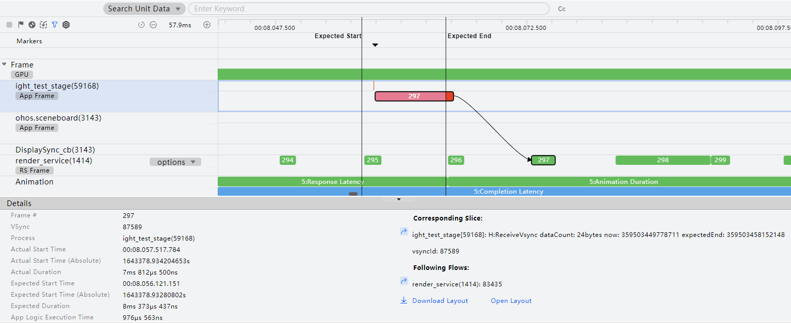

##### 查看指定时间段内所有进程的Frame数据统计信息
1. 在时间轴上拖拽鼠标选定要查看的时间段。
2. 框选Frame主泳道。

  窗口下方的“Statistics”区域中会以进程维度对选定时间段内的Frame信息进行统计，包括卡顿率、卡顿次数、最大连续卡顿次数、最大卡顿耗时、平均卡顿耗时以及平均正常耗时等。

  
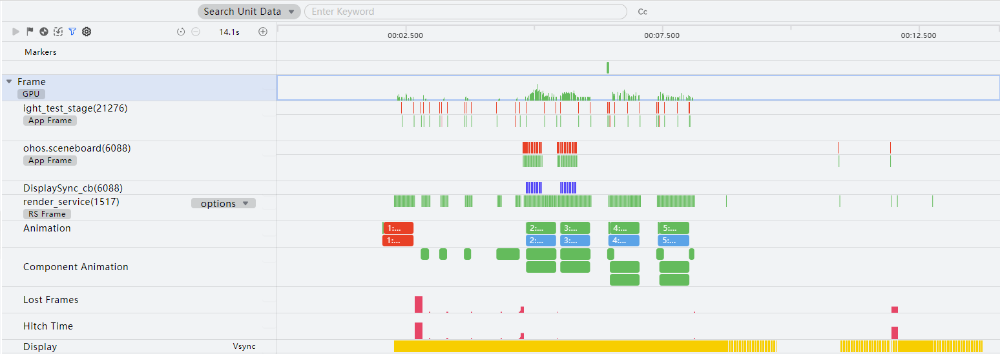

3. 点击“Statistics”列表中任一进程的跳转按钮，在“Frame List”区域将展现该进程对应的Frame列表。体现各帧的起始时间、总耗时、GPU耗时以及卡顿丢帧类型。

  
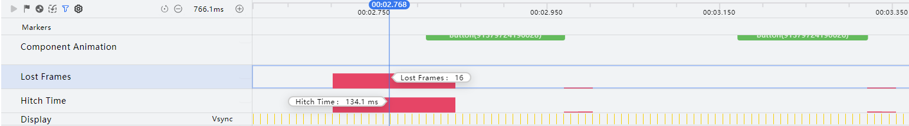

4. 单击“Frame List”列表中任意一帧，右侧的“More”区域会中显示该帧更多关键信息。在获取该帧的预期起始时间、预期持续时间之外，您可以单击
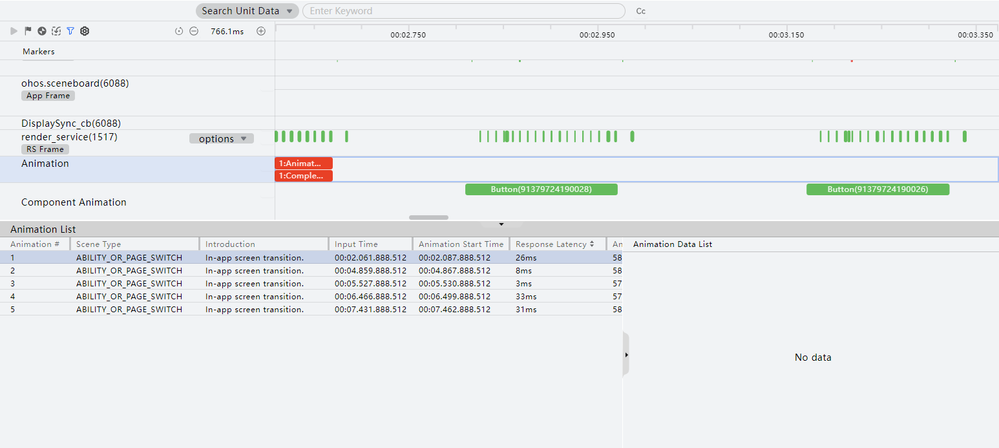
跳转至关联的切片。

##### 查看指定Frame页面布局信息

从DevEco Studio 5.1.0 Release版本开始，支持查看最新录制的Session中指定的Frame页面布局信息。

从DevEco Studio 6.1.0 Beta1版本开始，
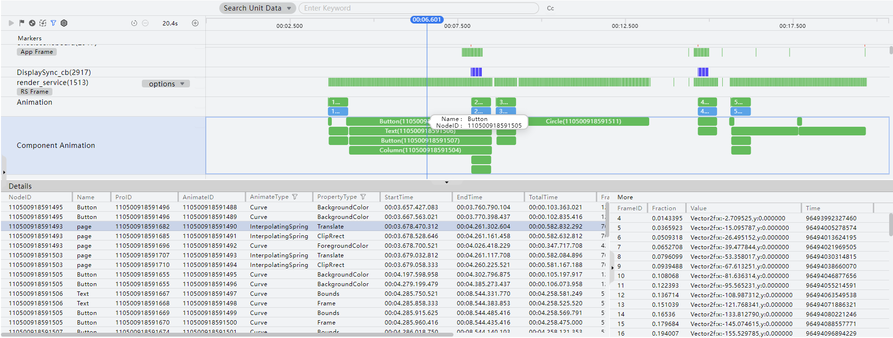
按钮中新增Frame Layout开关，开发者可自行设置开关状态。开关关闭时，不支持查看最新录制的Session中指定的Frame页面布局信息，默认关闭。

暂不支持在Wearable设备上查看指定Frame页面布局信息。

1. 单击RS Frame泳道或APP Frame泳道中任意一帧，“Details”区域中会展示该帧具体信息。点击**Open Layout**按钮，将在ArkUI Inspector中直接打开相应arkli文件；点击**Download Layout**将arkli文件下载到指定目录，之后可手动导入[ArkUI Inspector](https://developer.huawei.com/consumer/cn/doc/harmonyos-guides/ide-arkui-inspector)查看页面布局信息。

  
> [!NOTE]
> 单击“Download Layout”或 “Open Layout”前，需应用进程置于前台，才能正确回放全量渲染数据，获取arkli文件。

  
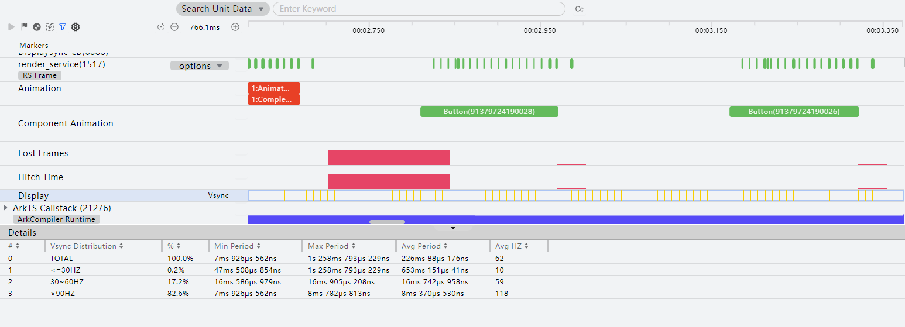

2. 在ArkUI Inspector中可查看组件树和组件属性信息，当前支持BackgroundFilter、nodeGroup、nodeGroupReuseCache组件。

  
 - BackgroundFilter：背景滤波器。

3. nodeGroup：节点组类型，0表示非节点组节点，1表示被动画标记的节点组，2表示被UI标记的节点组，4表示被用户标记的节点组，8表示被前景滤波器标记的节点组。

4. nodeGroupReuseCache： 0表示在生成缓存或无需缓存，1表示在重用缓存。

  

  ##### 查看指定时间段内指定进程的Frame数据统计信息

1. 在时间轴上拖拽鼠标选定要查看的时间段。

2. 选择要观察的子泳道（例如带“RS Frame”标签的泳道）。

  窗口下方的“Details”区域中会显示选定时间段内的RS帧统计信息列表，体现各帧的起始时间、总耗时、GPU耗时以及卡顿丢帧类型。

  
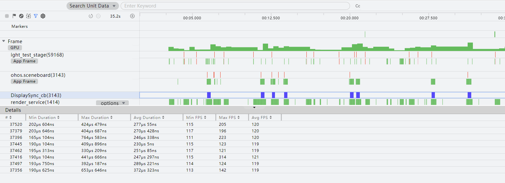

3. 单击列表中任意一帧，右侧的“More”区域会中显示该帧更多关键信息。在获取该帧的预期起始时间、预期持续时间之外，您可以单击
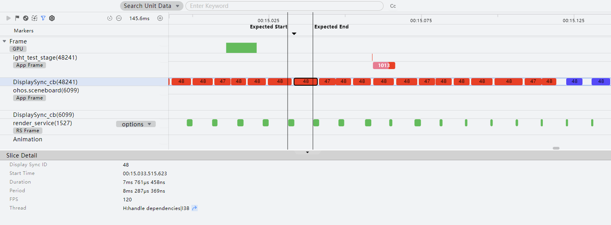
跳转至关联的切片。

  

  ##### 查看指定Frame信息

  在子泳道（例如带“APP Frame”标签的泳道）中选中要查看的Frame，该泳道上方是耗时最长的非UI函数，下方是UI主线程泳道。

  
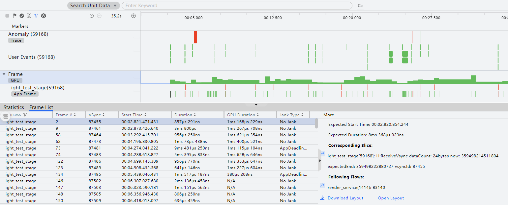

  窗口下方的“Frame”区域中会显示选定帧的关键信息，如VSync编号、开始时间、App应用侧持续时间、App应用侧业务逻辑耗时、Render Service侧持续时间、GPU持续时间、总持续时间、卡顿丢帧类型以及可能出现卡顿的原因等。“Non UI”区域中会显示非UI耗时最大的函数，如开始时间、结束时间、持续时间，函数名等。      
> [!NOTE]
> 在选定观察对象后，DevEco Profiler会自动关联与其相关的切片，用箭头连接。 如果该帧是由于超出期望结束时间引起的，则显示两条线，对应期望开始时间（Expected Start）和期望结束时间（Expected End），用于关联分析同一时刻Trace或者函数采样信息。 将鼠标悬浮在任意帧上，会冒泡显示该帧的Jank信息。 卡顿丢帧类型（Jank Type）：No Jank（不卡顿）、AppDeadlineMissed（App侧的卡顿）、RenderDeadlineMissed（Render Service侧的卡顿）。

  
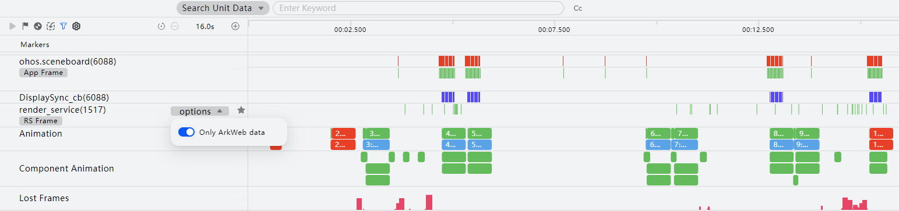

  

  ##### 查看屏幕帧率动态变化场景下丢帧和卡顿信息

  Frame泳道下新增Lost Frames和Hitch Time两类子泳道，用于识别和优化卡顿和丢帧现象。

  
Hitch Time：展示当前时间段内卡顿时长。计算方式为渲染前后两帧的间隔减去单帧耗时，若计算结果大于单帧耗时*70%，则视为出现卡顿现象。
 - Lost Frames：展示当前时间段内丢帧数。Lost Frames计算出的结果，六舍七入统计取整。

1. 创建Frame模板并录制会话，如存在卡顿和丢帧现象，会在Lost Frames和Hitch Time泳道对应时间显示矩形图。

  
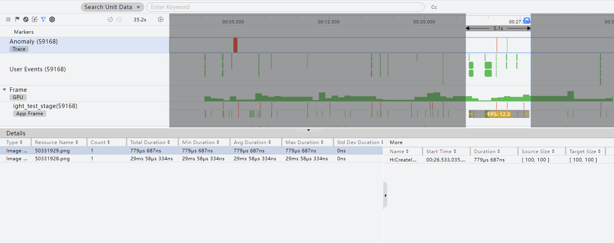

2. 鼠标点选某一时间点，提示信息会显示该点所属时间段内的丢帧数以及卡顿时间。

  
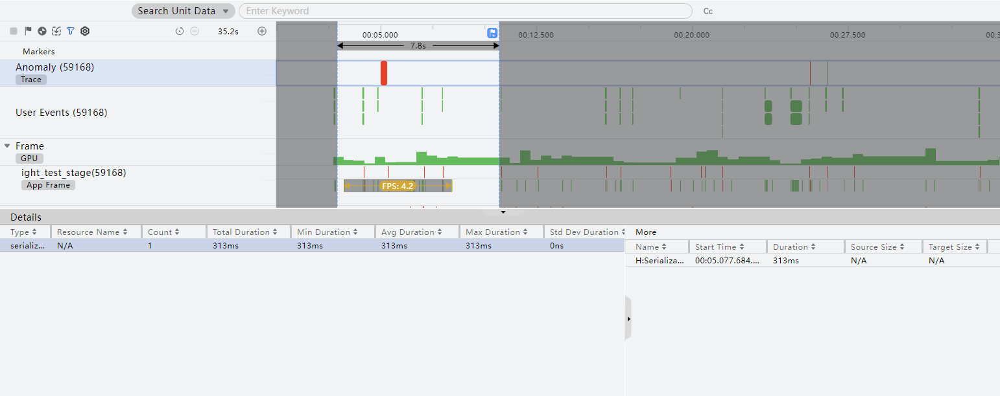

##### 支持动效场景调优

开发者在开发应用时，会使用到动效，动效的卡顿影响到用户的使用体验。DevEco Profiler提供动效场景的调优，能帮助开发者优化动效场景。

鼠标放置在某个动效上，显示该动效的详细信息，包括响应时延、动效持续时间、完成时延、期望帧率、FPS。

> [!NOTE]
> 响应时延：<=85ms 绿色，85ms~150ms 浅绿色，150ms ~250ms 浅红色，>250ms深红色。 期望帧率：当前系统运行满帧帧率，如60HZ、90HZ、120HZ。智能刷新率模式下，不展示期望帧率。 动效持续时间：根据帧率展示颜色，FPS大于达标帧率即为绿色，小于则为深红色。智能刷新率模式下，帧率可变，颜色为灰色。达标帧率与期望帧率的大小有关，一般情况下期望帧率为60HZ，则达标帧率= 60HZ * 91.7%。 完成时延：响应时延和动效持续时间只要有一个为深红色，完成时延为深红色。 Launch模板中Frame泳道点击detail区启动动效详情信息，more区域展示动效帧Animation Data List信息。

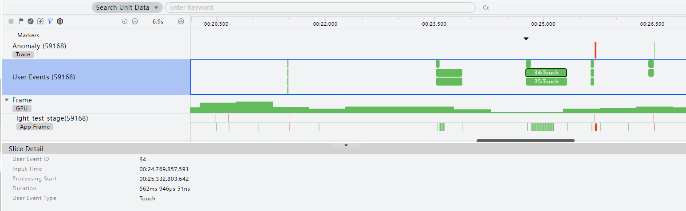

##### 查看组件动画信息

从DevEco Studio 6.0.0.828版本开始，Frame泳道下新增Component Animation子泳道，用于从组件的角度展示应用中包含的各种动画类型，包括属性动画 (animation)、显式动画 (animateTo)、关键帧动画 (keyframeAnimateTo)以及页面间转场 (pageTransition)。

在Details页签中，可以查看每个动画的详细信息，包括起止时间、帧率、动画曲线类型以及影响的组件属性等。

单击列表中任意一动画，右侧的“More”区域会中显示该动画所影响的组件属性的具体变化过程。

##### 查看组件帧率信息

Frame泳道下新增两类子泳道，分别为Display Vsync与DisplaySync_cb(tid)，用于对可变帧率的检测调优。      
 - Display Vsync：该泳道显示对应时间段的屏幕刷新率，支持对框选的时间段内的vsync进行分布统计。区分“<=30HZ”、“30~60HZ”、“60~90HZ”、“>90HZ”。统计值包括框选时间段内各区间的分布比率、最小/最大/平均时长以及平均HZ。如果某场景满足了帧率改变的要求，当底层系统根据机制进行变帧，相应的情况会展现在对应的泳道，帮助开发者了解vsync的变化情况是否符合预期。该泳道仅支持在配备硬件屏幕的设备上进行数据采集。
 - DisplaySync_cb(tid)：该泳道显示对应组件的帧率，如DisplaySync、XComponent两类接口组件动画对应的帧率。调测时，不同场景下由于帧率可变，系统实际表现是否符合预期，需要有实际的检测手段。尤其是由于DisplaySync的渲染均在UI主线程执行，当存在多个需要渲染的组件需要同时执行时，只能在UI主线程排队，此时任何一个组件的延迟都会对其他组件的渲染产生影响，导致UI卡顿。        如下图所示，vsync2和vsync4中，vsync周期内的组件由于渲染耗时长，导致以下两个vsync周期挤掉下一个vsync周期的渲染时间，导致掉帧的情况产生。

  

1. 选择Display Vsync泳道，在时间轴上拖拽鼠标选定要查看的时间段。
2. 详情区显示当前时间段的屏幕刷新率，当前帧最大持续时间、最小持续时间、平均持续时间以及该时间段内平均帧数。

  
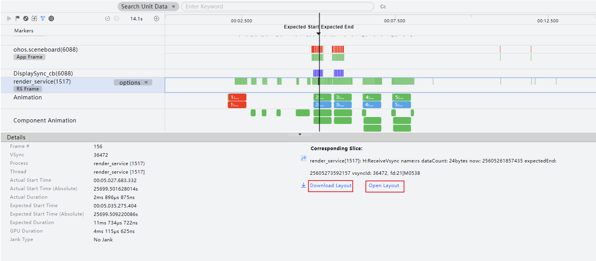

3. 点选Display Vsync泳道，可以查看当前帧的耗时和帧率。

  
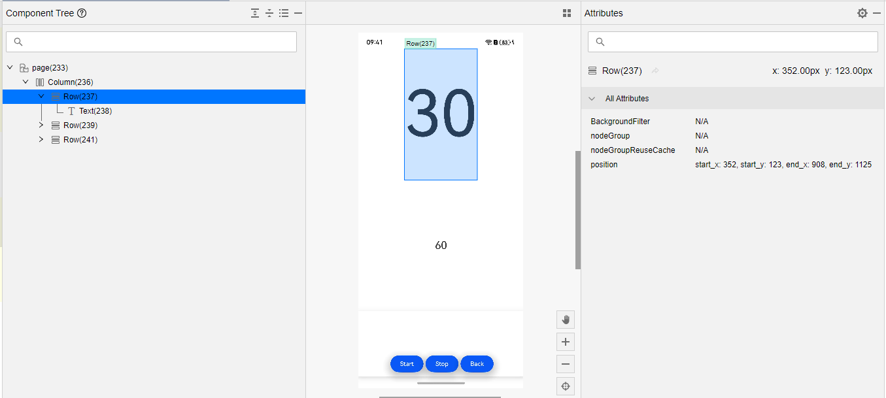

4. 框选DisplaySync_cb泳道，可以查看应用侧对应组件的帧率，渲染时间等信息。

  
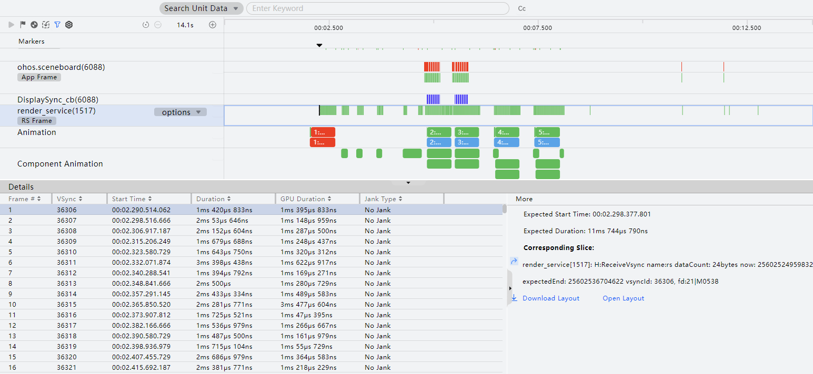

5. 同时如果组件有可能的掉帧情况，DisplaySync_cb泳道显示对应的掉帧情况并标红展示。

  

##### 查看帧率统计信息

Frame泳道中的App Frame泳道和RS Frame泳道在框选时新增fps标记。RS泳道新增过滤按钮，用于过滤ArkWeb数据。
1. 展开Frame泳道，框选一段数据。
2. 泳道出现fps标记，展示当前框选范围内的帧率统计信息。

  
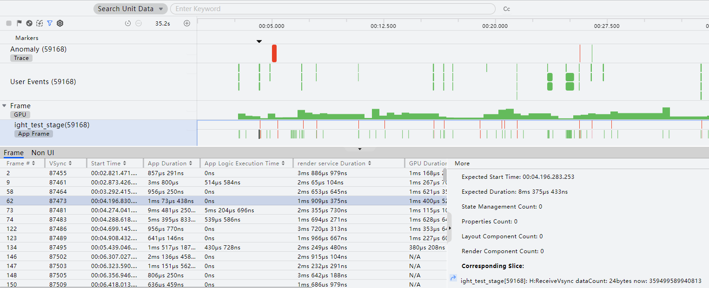

3. 打开Only ArkWeb data开关，筛选过滤出包含ArkWeb帧的数据。

  

##### Anomaly泳道：查看解码过度耗时和超过阈值的序列化、反序列化操作

如果工程中存在图片资源，并感知到解码绘制/渲染过程存在卡顿，可以通过Anomaly泳道查看主线程解码过程中是否存在解码过度耗时告警，并确认发生告警的时段。

如果应用中使用了worker、Taskpool工作线程等场景，通常会触发跨线程对象传递，并触发序列化和反序列化的操作。对于耗时超过阈值的序列化、反序列化操作，Anomaly也会给出对应的耗时告警，并给出发送这个操作的开始时间和耗时时间。
1. 在时间轴上拖拽鼠标选定出现告警的时间段。当耗时超过VSync周期的50%时，将在Anomaly泳道中出现红色告警，提示“Image decoding has exceeded 50% of the VSync time”。
2. 详情区给出录制时段内解码过度耗时的统计情况，包括类型，图片名，计数，总耗时，最小耗时、平均耗时、最大耗时，耗时标准差、 图源尺寸大小，目标尺寸大小等。

  

3. 对于耗时超过阈值的序列化、反序列化操作，Anomaly也会给出对应的耗时告警。其中可以通过泳道启动配置按钮配置检测阈值，默认配置阈值为8ms。
4. 详情区给出录制时段内序列化、反序列化耗时情况统计信息，包括类型、计数、总耗时、最小耗时、平均耗时、最大耗时、耗时标准差等。

  

  
> [!NOTE]
> 已上架应用市场的应用不支持录制Anomaly泳道。

##### User Events泳道：查看用户事件耗时

开发者在卡顿丢帧场景可通过User Event用户事件，查看用户事件开始时间、应用开始处理时间以及应用处理耗时等情况。
1. 选择User Event泳道，在时间轴上拖拽鼠标选定要查看的时间段。
2. 详情区列表给出录制时间段内用户事件详情，包括用户事件ID、事件开始时间Input Time、应用开始处理时间Processing Start、应用处理耗时Duration和事件类型User Event Type。

  

3. 点选User Event泳道中的条块，Slice详情区展示该事件的详情信息。

  

更多性能调优最佳实践，请参考[点击响应时延分析](https://developer.huawei.com/consumer/cn/doc/best-practices/bpta-click-to-click-response-optimization)、[点击完成时延分析](https://developer.huawei.com/consumer/cn/doc/best-practices/bpta-click-to-complete-delay-analysis)、[帧率问题分析](https://developer.huawei.com/consumer/cn/doc/best-practices/bpta-zhenlv)、[Web点击响应时延分析](https://developer.huawei.com/consumer/cn/doc/best-practices/bpta-web-click-response-delay-analysis)、[Web加载完成时延分析](https://developer.huawei.com/consumer/cn/doc/best-practices/bpta-web-completion-delay-analysis)。
