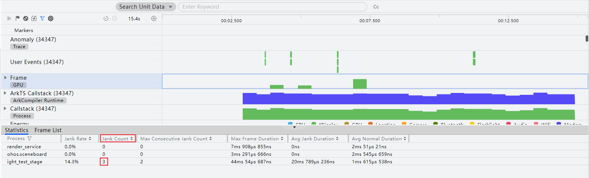
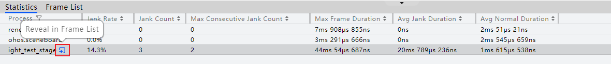
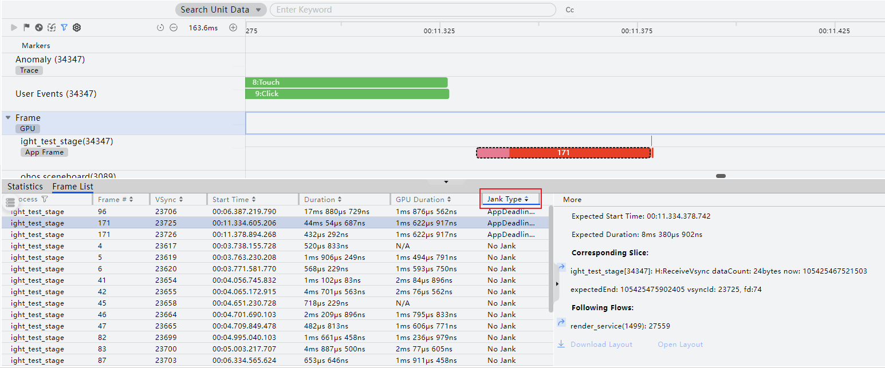
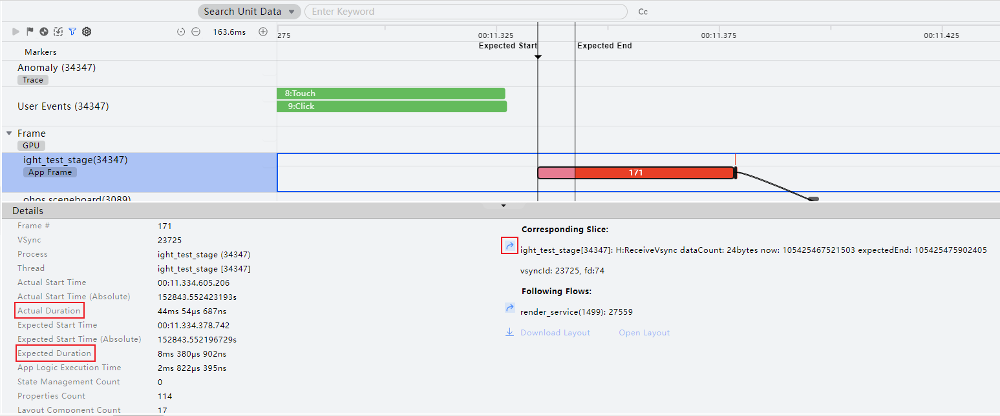
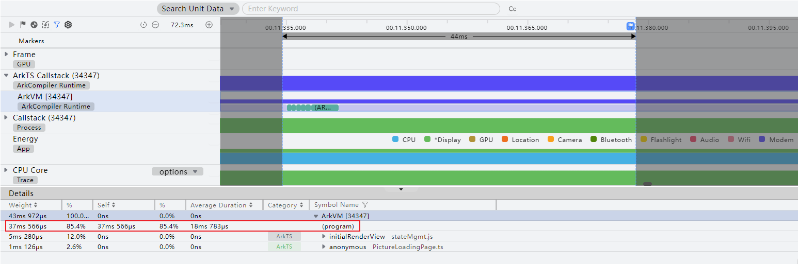
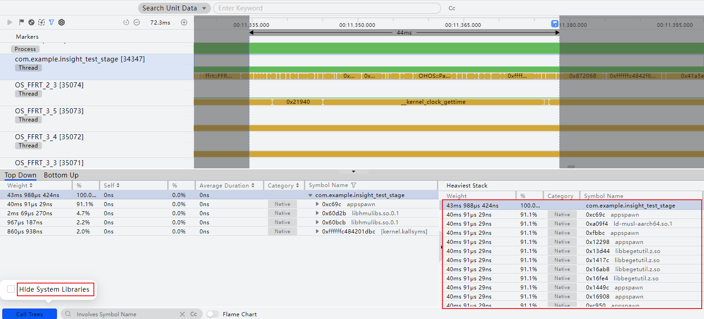
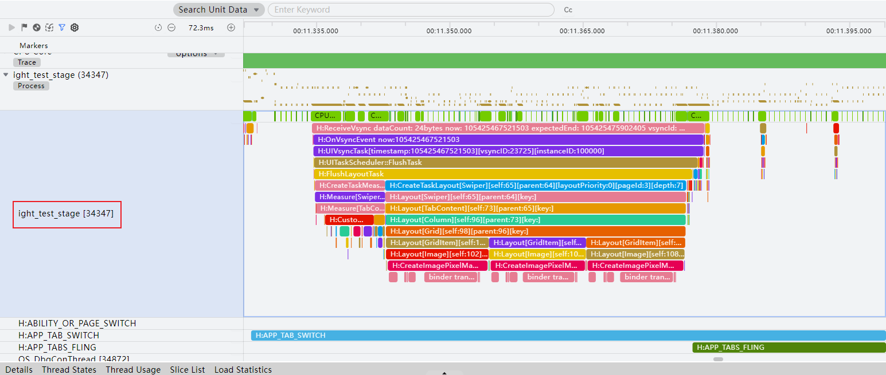
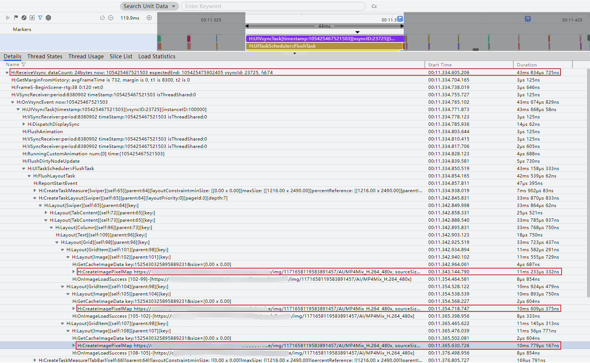
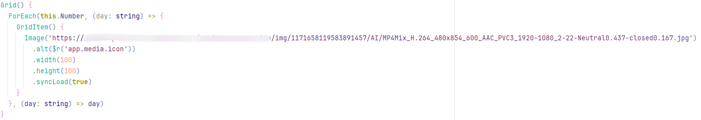

# 案例：使用Frame模板分析应用卡顿问题

更新时间：2026-03-11 08:49:31

来源：https://developer.huawei.com/consumer/cn/doc/harmonyos-guides/ide-frame-case

本案例介绍如何判断应用存在卡顿帧，再通过调用栈和trace信息分析应用运行逻辑，找出应用卡顿的原因。

 应用卡顿分析基础功能请参考[Frame分析](https://developer.huawei.com/consumer/cn/doc/harmonyos-guides/ide-insight-session-frame)。

## 分析步骤

分析应用卡顿类问题步骤如下： 确认是否存在卡顿帧。若存在卡顿帧，根据调用栈和trace等信息进一步确定问题点。

## 分析Frame数据

## 分析应用是否存在卡顿

框选Frame泳道，窗口下方的“Statistics”区域中会以进程维度对选定时间段内的Frame信息进行统计，当Jank Count大于0时，说明存在卡顿帧。

找到“Statistics”页签中存在卡顿帧的进程，点击进程名称后方跳转按钮，跳转到“Frame List”页签。

“Frame List”页签会展现该进程对应的Frame列表。在“Frame List”页签中对卡顿丢帧类型（Jank Type）进行升序排序，单击“Frame List”页签中任意一卡顿帧，直接跳转到该帧且泳道上该帧被反选。
> [!NOTE]
> 在“RS Frame”和“App Frame”标签的泳道中，正常完成渲染的帧显示为绿色，出现卡顿的帧显示为红色。AppDeadlineMissed：App侧的卡顿。

点选该卡顿帧，窗口下方的“Details”区域中显示卡顿帧的关键信息。右侧应用进程前方跳转按钮可以跳转到应用进程Trace。Expected Duration：一帧绘制的期望耗时。与fps的大小有关，如fps为120，对应的Vsync周期为8.3ms，即App侧/Render Service侧的帧耗时，一般需要在8.3ms以内。Actual Duration：一帧绘制的实际耗时。 如下图，可以看到该帧的期望耗时为8ms 330μs，实际耗时为44ms54μs，远远超过了期望耗时，因此被识别为卡顿帧。

框选该异常帧时间范围，结合ArkTS Callstack泳道、Callstack泳道和Trace等信息进一步分析异常点。

## 案例：分析应用卡顿原因

找到并框选要分析的异常帧，查看ArkTS Callstack泳道分析ArkTS侧耗时函数。优先查看主线程调用栈，即线程号与进程号一致的ArkVM子泳道。可以看到ArkTS侧一些方法的耗时。查看下图调用栈，除(program)外，其他调用栈耗时小于一帧绘制的期望耗时8.3ms（被调优的设备fps为120），因此该卡顿帧主要分析调用栈(program)的耗时。(program)代表程序执行进入纯Native代码阶段，该阶段无ArkTS代码执行，也无ArkTS调用Native或者Native调用ArkTS情况，一般很难通过这里分析出有效的信息，需要切换到Callstack泳道看具体的调用栈信息。

切换到Callstack泳道，查看Callstack泳道的主线程（线程号与进程号一致）子泳道，滑动观察下方Heaviest Stack区域“%”列中占比最大的函数调用栈，Category中亮色代表开发者调用栈，灰色代表系统调用栈，可以看出下图中耗时主要在系统侧的so，无法识别具体异常原因，接下来进一步分析应用进程Trace。
> [!NOTE]
> 也可通过底部的“Call Trees”选择框来隐藏系统调用栈，减少干扰信息。

切换到应用进程Process泳道，查看主线程（线程号与进程号一致）。

窗口下方详情区可查看到Trace统计信息列表，逐层展开耗时最长的Trace，定位到主要耗时是在3次H:CreateImagePixelMap。接下来进一步分析这3次H:CreateImagePixelMap耗时的原因。

H:CreateImagePixelMap和图片加载相关，再结合业务代码查看，可以看到是因为同步加载网络图片，建议修改为异步加载。

> [!NOTE]
> 一般情况下，图片加载流程会异步进行，以避免阻塞主线程，影响UI交互。不建议图片加载较长时间时使用同步加载。
