# 内存分析介绍

更新时间：2026-04-30 02:42:31

来源：https://developer.huawei.com/consumer/cn/doc/harmonyos-guides/ide-insight-session-allocations-memory

应用在开发过程中，可能因API使用错误、变量未及时释放、异常频繁创建/释放内存等情况引发各种内存问题。

DevEco Profiler提供了基础的Allocation内存场景分析功能。通过使用Allocation来分析应用或元服务在运行时的内存分配及使用情况，识别和定位内存泄漏、内存抖动以及内存溢出等问题，对应用或元服务的内存使用进行优化。

从DevEco Studio 6.1.0 Beta1开始，Allocation分析任务新增支持录制All Heap & Anonymous VM泳道、All Heap泳道、All Anonymous VM泳道，不支持录制Native Allocation泳道。

## 操作步骤

## DevEco Studio 6.1.0 Beta1及以上版本

在设备连接完成后，可按照如下方法查看内存分析结果： 构建应用前请参考[模块级build-profile.json5文件](https://developer.huawei.com/consumer/cn/doc/harmonyos-guides/ide-hvigor-build-profile)，增加strip字段并赋值为false（strip：是否移除当前模块.so文件中的符号表、调试信息，配置为false代表不移除）。采集函数栈解析符号需要附带符号表信息，无符号表信息可能采集不到函数名称，因此请按照下图进行配置。
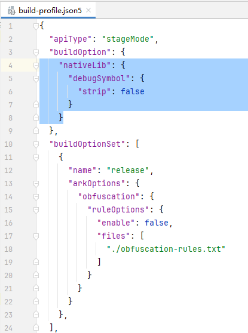
创建Allocation分析任务并录制相关数据，操作方法可参考[性能问题定位：深度录制](https://developer.huawei.com/consumer/cn/doc/harmonyos-guides/deep-recording)，或在会话区选择**Open File**，导入历史数据，在录制前单击

指定要录制的泳道。

> [!NOTE]
> Allocation分析支持离线符号解析能力，请参见离线符号解析。 在任务录制过程中，单击分析窗口左上角的可启动内存回收机制。 当方舟虚拟机的调优对象的某个程序/进程占用的部分内存空间在后续的操作中不再被该对象访问时，内存回收机制会自动将这部分空间归还给系统，降低程序错误概率，减少不必要的内存损耗。

**Memory泳道**：显示当前进程的物理内存使用情况，计算方式为PSS+GL+Graph。PSS表示进程独占内存和按比例分配共享库占用内存之和。
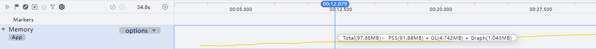
展开Memory泳道，子泳道展示的是按照内存类型将进程PSS值拆分开的各个维度的内存信息，包含ArkTS Heap、Native Heap、GL、Graph、Guard、AnonPage Other、FilePage Other、Dev/Stack、.hap、.so、.ttf。默认展示其中的五个子泳道，可以点击主泳道的options标签并勾选其他子泳道查看其他子泳道。

| 子泳道 | 说明 |
| --- | --- |
| ArkTS Heap | ArkTS堆的内存占用。 |
| Native Heap | Native层（主要是应用依赖的so库的C/C++代码）使用new/malloc分配的堆内存。 |
| GL | 包括应用和RS，应用为纹理内存，RS为纹理和图形渲染内存。 |
| Graph | 该进程按去重规则统计的dma内存占用，包括直接通过接口申请的dma buffer和通过allocator_host申请的dma buffer。 |
| Guard | 保护段所占内存。 |
| AnonPage Other | 其他所有匿名页所占内存（非heap、anon:native_heap、anon:ArkTS heap开头的匿名页）。 |
| FilePage Other | 其它映射到文件页但不能被归类到.so/.db/.ttf类型的内存占用。 |
| Dev | 进程加载的以/dev开头的文件所占内存。 |
| Stack | 栈内存。 |
| .hap | 进程加载的.hap文件所占内存。 |
| .so | 进程加载的.so动态库所占内存。 |
| .ttf | 进程加载的.ttf字体文件所占内存。 |

**ArkTS Allocation泳道**：DevEco Studio 6.1.0 Release新增，用于显示方舟虚拟机上的内存分配信息。该泳道默认不展示，如需录制该泳道数据，在录制前单击左上角菜单栏

图标，勾选ArkTS Allocation泳道。由于隐私安全政策，已上架应用市场的应用不支持录制此泳道。该泳道即将下线，推荐使用Snapshot模板分析ArkTS内存泄漏。
> [!NOTE]
> 由于较大的性能开销可能导致卡顿/卡死问题，ArkTS Allocation暂不支持和如下泳道同时录制： ArkTS Snapshot泳道 All Heap & Anonymous VM泳道 All Heap泳道 All Anonymous VM泳道 System Resources泳道 Graphic Memory泳道

**ArkTS Snapshot泳道**：DevEco Studio 6.1.0 Release版本新增，用于抓取ArkTS堆内存快照，结束录制时会自动录制一次快照，默认不支持录制该泳道。如需录制，在录制前单击工具控制栏中的

按钮关闭统计模式（Statistics Mode）。由于隐私安全政策，已上架应用市场的应用不支持录制此泳道。
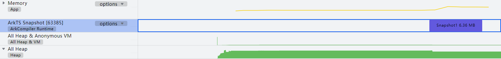
**All Heap & Anonymous VM泳道**：显示具体的Native内存分配情况，包括静态统计数据、分配栈、每层函数栈消耗的Native内存等信息。由于隐私安全政策，已上架应用市场的应用不支持录制此泳道。 单击工具控制栏中的

按钮，可以设置是否为统计模式、统计间隔、最小跟踪内存、回栈模式、JS回栈、JS回栈深度和Native回栈深度。
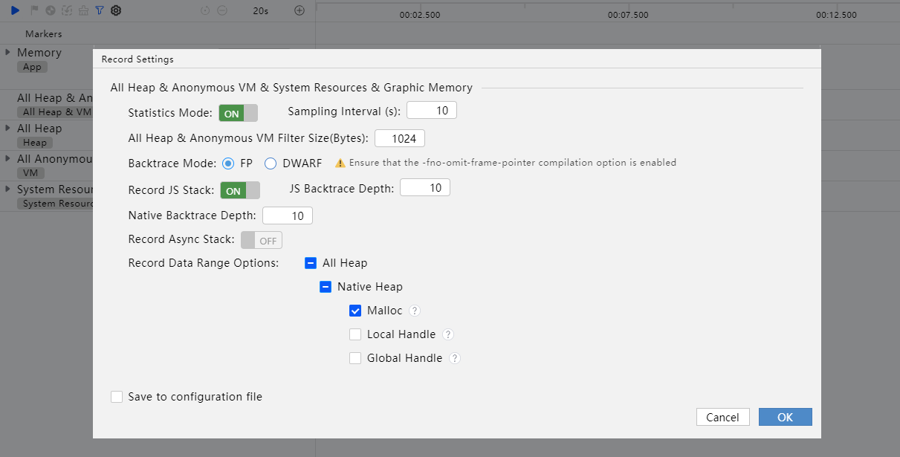
| 配置项 | 说明 |
| --- | --- |
| Statistics Mode | 该项配置代表是否开启统计模式采集数据，默认开启。开启后，数据会每隔Sampling Interval中设置的时间从设备端汇总并返回。关闭后，处于非统计模式，每次内存分配后数据会实时从设备端返回。 |
| Sampling Interval | 统计时间间隔。仅在统计模式下需要设置，可设置范围为1s~3600s，默认为10s。 |
| All Heap & Anonymous VM Filter Size | 最小跟踪内存，该参数表示最小抓取的内存大小。可配置范围为0-65535Bytes，默认为1024Bytes。 |
| Backtrace Mode | 内存分配栈回栈模式。当前提供FP和DWARF两种回栈模式。FP回栈是通过帧指针（FP寄存器）链接栈帧，直接遍历调用链。DWARF回栈是基于编译器生成的DWARF调试信息进行栈回溯。默认FP回栈。FP回栈性能更好，但在某些特定场景下（例如so的编译参数控制），FP回栈可能失效，此时可选择DWARF回栈尝试。 |
| Record JS Stack | 是否开启JS回栈。开启后，系统回栈时会自动从Native向JS层回栈，完成Native到JS的栈缝合，适合ArkTS/JS代码调用Native的场景。               在DevEco Studio 6.1.0 Beta2之前版本，默认关闭。               从DevEco Studio 6.1.0 Beta2版本开始，默认开启。 |
| JS Backtrace Depth | JS回栈深度。可配置范围为1-128，默认10层。 |
| Native Backtrace Depth | Native回栈深度。可配置范围为5-100，默认10层。 |
| Backtrace Stack | 回栈深度。仅当Backtrace Mode选择为DWARF模式的情况下存在，其层数代表着JS与Native的共同回栈深度。可配置范围为5-100，默认20层。 |
| Sync Backtrace Depth | DevEco Studio 6.1.1 Beta1版本新增。               同步回栈深度。仅当Record Async Stack开启的情况下存在，其层数代表着JS与Native的共同同步回栈深度。可配置范围为5-100，默认20层。 |
| Record Async Stack | DevEco Studio 6.1.1 Beta1版本新增。               用于开启[异步栈缝合](https://developer.huawei.com/consumer/cn/doc/harmonyos-guides/ide-devecostudio-glossary#section58492173810)。仅当Backtrace Mode选择为FP模式的情况下可以开启。开启后，在异步回栈时支持多回一层异步栈帧，最大异步回栈深度为16层，且暂不支持设置异步回栈深度。默认关闭。 |
| Record Data Range Options | DevEco Studio 6.1.0 Release版本新增。               用于设置采样数据范围，包含Malloc、Local Handle和Global Handle，默认勾选Malloc。。                               Malloc记录malloc系列函数的内存分配。                Local Handle用于管理JS对象生命周期的引用句柄（napi_value），仅支持Phone和PC设备。                Global Handle允许用户管理ArkTS/JS值的生命周期的引用句柄（napi_ref）。 |

> [!NOTE]
> 若勾选Local Handle，在应用生命周期内首次录制时会重启应用。若应用在生命周期内被强制终止后重启，再次录制时仍会重启应用。 最小跟踪内存设置的数值越小，回栈深度越大，这可能会导致DevEco Profiler卡顿，请根据应用实际的调测情况进行合理设置。 最小跟踪内存设置的数值大小不影响Local Handle和Global Handle。 统计模式适用于不关注单次分配，但关注应用较长时间的内存变化，将指定的采样间隔内的数据做合并统计，以达到降低处理数据量，提高录制效率和时长。Sampling Interval设置为近似值，将尽可能在接近这个时间内做统计汇总，会有不超过1s偏差，不影响内存分配的正确性。 使用统计模式时，录制的结束时间需要是Sampling Interval即采样周期的整数倍，例如当采样周期是10s时，停止录制时间建议在11s+/21s+，以此类推，留出余量给系统做数据处理与传输。

**All Heap泳道**：显示Heap类型数据之和。展开主泳道，包括Native Heap、ArkTS Heap、JS Heap三条子泳道。其中Native Heap子泳道显示Malloc、ArkLocalHandle和ArkGlobalHandle内存分配，ArkTS Heap子泳道显示ArkTS对象内存分配，JS Heap子泳道显示JS对象内存分配。由于隐私安全政策，已上架应用市场的应用不支持录制此泳道。
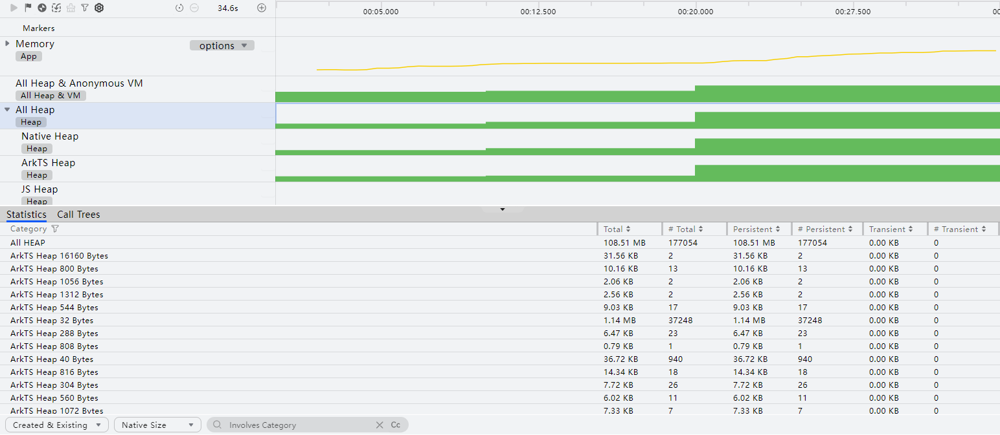
**All Anonymous VM泳道**：显示匿名内存使用分布。展开主泳道，包括VM:ION、VM:ASHMem、VM:.so、VM:others四条子泳道。VM:ION子泳道显示DMA内存分配数据，VM:ASHMem子泳道显示匿名共享内存，VM:.so子泳道显示.so文件内存消耗，VM:others子泳道显示除ION、ASHMem、**.**so外的mmap类型数据。由于隐私安全政策，已上架应用市场的应用不支持录制此泳道。
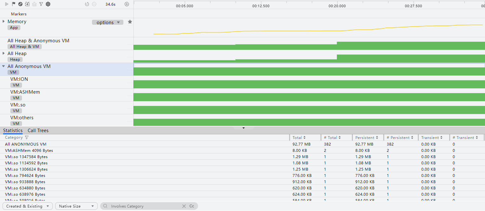
**System Resources泳道**：DevEco Studio 6.1.0 Beta2版本新增，用于显示进程的系统资源使用情况。展开主泳道，包括File Descriptors、Threads两条子泳道。File Descriptors子泳道显示进程的文件句柄使用情况，Threads子泳道显示进程的线程使用情况。由于隐私安全政策，已上架应用市场的应用不支持录制此泳道。

**Graphic Memory泳道**：DevEco Studio 6.0.2 Beta1版本新增，用于显示图形渲染相关的内存分配情况。该泳道默认不展示，如需录制该泳道数据，在录制前单击左上角菜单栏

图标，勾选Graphic Memory泳道。由于隐私安全政策，已上架应用市场的应用不支持录制此泳道。 展开主泳道，包括Vulkan、OpenGL ES、OpenCL三条子泳道。其中Vulkan子泳道对应GPU_VK类型的内存分配数据，OpenGL ES子泳道对应GPU_GLES类型的内存分配数据，OpenCL子泳道对应GPU_CL类型的内存分配数据。
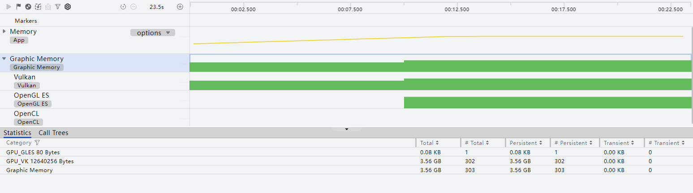
在目标泳道上长按鼠标左键并拖拽，框选要展示分析的时间段。Details区域中显示此时间段内指定类型的内存分析统计信息： **Memory泳道：** 主泳道的详情区域显示当前框选时间段内各采样点的应用内存PSS总和，以及各种内存页面状态的内存占用总和。
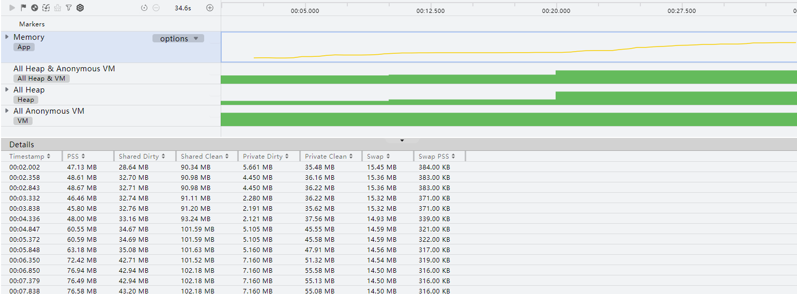
子泳道的详情区域显示该泳道所代表的内存类型的框选时间段内各采样点的PSS总和以及各种内存页面状态的实际占用情况。

Graph字段统计方式为：计算/proc/process_dmabuf_info节点下该进程使用的内存大小。

**ArkTS Allocation泳道**：显示被选择进程所使用的所有ArkTS内存总和，框选后展示此时段内录制到的所有方舟实例的对象分配信息。框选子泳道后显示当前框选时段内运行对象的内存使用情况，包括层级、对象自身内存大小、对象关联内存大小等。该泳道即将下线，推荐使用Snapshot模板分析ArkTS内存泄漏。 “Details”区域中带

标识的对象，表示其可以通过窗口访问。每个时段内已经释放的内存标记为灰色，未释放的内存标记为绿色。
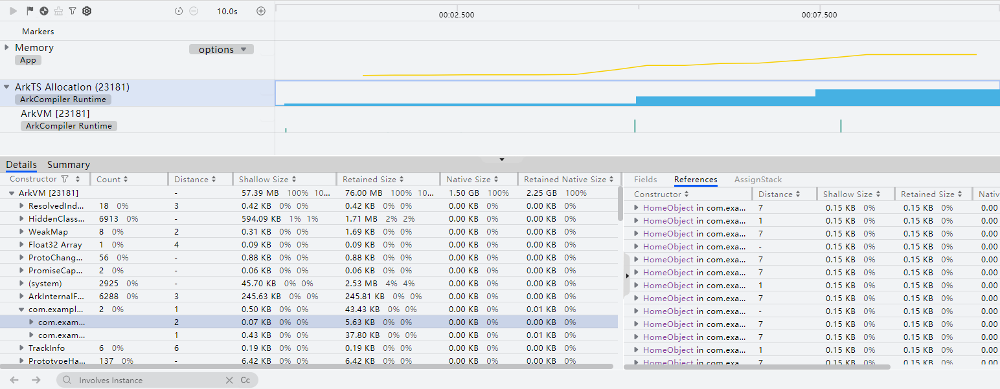
**ArkTS Snapshot泳道**：泳道的紫色区块表示一次快照完成。在“Statistics”页签中点击任一对象后，右侧More区域“Native List”页签将展示引用该实例对象的Native堆栈信息。
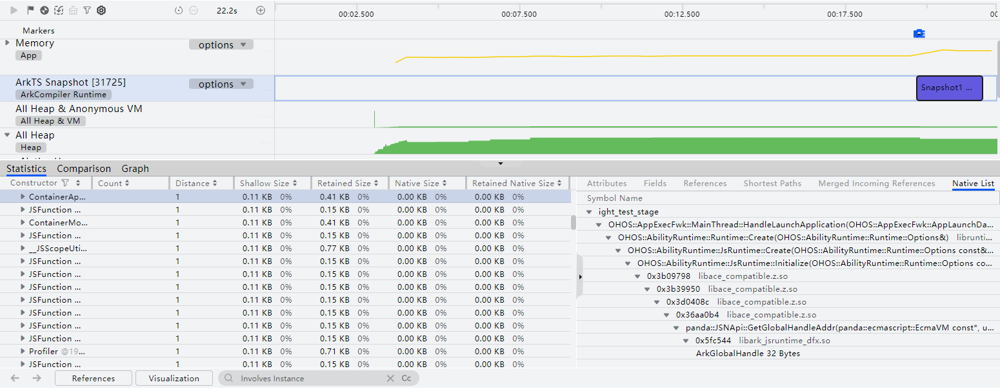
**All Heap & Anonymous VM或All Heap或All Anonymous VM或System Resources或Graphic Memory泳道**：框选子泳道后显示具体的内存分配，包括静态统计数据、分配栈等。 Statistics页签中显示该段时间内的静态分配情况，包括分配方式、总分配内存大小、总分配次数、尚未释放的内存大小、尚未释放次数、已释放的内存大小、已释放次数。 在System Resources泳道的Statistics页签中不提供内存大小数据。 点击任意对象上的跳转按钮，可跳转至此类对象的详细占用/分配信息。当前统计模式下不支持跳转。 Call Trees页签显示线程的内存分配栈情况，包括函数地址或符号、分配大小、占比以及函数栈帧的类别等。 在System Resources泳道的Call Trees页签中不提供分配大小数据。 当未开启统计模式，以及录制了ArkTS Snapshot泳道时，框选All Heap & Anonymous VM或All Heap或Native Heap子泳道，单击任一行栈帧，“More”区域显示经过该栈帧的分配内存最大的调用栈和ArkTS对象列表（ArkTS Object List）。否则，单击任一行栈帧，“More”区域显示经过该栈帧的分配内存最大的调用栈。
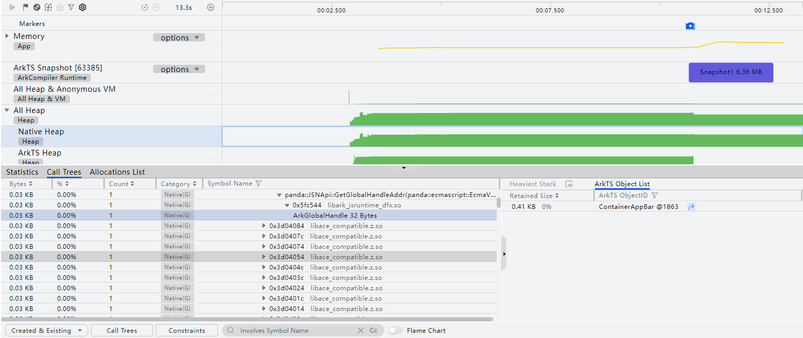
点击“ArkTS Object List”列表中的跳转按钮，跳转到ArkTS Snapshot泳道中的目标对象节点。
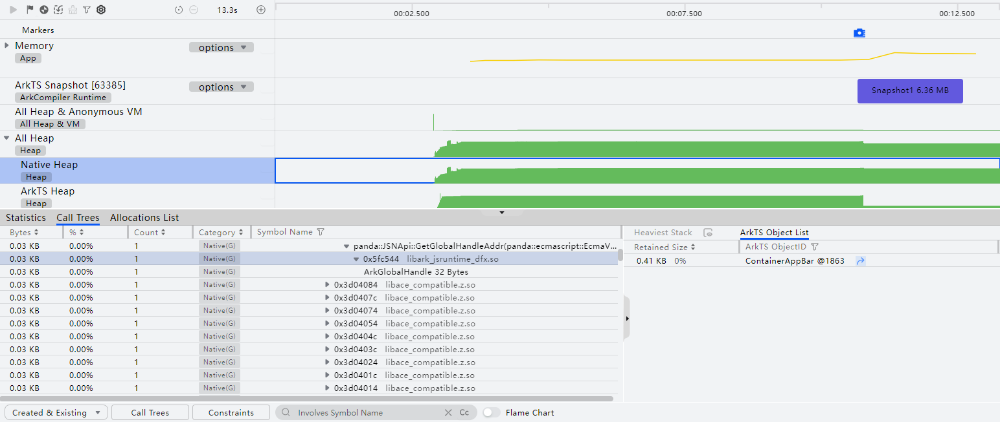
Allocations List显示内存分配的详细信息，包括内存块起始地址、时间戳、当前活动状态、大小、调用的库、调用库的具体函数、事件类型（与Statistics页签的分配方式对应）等。在System Resources泳道的Allocations List页签中不提供内存块起始地址和大小。
> [!NOTE]
> 统计模式（Statistics Mode）开启后，不存在Allocations List信息。

选择任一对象，右侧会展示与该对象相关的所有库和调用者。
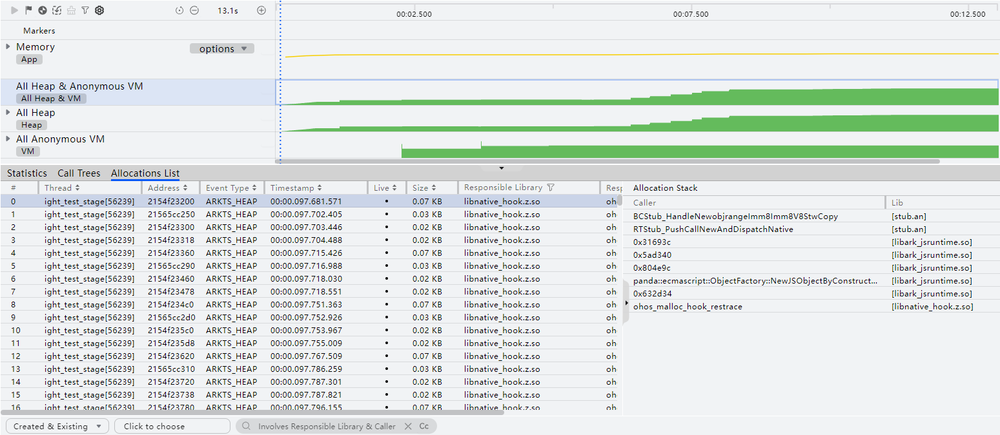
（可选）根据分析结果，双击可能存在问题的调用栈，跳转至相关代码。开发者可根据实际需要进行优化。
> [!NOTE]
> Release应用暂不支持跳转到用户侧Native代码。

## DevEco Studio 6.1.0 Beta1以下版本

在设备连接完成后，可按照如下方法查看内存分析结果： 构建应用前请参考[模块级build-profile.json5文件](https://developer.huawei.com/consumer/cn/doc/harmonyos-guides/ide-hvigor-build-profile)，增加strip字段并赋值为false（strip：是否移除当前模块.so文件中的符号表、调试信息，配置为false代表不移除）。采集函数栈解析符号需要附带符号表信息，无符号表信息可能采集不到函数名称，因此请按照下图进行配置。

创建Allocation分析任务并录制相关数据，操作方法可参考[性能问题定位：深度录制](https://developer.huawei.com/consumer/cn/doc/harmonyos-guides/deep-recording)，或在会话区选择**Open File**，导入历史数据，在录制前单击

指定要录制的泳道。
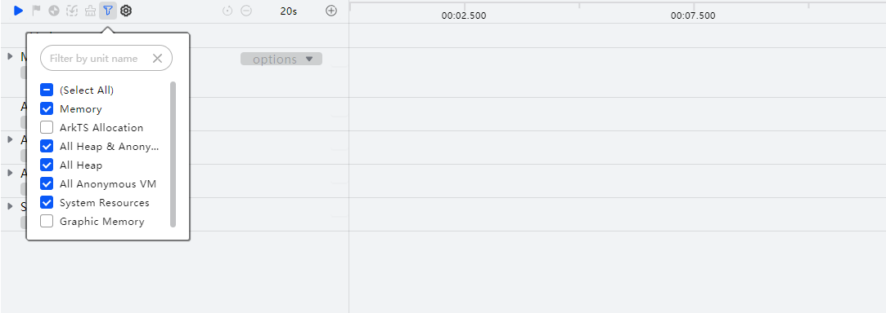
> [!NOTE]
> Allocation分析支持离线符号解析能力，请参见离线符号解析。 在任务录制过程中，单击分析窗口左上角的可启动内存回收机制。 当方舟虚拟机的调优对象的某个程序/进程占用的部分内存空间在后续的操作中不再被该对象访问时，内存回收机制会自动将这部分空间归还给系统，降低程序错误概率，减少不必要的内存损耗。

**Memory泳道**：显示当前进程的物理内存使用情况，其度量方式包含：

PSS：进程独占内存和按比例分配共享库占用内存之和。

RSS：进程独占内存和相关共享库占用内存之和。

USS：进程独占内存。 默认只显示PSS的统计图，如需要查看USS或RSS，需要在Memory泳道的右上角点选相关数据类型。

展开Memory泳道，子泳道展示的是按照内存类型将进程PSS值拆分开的各个维度的内存信息，包含ArkTS Heap、Native Heap、GL、Graph、Guard、AnonPage Other、FilePage Other、Dev/Stack、.hap、.so、.ttf。默认展示其中的五个子泳道，可以点击主泳道的options标签并勾选其他子泳道查看其他子泳道。
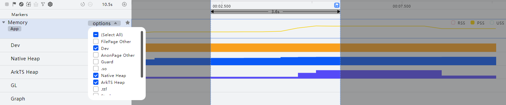
| 子泳道 | 说明 |
| --- | --- |
| ArkTS Heap | ArkTS堆的内存占用。 |
| Native Heap | Native层（主要是应用依赖的so库的C/C++代码）使用new/malloc分配的堆内存。 |
| GL | 包括应用和RS，应用为纹理内存，RS为纹理和图形渲染内存。 |
| Graph | 该进程按去重规则统计的dma内存占用，包括直接通过接口申请的dma buffer和通过allocator_host申请的dma buffer。 |
| Guard | 保护段所占内存。 |
| AnonPage Other | 其他所有匿名页所占内存（非heap、anon:native_heap、anon:ArkTS heap开头的匿名页）。 |
| FilePage Other | 其它映射到文件页但不能被归类到.so/.db/.ttf类型的内存占用。 |
| Dev | 进程加载的以/dev开头的文件所占内存。 |
| Stack | 栈内存。 |
| .hap | 进程加载的.hap文件所占内存。 |
| .so | 进程加载的.so动态库所占内存。 |
| .ttf | 进程加载的.ttf字体文件所占内存。 |

**ArkTS Allocation泳道**：显示方舟虚拟机上的内存分配信息。该泳道默认不展示，如需录制该泳道数据，在录制前单击左上角菜单栏

图标，勾选ArkTS Allocation泳道。由于隐私安全政策，已上架应用市场的应用不支持录制此泳道。该泳道即将下线，推荐使用Snapshot模板分析ArkTS内存泄漏。
> [!NOTE]
> 由于较大的性能开销可能导致卡顿/卡死问题，ArkTS Allocation暂不支持和如下泳道同时录制： All Heap & Anonymous VM泳道 All Heap泳道 All Anonymous VM泳道 System Resources泳道 Graphic Memory泳道

**All Heap & Anonymous VM泳道**：显示具体的Native内存分配情况，包括静态统计数据、分配栈、每层函数栈消耗的Native内存等信息。由于隐私安全政策，已上架应用市场的应用不支持录制此泳道。 单击工具控制栏中的

按钮，可以设置是否为统计模式、统计间隔、最小跟踪内存、回栈模式、JS回栈、JS回栈深度和Native回栈深度。
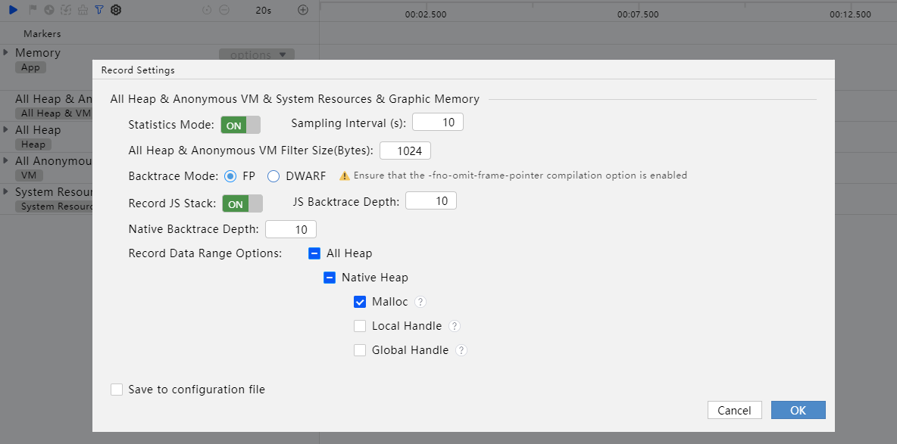
| 配置项 | 说明 |
| --- | --- |
| Statistics Mode | 该项配置代表是否开启统计模式采集数据，默认开启。开启后，数据会每隔Sampling Interval中设置的时间从设备端汇总并返回。关闭后，处于非统计模式，每次内存分配后数据会实时从设备端返回。 |
| Sampling Interval | 统计时间间隔。仅在统计模式下需要设置，可设置范围为1s~3600s，默认为10s。 |
| All Heap & Anonymous VM Filter Size | 最小跟踪内存，该参数表示最小抓取的内存大小。可配置范围为0-65535Bytes，默认为1024Bytes。 |
| Backtrace Mode | 内存分配栈回栈模式。当前提供FP和DWARF两种回栈模式。FP回栈是通过帧指针（FP寄存器）链接栈帧，直接遍历调用链。DWARF回栈是基于编译器生成的DWARF调试信息进行栈回溯。默认FP回栈。FP回栈性能更好，但在某些特定场景下（例如so的编译参数控制），FP回栈可能失效，此时可选择DWARF回栈尝试。 |
| Record JS Stack | 是否开启JS回栈。开启后，系统回栈时会自动从Native向JS层回栈，完成Native到JS的栈缝合，适合ArkTS/JS代码调用Native的场景。 |
| JS Backtrace Depth | JS回栈深度。可配置范围为1-128，默认10层。 |
| Native Backtrace Depth | Native回栈深度。可配置范围为5-100，默认10层。 |
| Backtrace Stack | 回栈深度。仅当Backtrace Mode选择为DWARF模式的情况下存在，其层数代表着JS与Native的共同回栈深度。可配置范围为5-100，默认20层。 |

> [!NOTE]
> 最小跟踪内存设置的数值越小，回栈深度越大，这可能会导致DevEco Profiler卡顿，请根据应用实际的调测情况进行合理设置。 统计模式适用于不关注单次分配，但关注应用较长时间的内存变化，将指定的采样间隔内的数据做合并统计，以达到降低处理数据量，提高录制效率和时长。Sampling Interval设置为近似值，将尽可能在接近这个时间内做统计汇总，会有不超过1s偏差，不影响内存分配的正确性。 使用统计模式时，录制的结束时间需要是Sampling Interval即采样周期的整数倍，例如当采样周期是10s时，停止录制时间建议在11s+/21s+，以此类推，留出余量给系统做数据处理与传输。

**All Heap泳道**：显示Heap类型数据之和。展开主泳道，包括Native Heap、ArkTS Heap、JS Heap三条子泳道。其中Native Heap子泳道显示Malloc、ArkLocalHandle和ArkGlobalHandle内存分配，ArkTS Heap子泳道显示ArkTS对象内存分配，JS Heap子泳道显示JS对象内存分配。由于隐私安全政策，已上架应用市场的应用不支持录制此泳道。

**All Anonymous VM泳道**：显示匿名内存使用分布。展开主泳道，包括VM:ION、VM:ASHMem、VM:.so、VM:others四条子泳道。VM:ION子泳道显示DMA内存分配数据，VM:ASHMem子泳道显示匿名共享内存，VM:.so子泳道显示.so文件内存消耗，VM:others子泳道显示除ION、ASHMem、**.**so外的mmap类型数据。由于隐私安全政策，已上架应用市场的应用不支持录制此泳道。

**System Resources泳道**：显示进程的系统资源使用情况。展开主泳道，包括File Descriptors、Threads两条子泳道。File Descriptors子泳道显示进程的文件句柄使用情况，Threads子泳道显示进程的线程使用情况。由于隐私安全政策，已上架应用市场的应用不支持录制此泳道。
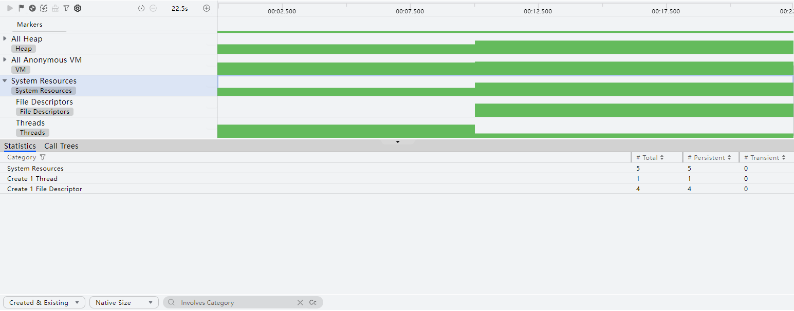
**Graphic Memory泳道**：DevEco Studio 6.0.2 Beta1新增，用于显示图形渲染相关的内存分配情况。该泳道默认不展示，如需录制该泳道数据，在录制前单击左上角菜单栏

图标，勾选Graphic Memory泳道。由于隐私安全政策，已上架应用市场的应用不支持录制此泳道。 展开主泳道，包括Vulkan、OpenGL ES、OpenCL三条子泳道。其中Vulkan子泳道对应GPU_VK类型的内存分配数据，OpenGL ES子泳道对应GPU_GLES类型的内存分配数据，OpenCL子泳道对应GPU_CL类型的内存分配数据。

在目标泳道上长按鼠标左键并拖拽，框选要展示分析的时间段。Details区域中显示此时间段内指定类型的内存分析统计信息： **Memory泳道：** 主泳道的详情区域显示当前框选时间段内各采样点的应用内存PSS总和，以及各种内存页面状态的内存占用总和。

子泳道的详情区域显示该泳道所代表的内存类型的框选时间段内各采样点的PSS总和以及各种内存页面状态的实际占用情况。

Graph字段统计方式为：计算/proc/process_dmabuf_info节点下该进程使用的内存大小。
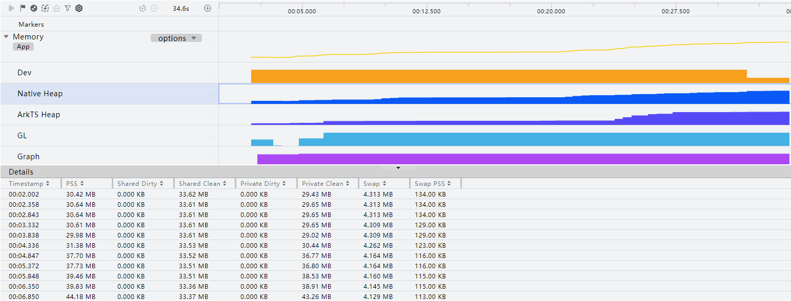
**ArkTS Allocation泳道**：显示被选择进程所使用的所有ArkTS内存总和，框选后展示此时段内录制到的所有方舟实例的对象分配信息。框选子泳道后显示当前框选时段内运行对象的内存使用情况，包括层级、对象自身内存大小、对象关联内存大小等。该泳道即将下线，推荐使用Snapshot模板分析ArkTS内存泄漏。 “Details”区域中带

标识的对象，表示其可以通过窗口访问。每个时段内已经释放的内存标记为灰色，未释放的内存标记为绿色。
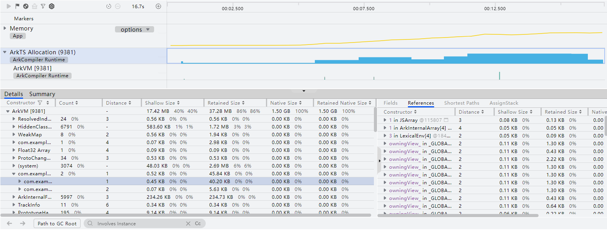
**All Heap & Anonymous VM或All Heap或All Anonymous VM或System Resources或Graphic Memory泳道**：框选子泳道后显示具体的内存分配，包括静态统计数据、分配栈等。 Statistics页签中显示该段时间内的静态分配情况，包括分配方式、总分配内存大小、总分配次数、尚未释放的内存大小、尚未释放次数、已释放的内存大小、已释放次数。 在System Resources泳道的Statistics页签中不提供内存大小数据。 点击任意对象上的跳转按钮，可跳转至此类对象的详细占用/分配信息。当前统计模式下不支持跳转。 Call Trees页签显示线程的内存分配栈情况，包括函数地址或符号、分配大小、占比以及函数栈帧的类别等。 在System Resources泳道的Call Trees页签中不提供分配大小数据。单击任一行栈帧，“More”区域将显示经过该栈帧的分配内存最大的调用栈。 Allocations List显示内存分配的详细信息，包括内存块起始地址、时间戳、当前活动状态、大小、调用的库、调用库的具体函数、事件类型（与Statistics页签的分配方式对应）等。在System Resources泳道的Allocations List页签中不提供内存块起始地址和大小。
> [!NOTE]
> 统计模式（Statistics Mode）开启后，不存在Allocations List信息。

选择任一对象，右侧会展示与该对象相关的所有库和调用者。

（可选）根据分析结果，双击可能存在问题的调用栈，跳转至相关代码。开发者可根据实际需要进行优化。
> [!NOTE]
> Release应用暂不支持跳转到用户侧Native代码。
