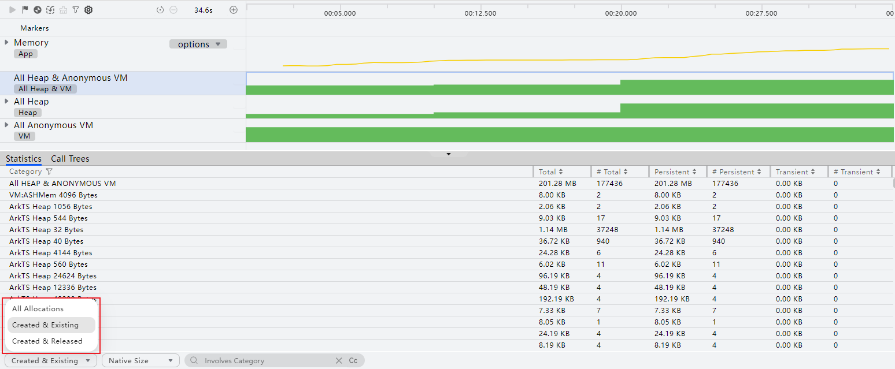
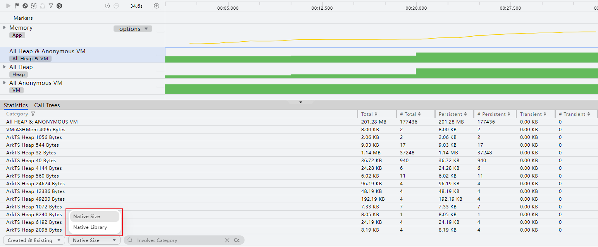
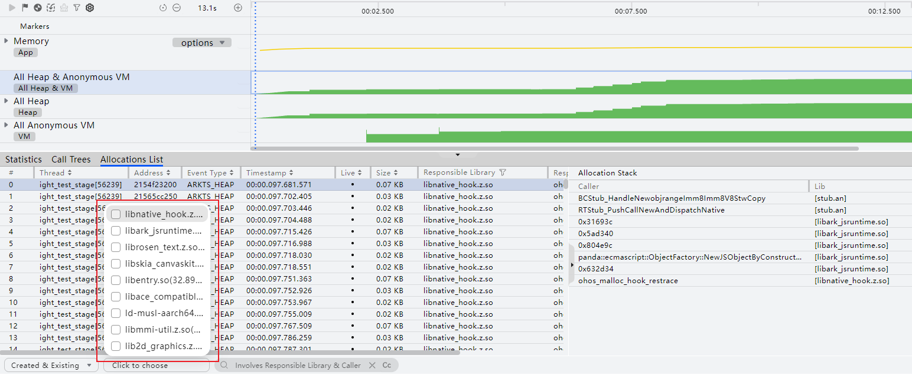
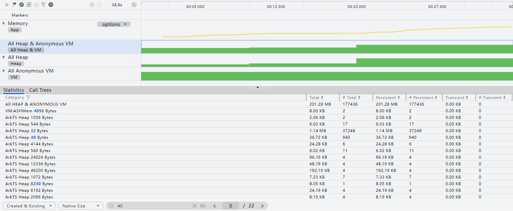
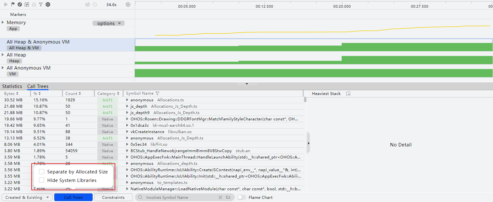
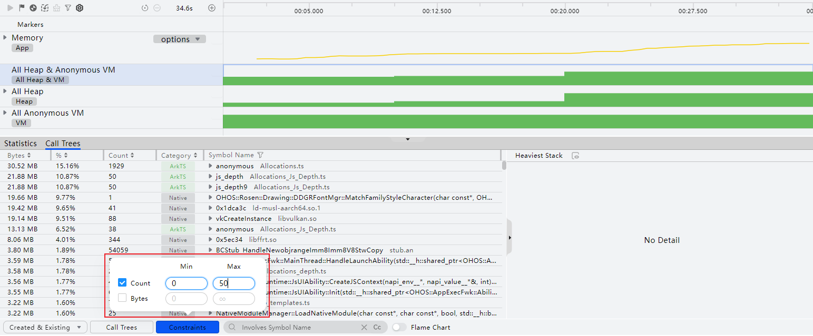
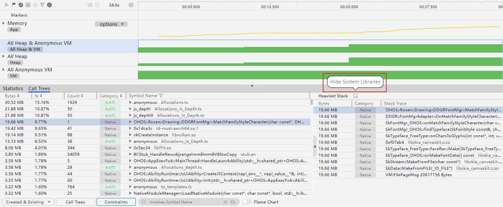
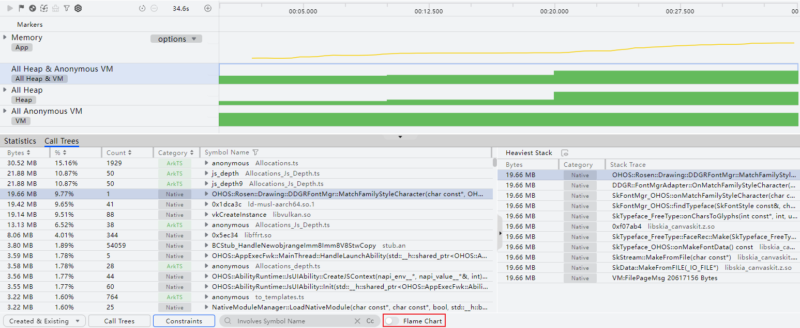

# 内存分析数据筛选

更新时间：2026-04-24 09:16:30

来源：https://developer.huawei.com/consumer/cn/doc/harmonyos-guides/ide-insight-session-allocations-data-filtering

Allocation分析过程中提供多种数据筛选方式，方便开发者缩小分析范围，更精确地定位问题所在。

## 通过内存状态筛选

从DevEco Studio 6.0.2 Beta1版本开始，支持对Native Allocation泳道、Graphic Memory泳道的内存状态信息进行过滤。 从DevEco Studio 6.1.0 Beta1版本开始，支持对All Heap & Anonymous VM泳道、All Heap泳道、All Anonymous VM泳道、System Resources泳道 Graphic Memory泳道的内存状态信息进行过滤，便于开发者定位内存问题。  在泳道“Detail”区域左下方的下拉框中，可以选择过滤内存状态： All Allocations：详情区域展示当前框选时间段内的所有内存分配信息。Created & Existing：默认选中，详情区域展示当前框选时间段内分配未释放的内存。Created & Released：详情区域展示当前框选时间段内分配已释放的内存。

## 通过统计方式筛选

在All Heap & Anonymous VM泳道、All Heap泳道、All Anonymous VM泳道、System Resources泳道、Graphic Memory泳道的“Statistics”页签中，可以打开“Native Size”选择统计方式以过滤统计数据： Native Size：详情区域按照对象的内存进行展示。Native Library：详情区域按照对象的so库进行展示。

## 通过so库名筛选

非统计模式下，在All Heap & Anonymous VM泳道、All Heap泳道、All Anonymous VM泳道、System Resources泳道、Graphic Memory泳道的“Allocations List”页签中，可以单击“Click to choose”选择要筛选的so库以过滤出与目标so库相关的数据：

## 通过搜索筛选

在All Heap & Anonymous VM泳道、All Heap泳道、All Anonymous VM泳道、System Resources泳道、Graphic Memory泳道的页签中， 根据界面提示信息输入需要搜索的项目，可定位到相关内容位置，使用搜索框的按键可依次显示搜索结果的详细内容。

## 筛选内存分配堆栈

在All Heap & Anonymous VM泳道、All Heap泳道、All Anonymous VM泳道、System Resources泳道、Graphic Memory泳道的Call Trees页签中，可以通过底部的“Call Trees”和“Constraints”选择框筛选和过滤内存分配栈。 Call Trees选择框包含两种过滤条件： Separate by Allocated Size：在内存分配栈完全相同的情况下，会按照每次分配栈申请的内存大小将栈分开；System Resources泳道中不包含该过滤条件；Hide System Libraries：隐藏内存分配栈中的系统堆栈。
> [!NOTE]
> “Category”字段表示函数调用类型，将调用栈类型归类如下： ArkTS：程序正在执行ArkTS代码；NAPI：程序正在执行的NAPI代码；Native：程序正在执行的Native代码；Native(G)：程序正在执行的Native代码所申请的Global Handle对象，DevEco Studio 6.1.0 Beta2版本新增；Native(L)：程序正在执行的Native代码所申请的Local Handle对象，DevEco Studio 6.1.0 Release版本新增；其中每一个类型的亮色和灰色分别代表开发者和系统的代码。其中，亮色代表开发者自定义的代码，灰色代表直接使用模板中代码。

Constraints选择框也包含了两种过滤条件： Count：根据指定的内存申请次数过滤内存分配栈信息；Bytes：根据指定的内存申请大小过滤内存分配栈信息。

在Call Trees页签的More区域，单击“Heaviest Stack”旁的隐藏按钮可以单独控制是否显示More区域最大内存分配栈中的系统堆栈。System Resources泳道中不包含Bytes字段。

在Call Trees页签，可以通过底部的“Flame Chart”切换到火焰图视图。

