# 案例：Native内存泄漏分析

更新时间：2026-05-07 02:57:00

来源：https://developer.huawei.com/consumer/cn/doc/harmonyos-guides/ide-native-allocation-case

本案例介绍如何判断应用存在Native内存泄漏。

 DevEco Studio 6.1.0 Beta1以下版本，通过Native Allocation泳道找出Native内存泄漏的原因。

 DevEco Studio 6.1.0 Beta1及以上版本，通过All Heap泳道找出Native内存泄漏的原因。

## 初步识别内存问题

使用[实时监控功能](https://developer.huawei.com/consumer/cn/doc/harmonyos-guides/realtime-monitor)对应用的内存资源进行监控。正常操作应用，观察运行过程中Memory泳道的变化。当在一段时间内应用内存没有明显增加或者在内存上涨后又逐渐回落至正常水平，则基本可以排除应用存在内存问题；反之，在一段时间内不断上涨且无回落或者内存占用明显增长超出预期，那么则可初步判断应用可能存在内存问题。

当从实时监控页面初步判断应用可能存在内存问题后，通过[深度录制](https://developer.huawei.com/consumer/cn/doc/harmonyos-guides/deep-recording)抓取应用内存在问题场景下的详细数据，初步定界问题出现的位置。Memory泳道存在Allocation或Snapshot模板中，使用Allocation或Snapshot模板录制均可。以Allocation模板为例，创建模板后，将模板中的其余泳道去除勾选，仅录制Memory泳道的数据。
> [!NOTE]
> 其余泳道会抓取内存分配、内存对象等数据，为避免额外开销和影响分析，建议先排除录制。

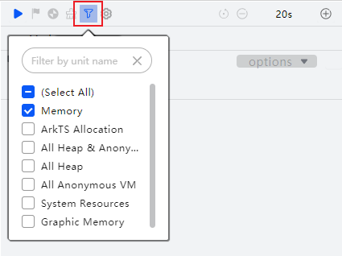
点击三角按钮

即开始录制。录制过程中，不断在问题场景操作应用功能，放大问题便于快速定界问题点。点击下图中方块按钮或者左侧停止按钮结束录制。
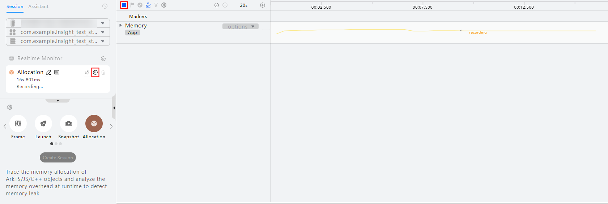
录制完成后，展开Memory泳道，其中Native Heap表示Native内存，主要是应用使用到的一些涉及Native API所申请的内存以及开发者自己的Native代码所申请使用的堆内存（通常是C/C++），这部分内存需要开发者自行管理申请和释放。当Native Heap有明显的上涨，说明Native内存上可能存在内存泄漏，可以使用[Allocation模板](#section776643810160)进行下一步分析。
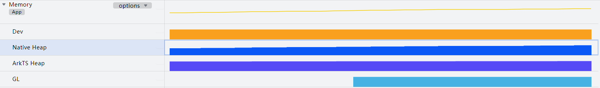

## 使用Allocation模板分析Native内存问题（DevEco Studio 6.1.0 Beta1及以上版本）

## 录制模板数据

连接设备后，点击应用选择框选择需要录制的应用，选择**Allocation**模板，点击Create Session或双击Allocation图标即可创建一个Allocation的录制模板。创建模板后，点击三角按钮即开始录制。
> [!NOTE]
> 如果要分析启动内存，单击Allocation任务后的按钮。

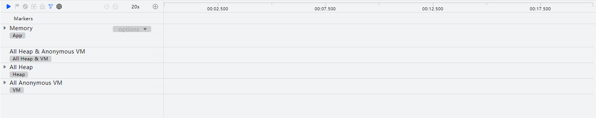
操作应用复现问题场景，并在问题复现完成后，点击下图中方块按钮或者左侧停止按钮结束录制。
> [!NOTE]
> 默认使用统计模式采集数据。该模式下工具的采集性能更好、负载更低。

 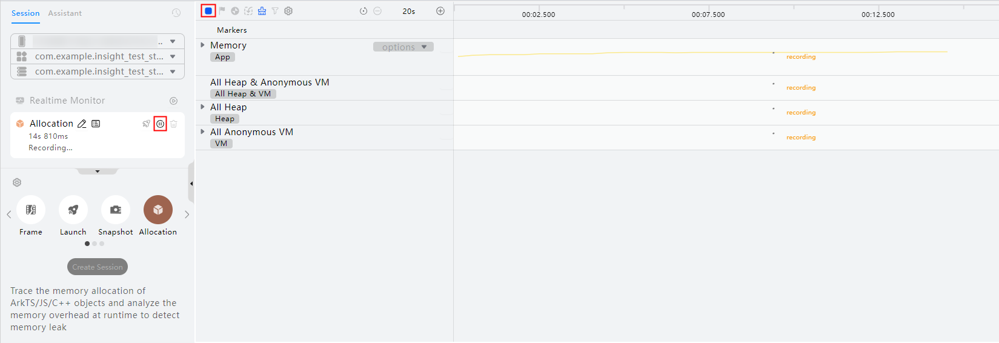

## 分析Native数据

框选All Heap中的Native Heap子泳道。在下方详情区的“Statistics”页签中选择Created & Existing。All Allocations：框选的时间段的所有分配内存信息。Created & Existing：默认选中，在框选范围的起点之后分配的，且在框选范围的终点之前没有释放的内存数据。Created & Released：在框选范围的起点之后分配的，且在框选范围的终点之前已经释放的内存数据。
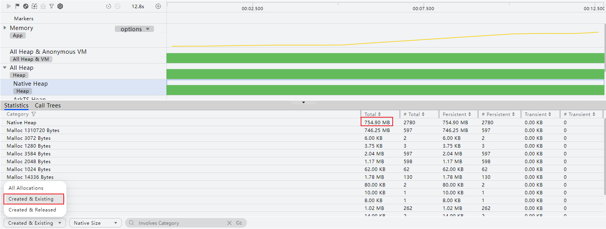
切换到“Call Trees”页签，该部分数据展示了详细的内存分配栈信息。
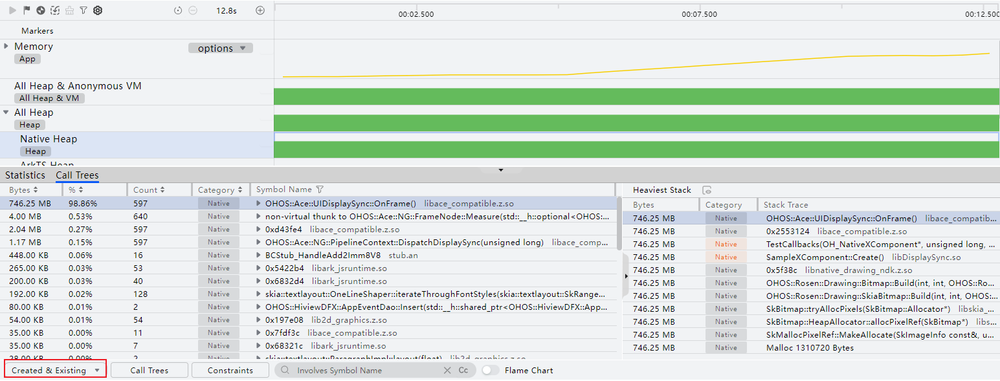
优先在内存分配栈信息中寻找与业务代码强相关的Symbol Name，即Category中为亮色。从上图中看，主要泄漏点在业务代码侧，需要结合业务代码进行分析。
> [!NOTE]
> Category中亮色代表开发者调用栈，灰色代表系统调用栈。栈帧中主要为Native栈，为便于开发者分析Native的函数热点，工具提供了符号导入的能力，若需要查看这部分信息，需要导入相应版本的带符号的so库（具体参考离线符号解析）。

## 使用Allocation模板分析Native内存问题（DevEco Studio 6.1.0 Beta1以下版本）

## 录制Allocation模板数据

连接设备后，点击应用选择框选择需要录制的应用，选择**Allocation**模板，点击Create Session或双击Allocation图标即可创建一个Allocation的录制模板。创建模板后，点击三角按钮即开始录制。
> [!NOTE]
> 如果要分析启动内存，单击Allocation任务后的按钮。

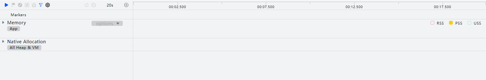
操作应用复现问题场景，并在问题复现完成后，点击下图中方块按钮或者左侧停止按钮结束录制。
> [!NOTE]
> 默认使用统计模式采集数据。该模式下工具的采集性能更好、负载更低。

 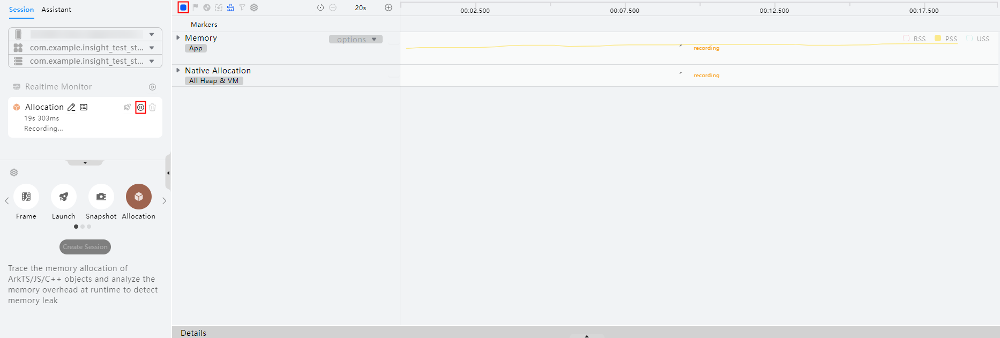

## 分析Native数据

框选Native Allocation泳道或子泳道。两个子泳道All Heap和All Anonymous VM分别代表使用malloc和mmap函数分配的内存情况。在下方详情区的“Statistics”页签中选择Created & Existing。All Allocations：框选的时间段的所有分配内存信息。Created & Existing：在框选范围的起点之后分配的，且在框选范围的终点之前没有释放的内存数据。Created & Released：在框选范围的起点之后分配的，且在框选范围的终点之前已经释放的内存数据。
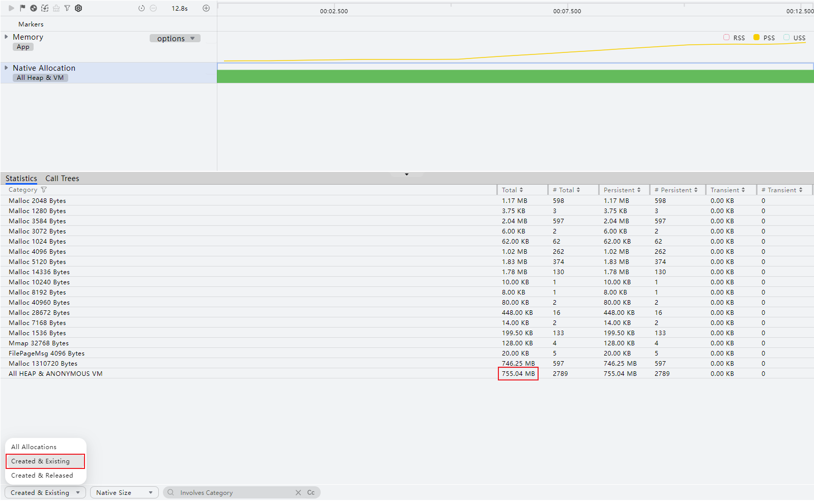
切换到“Call Trees”页签，该部分数据展示了详细的内存分配栈信息，同样需要选择Created & Existing。
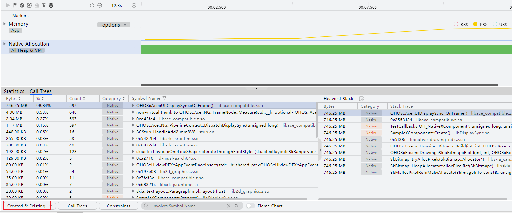
优先在内存分配栈信息中寻找与业务代码强相关的Symbol Name，即Category中为亮色。从上图中看，主要泄漏点在业务代码侧，需要结合业务代码进行分析。
> [!NOTE]
> Category中亮色代表开发者调用栈，灰色代表系统调用栈。栈帧中主要为 Native 栈，除了应用本身编译的一些so及带有部分接口信息的so信息外，其他系统库部分仅展示so库与函数偏移信息，若需要查看这部分信息，需要导入相应版本的带符号的 so 库（具体参考离线符号解析）。
