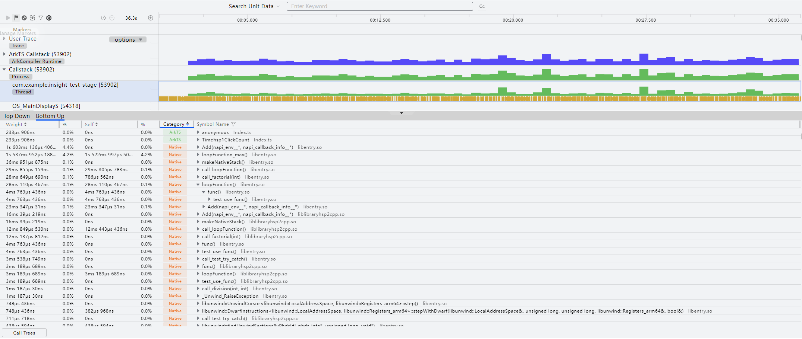
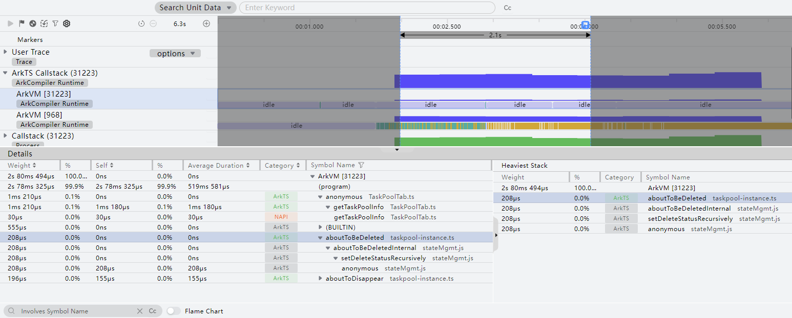
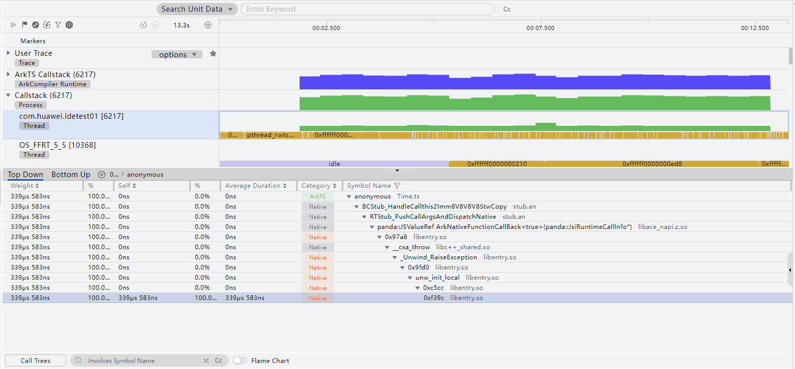

# 基础耗时：Time分析

更新时间：2026-06-12 06:54:33

来源：https://developer.huawei.com/consumer/cn/doc/harmonyos-guides/ide-insight-session-time

#### 功能介绍

开发应用或元服务过程中，如果遇到卡顿、加载耗时等性能问题，开发者通常会关注相关函数执行的耗时情况。DevEco Profiler提供的Time场景分析任务，可在应用/元服务运行时，展示热点区域内基于CPU和进程耗时分析的调用栈情况，并提供跳转至相关代码的能力，使开发者更便捷地进行代码优化。

Time模板支持的泳道包括：User Trace、ArkTS Callstack、Callstack、Energy。本文介绍User Trace、ArkTS Callstack、Callstack泳道，Energy泳道的详细信息请参考[能耗诊断：Energy分析](https://developer.huawei.com/consumer/cn/doc/harmonyos-guides/ide-profiler-energy)。

#### 函数耗时分析及优化

在设备连接完成后，可按照如下方法查看耗时分析结果：
1. 构建应用前请参考[模块级build-profile.json5文件](https://developer.huawei.com/consumer/cn/doc/harmonyos-guides/ide-hvigor-build-profile)，增加strip字段并赋值为false，不移除当前模块.so文件中的符号表、调试信息。采集函数栈解析符号需要附带符号表信息，无符号表信息可能采集不到函数名称，或ArkTS Callstack泳道无法关联到Native调用栈，因此请按照下图进行配置。

  

2. 创建Time任务并录制相关数据，操作方法可参考[性能问题定位：深度录制](https://developer.huawei.com/consumer/cn/doc/harmonyos-guides/deep-recording)。Time分析任务支持在录制前单击

指定要录制的泳道：

  
 - **User Trace**：用户自定义打点泳道，基于时间轴展示当前时段内用户使用hiTraceMeter接口自定义的打点任务的具体运行情况。

3. **ArkTS Callstack**：方舟运行时函数调用泳道，基于时间轴展示CPU使用率和虚拟机的执行状态，以及当前调用栈名称和调用类型。由于隐私安全政策，已上架应用市场的应用不支持录制此泳道。         调用栈分类从语言层面分为ArkTS、NAPI以及Native，从归属层面分为开发者代码以及系统代码。从这两个方面可以将调用栈类型归类如下：

  
ArkTS：程序正在执行ArkTS代码；

4. NAPI：程序正在执行的NAPI代码；

5. Native：程序正在执行的Native代码；           其中每一个类型的亮色和灰色分别代表开发者和系统的代码。

6. **Callstack**：ArkTS和Native混合函数调用泳道。基于时间轴展示各线程的CPU使用率，以及在一段时间内的混合调用栈。调用栈类型会分为开发者或系统的ArkTS以及Native代码两类。由于隐私安全政策，已上架应用市场的应用不支持录制此泳道。         Callstack基于采样模式采集数据，默认采样间隔是500微秒。耗时小于500微秒的函数，Details区域时间相关数据可能存在误差，可通过录制过程中多次触发该函数，根据其耗时百分比判断是否为热点函数。

7. 在**ArkTS Callstack****泳道**和**ArkTS Callstack****子泳道**上长按鼠标左键并拖拽，框选要分析的时间段。**Details**区域会显示所选时间段内的函数栈耗时分布情况，**Heaviest Stack**区域会展示出Details区域选择节点所处的耗时最长的完整调用栈。函数栈耗时分布有三种展现方式：Call Tree（调用树，默认方式）、Flame Chart（火焰图）、Flame Chart（冰锥图）。

  
在Call Tree中，“Weight”字段表示当前函数的总执行时间，“Self”字段表示函数自身的执行时间，两者之差为当前函数所调用的子函数执行时间之和，“Average Duration”字段表示函数自身的平均执行时间，“Category”字段表示函数调用类型。

8. 打开页面下方的Flame Chart开关，函数调用栈将以火焰图的形式展示，横轴表示函数的执行时长，纵轴表示调用栈的深度。         
> [!NOTE]
> 火焰图条块支持搜索，搜索结果不匹配的条块会被置灰。 “Ctrl+鼠标滚轮”的操作，或单击该区域右上角的 、 可放大和缩小火焰图的时间轴比例，单击 可恢复时间轴比例为初始状态。 “Shift+鼠标滚轮”的操作可左右横向调整可视区间，单独操作滚轮可上下纵向调整可视区间。 选中节点，单击该区域右上角的 ，点击添加面包屑。添加面包屑后，该节点成为根节点，耗时占比为100%，子节点的耗时占比相对于该节点重新计算。 在火焰图中选中任一节点，使用“Alt+鼠标左键”可将该节点左置底并将其占比放大到100%，其上从属节点按同比例放大显示。

  

9. 在ArkTS Callstack子泳道或Callstack子泳道上点击**Unfold CallStack**按钮，可以在泳道图区域将函数调用栈以冰锥图的形式展示，调用栈的先后顺序与实际调用时序保持一致。         

 - 在**Callstack**泳道上长按鼠标左键并拖拽，框选要分析的时间段。

  
**Summary**区域展示框选时段内，所有Native线程的CPU占用率的峰值、谷值、平均值。
 - **Callstack**区域展示框选时段内，所有Native线程的函数热点。

 - 将鼠标悬浮到节点，显示以此节点为根节点，点击添加面包屑。添加面包屑后，该节点成为根节点，耗时占比为100%，子节点的耗时占比相对于该节点重新计算。

      - 在**Callstack**子泳道上长按鼠标左键并拖拽，框选要展示分析的时间段。

  
**Top Down**页签显示所选时间段内的函数栈耗时分布情况，**Heaviest Stack**区域会展示出Details区域选择节点所处的耗时最长的完整调用栈。
 - **Bottom UP**页签显示函数列表，展开任一函数节点可查看其调用方及每个调用方的耗时。

      - （可选）在**详情区**中双击需要优化的节点（例如耗时超过预期），可快速跳转至对应工程源码，为开发者节省定位代码路径的时间。

  
> [!NOTE]
> Release应用暂不支持跳转到用户侧Native代码。 静态链接的系统库无法支持源码跳转。如libunwind.a，在编译过程中该系统库会以静态链接的方式集成。该系统库的符号信息在调用栈中会被识别成用户侧定义的函数，实际上无法跳转到源码。

#### 多实例函数热点分析

在应用开发过程中，可能存在一些耗时操作，则需要引入Worker线程或者TaskPool任务池来协同处理。这些线程也可能会像主线程一样存在性能问题，所以需要同时对这些子线程进行性能调优。其中，主线程以及每一个Work线程或者TaskPool工作线程，都会对应一个方舟实例，通过连接这些方舟实例，开启性能采样，从而可以获取更全面的采样信息。

 - **ArkTS Callstack**父泳道内可以看到被选择进程的CPU使用率，框选后展示此时段内录制到的所有方舟实例的函数调用栈信息。
 - **ArkTS Callstack**子泳道框选后展示此时段内录制到的该方舟实例的函数调用栈信息。

#### 离线符号解析

DevEco Profiler提供离线符号解析能力，基于携带符号表信息的so库进行分析，可把符号地址解析为具体函数名称，便于定位函数位置。

对于有so库路径和偏移地址的采样数据，如图所示，通过导入对应的携带符号表信息的so库进行解析，补充release so库中缺失的符号表信息（包括系统so库，用户自编译的so库，三方库）。

您可以通过点击工具栏

按钮，导入包含debug信息的so库。

> [!NOTE]
> 离线导入携带符号表信息的so库，需要严格保证与release版本的so库保持同一优化等级（如-O1, -O2, -O3等）。可以在CMakeLists.txt文件中查看或配置编译优化等级。 离线导入携带符号表信息的so库，需要尽可能与release版本的so库编译选项保持一致，防止so库起始地址不一致，影响解析正确性。

#### 查询自定义打点信息

相较于异步调度，DevEco Profiler当前基于采样分析的Time任务更善于分析同步性能问题。如开发者需要分析异步调度延时等问题，可先在ArkTS代码中进行自定义打点，当应用/元服务在Time分析过程中触发打点后，DevEco Profiler会将这些打点的Trace数据解析后，以任务方块形式呈现在**User Trace**泳道中。

单击User Trace泳道的“options”下拉列表，可以设置子泳道是按照Task Name维度还是Thread ID维度显示。

 - 展开**User Trace**泳道，在子泳道上长按鼠标左键并拖拽，框选要展示分析的时间段，获取该时间段内的用户打点信息。       
**Statistics**区域：显示当前任务泳道在所选时间段内的打点任务统计信息，包括任务的名称、同一任务执行的次数、平均持续时长、最长持续时间和最短持续时间。通过这些统计信息，开发者可直观地了解打点任务的执行频率、持续时间偏差等，方便定位。
 - **User Trace**区域：将所选时间段内的所有任务都一一列举出来，包括任务的ID、名称、起始/结束时间、持续时长等。

      - 单击**User Trace**子泳道中的任意一个任务块，**Details**区域将展示该任务块的详细信息。       

