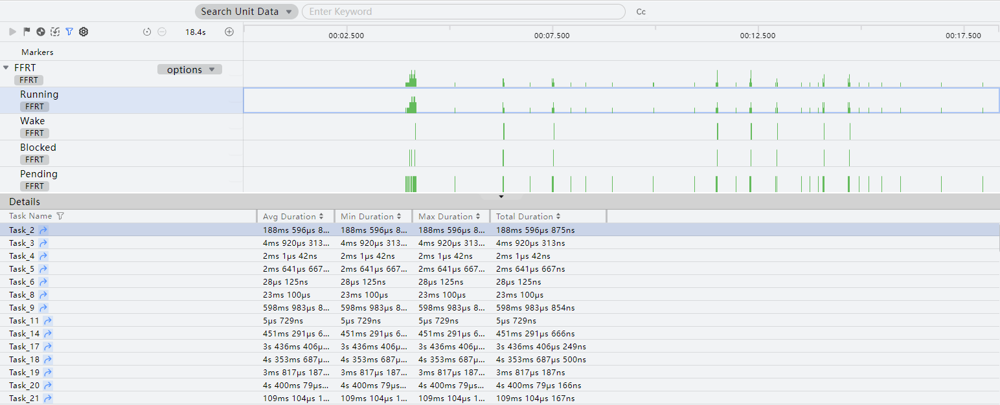
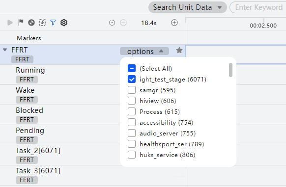
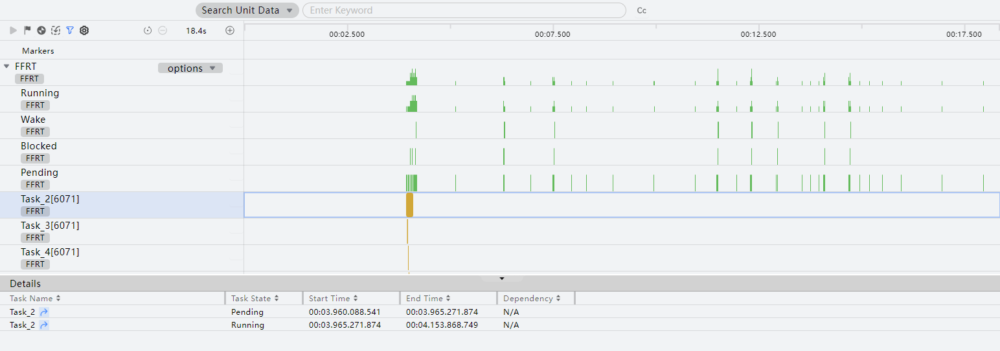
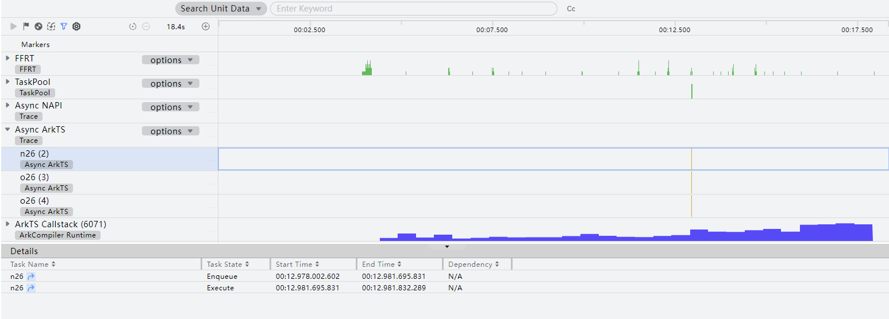
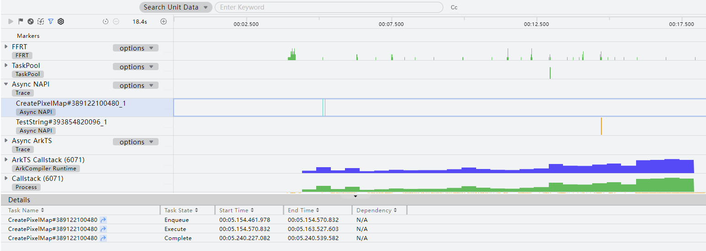
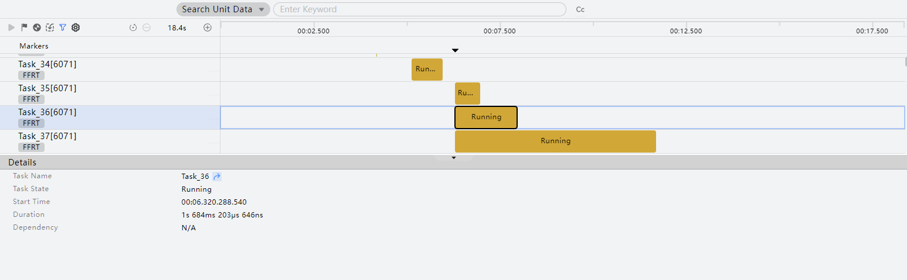

# 并行并发：Concurrency分析

更新时间：2026-06-12 06:54:33

来源：https://developer.huawei.com/consumer/cn/doc/harmonyos-guides/ide-parallel-concurrency-analysis

#### 功能介绍

 
[任务池（TaskPool）](https://developer.huawei.com/consumer/cn/doc/harmonyos-references/js-apis-taskpool)是为应用程序提供一个多线程的运行环境，降低整体资源的消耗和提高系统的整体性能，且您无需关心线程实例的生命周期。您可以使用任务池API创建后台任务（Task），并对所创建的任务进行如任务执行、任务取消的操作。
 
DevEco Profiler提供的Concurrency场景分析能力，帮助开发者针对并行并发场景，录制并行并发关键数据，分析Task的生命周期、吞吐量、耗时等性能问题。Concurrency模板支持展示ArkTS异步接口、NAPI异步接口、TaskPool、FFRT并发模型相关信息。
 
Concurrency模板支持的泳道包括：FFRT、TaskPool、Async NAPI、Async ArkTS、ArkTS Callstack、Callstack、Process。本文介绍FFRT、TaskPool、Async NAPI、Async ArkTS泳道，其他泳道的详细信息请参考对应模板内容。
 
- ArkTS Callstack、Callstack泳道的介绍请参考[基础耗时：Time分析](https://developer.huawei.com/consumer/cn/doc/harmonyos-guides/ide-insight-session-time)。
- Process泳道的介绍请参考[CPU活动分析](https://developer.huawei.com/consumer/cn/doc/harmonyos-guides/ide-insight-session-cpu)。

 
> [!NOTE]
> 任务分析前，需创建Concurrency分析任务并录制相关数据，操作方法可参考 性能问题定位：深度录制 ，或在 会话区 选择 Open File ，导入历史数据。

 

#### 查看Task统计信息
1. 选择展开某个泳道，可以用options下拉框筛选不同进程。

  

2. 框选子泳道中某段时间范围，详情区会出现该时段内，泳道对应执行状态下，并行并发任务的统计信息。
3. 点击Task Name的跳转按钮可跳转到对应的Task泳道。

  

 
 

#### 查看某一个Task的所有状态
1. 选择展开某个泳道，可以用options下拉框筛选不同进程。

  

2. 框选子泳道中某段时间范围，可以看到该Task在框选时间范围内的任务状态。
3. 点击Task Name的跳转按钮可跳转到对应线程的泳道，可查看在该Task执行时间范围内，trace文件的打点信息，反映的是线程该时段内的函数执行情况。

  

4. 展开**Async ArkTS**泳道，可单独查看ArkTS异步调用任务详情。

  

5. 展开**Async NAPI**泳道，单独查看NAPI异步调用任务详情。

  

 
 

#### 查看Task的某个状态

点击Task子泳道的某个执行节点，**Details**详情区里会出现task在该状态下的详细信息。
 

