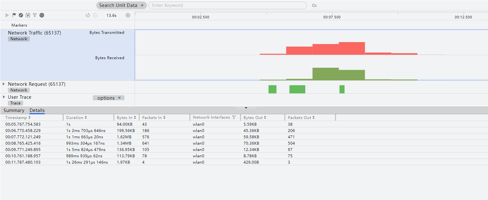
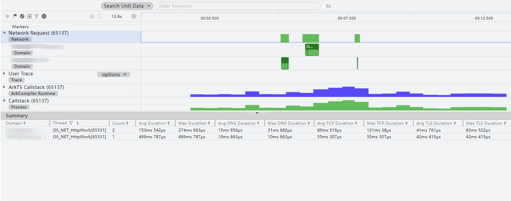
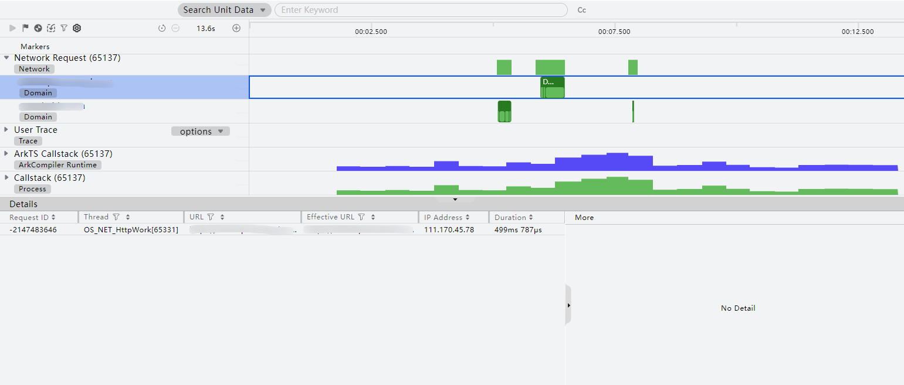
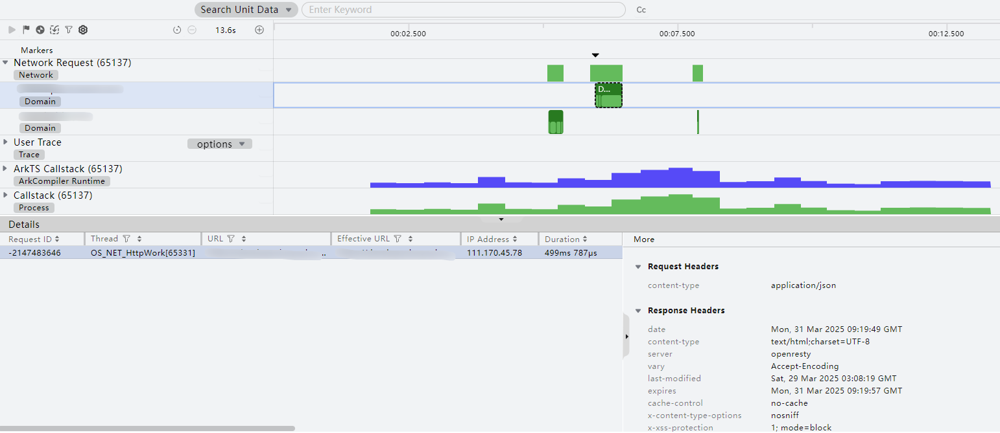
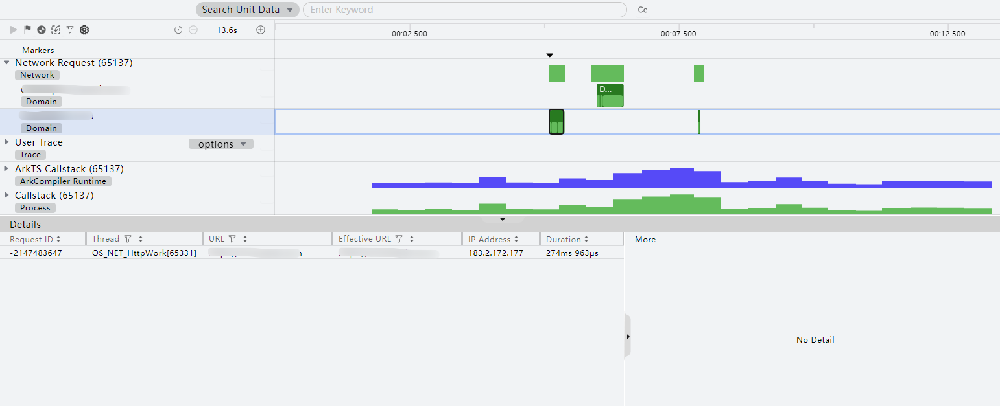

# 网络诊断：Network分析

更新时间：2026-06-12 06:54:33

来源：https://developer.huawei.com/consumer/cn/doc/harmonyos-guides/ide-profiler-network

#### 功能介绍

 
DevEco Profiler提供Network模板，帮助用户在应用运行过程中查看http协议栈网络信息和网络流量信息，http协议栈包括请求分段耗时以及请求具体内容，方便对网络问题进行调优。请求耗时按照以下五种阶段进行划分：DNS 解析、TCP连接、TLS连接、请求等待、接收响应，分别展示在各阶段的耗时，可以针对性的优化时延问题。同时，详情信息将展示每个请求中携带的信息，包含request、response侧及其携带的header、body、cookie信息，方便网络问题定位。
 
Network模板支持的泳道包括：Network Traffic、Network Request、User Trace、ArkTS Callstack、Callstack。本文介绍Network Traffic、Network Request泳道，其他泳道的详细信息请参考对应模板内容。
 
- User Trace、ArkTS Callstack、Callstack泳道的介绍请参考[基础耗时：Time分析](https://developer.huawei.com/consumer/cn/doc/harmonyos-guides/ide-insight-session-time)。

 
> [!NOTE]
> 任务分析前，需创建Network分析任务并录制相关数据，操作方法可参考 性能问题定位：深度录制 ，或在 会话区 选择 Open File ，导入历史数据。 当前Network模板任务仅支持对Network kit接口中request 类型接口进行录制和调优。 由于隐私安全政策，已上架应用市场的应用不支持录制Network分析模板。

 

#### 查看网络流量消耗信息

 
点击**Network Traffic**泳道，可在下方数据区查看录制过程中发生的网络流量消耗情况。
 
- **Summary**区域可以查看按照网络接口（Network Interfaces）维度统计每个类型的流量消耗，展示信息包含平均下行流量、下行总流量、下行数据包数、平均上行流量、上行总流量、上行数据包数。

- **Details**区域将展示按时间戳排序的周期上报的网络数据，每个网络数据包含上报时间戳、持续时间、下行流量、下行流量包数、网络数据类型、上行流量、上行流量包数。

 

#### 查看网络请求各阶段耗时

 
点击**Network Request**泳道，可在下方数据区查看录制过程中发生的网络请求数量变化。
 
- **Summary**区域可查看按照域名（Domain）维度统计展示网络请求耗时，展示信息包含域名、线程名称、数量、平均耗时、最大耗时、DNS解析/TCP连接/TLS连接/等待响应/接收数据平均耗时、DNS解析/TCP连接/TLS连接/等待响应/接收数据最大耗时。

- 选择任意Domain，**Details**区域将展示请求该Domain的所有网络请求耗时，展示信息包含请求ID、线程名称、请求url、重定向url、IP地址、总耗时、DNS 解析耗时、TCP连接耗时、TLS连接耗时、请求等待耗时、接收响应耗时、请求类型、状态码、使用的版本。

  选择Details中某条数据，泳道区域将以虚线框选展示其耗时方块，右侧**More**区域展示该请求的Request Headers、Response Headers、Response Body。

  

  定位到可能造成网络卡顿的网络请求，点选其耗时方块，可以看见该请求各阶段耗时。

  

 

#### 分析启动过程网络问题

DevEco Profiler的Network分析任务，提供了启动过程网络问题分析能力，协助开发者解决启动过程的网络问题。
 
针对调测应用的当前运行情况，DevEco Profiler对其做如下处理：
- 如选择的是已安装但未启动的应用，在启动该分析任务时，会自动拉起应用，进行数据录制，结束录制后可正常进入解析阶段。
- 如选择的是正在运行的应用，在启动该分析任务时，会先将应用关停，再自动拉起应用，进行数据录制，结束录制后可正常进入解析阶段。

 
 
具体操作方法为：在任务列表中单击Network任务后的

按钮。
 
在分析结束后，呈现出的数据类型以及相应的处理方法，与非启动过程的分析相同。
