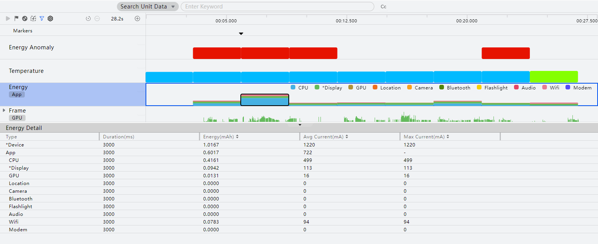
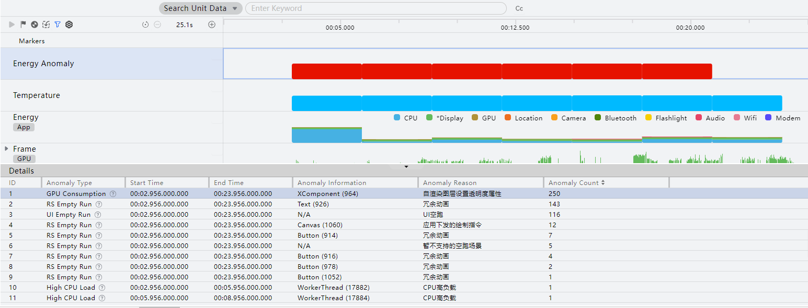
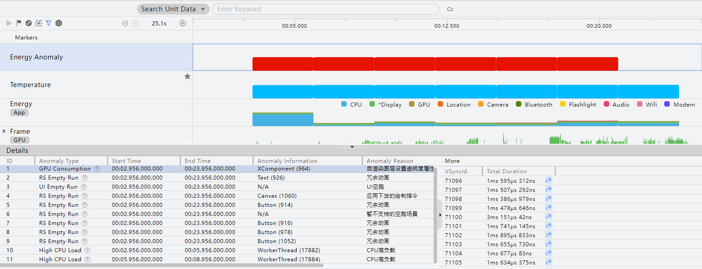
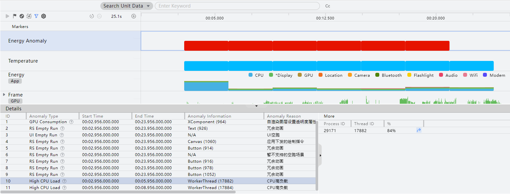

# 能耗诊断：Energy分析

更新时间：2026-06-12 06:54:33

来源：https://developer.huawei.com/consumer/cn/doc/harmonyos-guides/ide-profiler-energy

#### 功能介绍

 
从DevEco Studio 5.1.0 Release版本开始，DevEco Profiler提供Energy模板，帮助用户在应用运行过程中查看能耗信息，包括不同器件的能耗、整机温度以及能耗异常帧，从而方便用户对能耗问题进行调优。
 
Energy模板支持的泳道包括：Energy Anomaly、Temperature、Energy、Frame、ArkTS Callstack、Callstack、CPU Core、Process。本文介绍Energy Anomaly、Temperature、Energy泳道，其他泳道的详细信息请参考对应模板内容。
 
- Frame泳道的介绍请参考[Frame分析](https://developer.huawei.com/consumer/cn/doc/harmonyos-guides/ide-insight-session-frame)。
- ArkTS Callstack、Callstack泳道的介绍请参考[基础耗时：Time分析](https://developer.huawei.com/consumer/cn/doc/harmonyos-guides/ide-insight-session-time)。
- CPU Core、Process泳道的介绍请参考[CPU活动分析](https://developer.huawei.com/consumer/cn/doc/harmonyos-guides/ide-insight-session-cpu)。

 
> [!NOTE]
> TV设备暂不支持使用Energy模板进行应用性能分析。 任务分析前，需创建Energy分析任务并录制相关数据，操作方法可参考 性能问题定位：深度录制 ，或在 会话区 选择 Open File ，导入历史数据。

 

#### 定位能耗问题

录制结束等待处理数据完成。默认包含Energy Anomaly、Temperature以及Energy三条能耗相关泳道。
 

 
**Energy Anomaly泳道**
 
用于展示能耗相关的异常帧信息。该泳道暂不支持在Wearable设备上进行应用性能分析。
 
- 将鼠标悬浮于泳道上，可以查看空跑的渲染帧数（RS Empty Run）、不能正常调用动态系统合成器（DSS）合成而直接使用GPU进行渲染导致能耗恶化的帧的次数（GPU Consumption）、UI空跑次数（UI Empty Run）、CPU高负载异常次数（High CPU Load）。下方**Details**区域，可以看到所选范围内的能耗异常类型、开始时间、结束时间、能耗异常信息、能耗异常原因、能耗异常数量。

 
- 点击对应的异常类型数据（**RS Empty Run**、**UI Empty Run**、**GPU Consumption**），右侧**More**区域展示该异常帧信息，包括RS VsyncId、帧持续时间，点击跳转按钮可以跳转到Frame泳道中对应的具体帧，可以参考[查看指定Frame页面布局信息](https://developer.huawei.com/consumer/cn/doc/harmonyos-guides/ide-insight-session-frame#section1784351123920)查看页面组件的布局情况，和识别存在能耗问题的组件。

- 点击**CPU高负载**异常数据，右侧**More**区域展示该异常帧信息，包括进程ID、线程ID、负载值，点击跳转按钮可以跳转到对应线程调用栈。

 

 
**Temperature泳道**
 
用于展示整机的温度信息。该泳道暂不支持在2in1设备上进行应用性能分析。
 
- 将鼠标悬浮于泳道上可以查看对应时间范围的温度、温度等级，帮助用户明确温度是否有明显上升，从而进行进一步的能耗定位。下方**Detail****s**区域，可以看到所选范围内的最大温度、最小温度、平均温度。

 

 
**Energy泳道**
 
用于展示各器件的能耗信息及整机电流信息。
 
- 可在Energy泳道中查看录制范围内具体器件消耗的电量，器件包含：CPU、*Display（屏幕显示耗电量）、GPU、Location（定位模块耗电量）、Camera（相机耗电量）、Bluetooth（蓝牙功能耗电量）、Flashlight（闪光灯功能耗电量）、Audio（声音模块耗电量）、Wifi（无线功能耗电量）、Modem（信号模块耗电量）。*Device表示整机电流消耗情况。
- 框选Energy泳道数据，**Energy Detail**中呈现框选时间段内的详情信息，根据不同器件的消耗可结合Callstack泳道的调用栈信息进行进一步分析。

