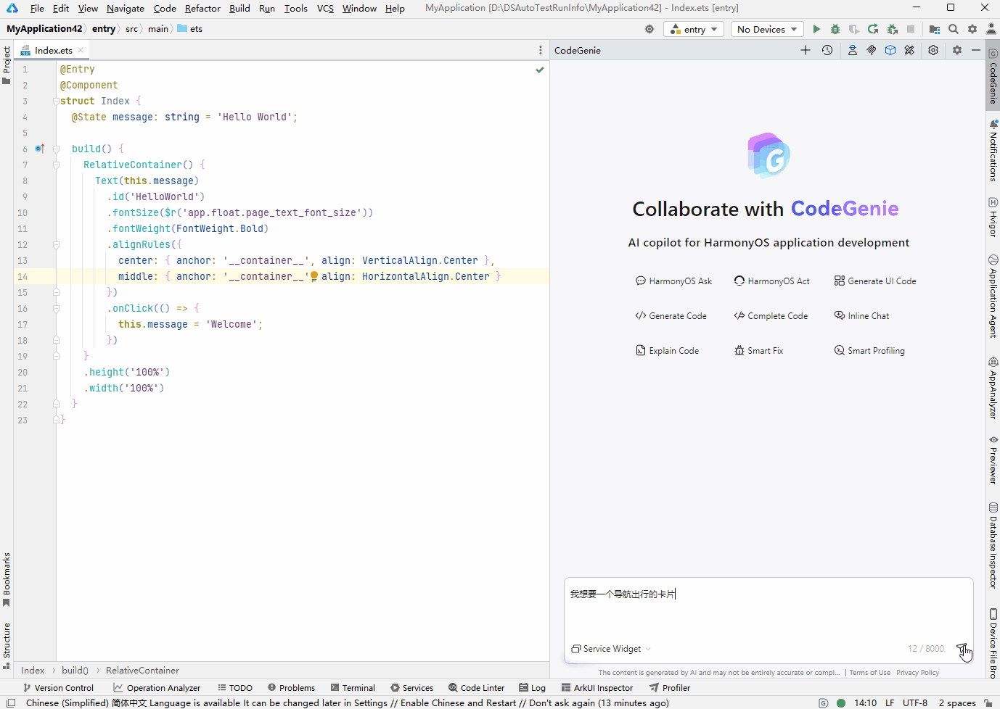
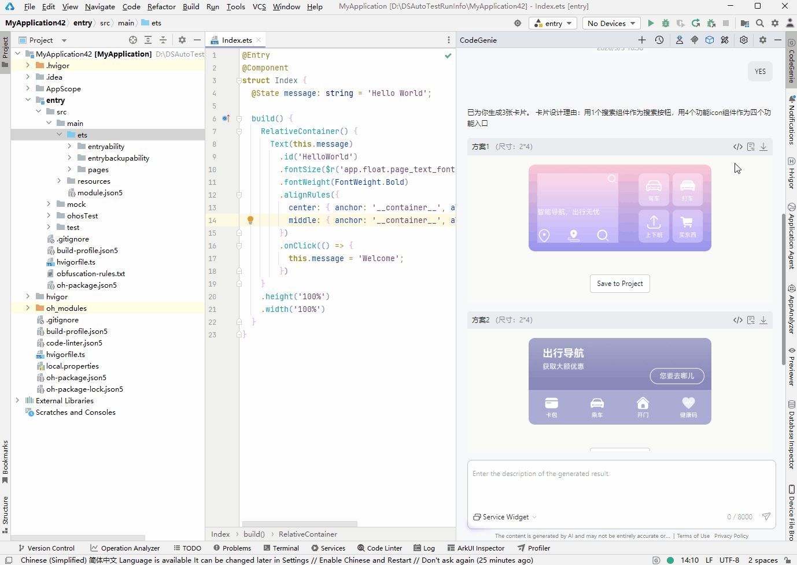
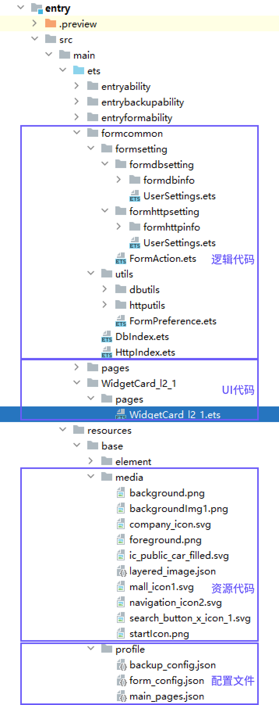
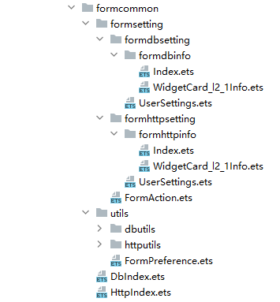
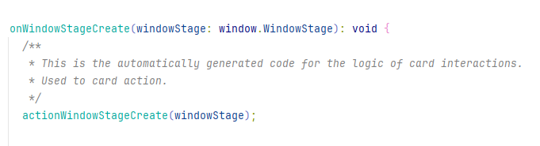

# 万能卡片生成

更新时间：2026-04-30 02:42:31

来源：https://developer.huawei.com/consumer/cn/doc/harmonyos-guides/ide-codegenie-service-widget

基于AI大模型理解开发者的卡片需求信息，通过对话式的交互智能生成HarmonyOS万能卡片工程。
 

#### 使用约束

1. 建议从以下维度描述卡片需求：

| 序号 | 建议描述维度 | 说明 | 举例 |

| 1 | 卡片用途 | 卡片的用途/业务场景，比如电商购物、娱乐、生活服务类等。 | 例如“电商购物卡片”、“娱乐类卡片”。 |

| 2 | 卡片功能 | 卡片包含的组件，如图标、标题、按钮等。 组件的状态信息，如图标主题、标题内容、按钮显示的文字等。 | 例如“新品上市主标题”、“商品搜索按钮”、“热门电影子板块入口”等。 |

| 3 | 卡片尺寸 | HarmonyOS官网提供的四种卡片尺寸：1*2（微卡片）、2*2（小卡片）、2*4（中卡片）、4*4（大卡片）。 卡片尺寸为非必选项，AI会根据前两个维度描述的信息，智能选择效果最佳的尺寸。 | 例如“2*2尺寸的卡片”、“中卡片”等。 |
2. 当前不支持在生成卡片预览图后，继续描述需求进行增量修改。
 

#### 万能卡片生成
1. 点击页面右侧菜单栏CodeGenie图标完成登录后，可以通过如下两种方式进入卡片生成窗口。在窗口输入万能卡片的需求，并点击发送，根据模型提示进行多轮交互，不断完善需求。

  
- 在对话区域输入"/"调出命令，选择**Service Widget**。从DevEco Studio 6.1.0 Beta2版本开始不支持。

2. 在输入框左下角的下拉框选择**Service Widget**。DevEco Studio 6.0.1 Beta1版本新增。

3. 需求描述完成后，可以根据提示信息进一步细化卡片尺寸、用途、展示元素等，以及预览卡片效果图。生成效果示例**：**

  

  #### 万能卡片保存

1. 点击

，可查看生成卡片的UI代码、配置信息和下载静态资源文件。

2. 保存卡片工程有两种方式：方式一：使用代码/配置查看窗口的“复制”、“插入”或“创建文件”等按钮，手动保存卡片代码和配置信息。

  方式二：点击“保存工程”按钮，自动保存卡片工程，卡片代码、配置、静态资源文件等会自动保存到工程对应目录中。默认勾选保存逻辑代码，逻辑代码用于配置卡片事件及卡片数据等信息，具体请参考[自定义配置逻辑代码](#section17840955102711)。

  **流程示例：**

  

  工程保存完成后，工程中会新增如下卡片相关文件：

  

  

  #### 自定义配置逻辑代码

  逻辑代码包含实现卡片数据交互和卡片事件两类。

  
卡片数据交互：触发卡片页面刷新。应用工程生成的卡片数据交互，可通过数据库或网络请求两种方式来触发卡片页面刷新；对于元服务工程生成的卡片，数据交互为通过网络请求方式触发卡片页面刷新。
- 卡片事件：使用router事件跳转到指定的UIAbility、使用call事件拉起UIAbility到后台、使用message事件刷新卡片内容。

 
 

#### 目录结构

在module > src > main > ets 路径下， formcommon目录用于存放生成卡片的逻辑代码。
 

 
- formsetting：存放用户可配置的文件。
formsetting > formdbsetting：自定义配置以数据库方式进行卡片刷新的相关参数。
formdbsetting > formdbinfo：存放包含卡片信息的Info.ets文件，可在Info.ets文件中，添加卡片刷新所需要的具体的数据，后续会读取该文件并将数据存入数据库中。
- UserSettings.ets：可以自定义卡片刷新时从数据库获取数据的规则、数据解析规则、message内容刷新规则。

 - formsetting > formhttpsetting：自定义配置以网络请求方式进行卡片刷新的相关参数。
formhttpsetting > formhttpinfo：存放包含卡片信息的Info.ets文件，可在Info.ets文件中添加获取卡片刷新数据的URL。
- UserSettings.ets：可以自定义卡片刷新时从URL获取数据的规则、数据解析规则、message内容刷新规则。

 
> [!NOTE]
> 如需使用网络请求方式刷新卡片页面，需在EntryFormAbility.ets文件中将FormDbUpdate的接口注释掉，并将启用FormHttpUpdate接口。

 - formsetting > FormAction.ets：配置卡片事件。

 - utils：存放工具类的目录，用户不可修改，如果修改再次生成逻辑代码时utils目录会被刷新。

 
 

#### 自定义配置卡片事件

 
1. 在FormAction.ets文件中，配置触发卡片router事件时具体的页面分发规则。
 
 
2. 在EntryAbility.ets文件的onWindowStageCreate方法中，会插入页面分发接口的调用，示例如下：
 

 

 
此接口默认插入到方法开头，开发者可根据当前工程onWindowStageCreate逻辑来将此接口移动至合适的位置，保证页面能正常跳转。
