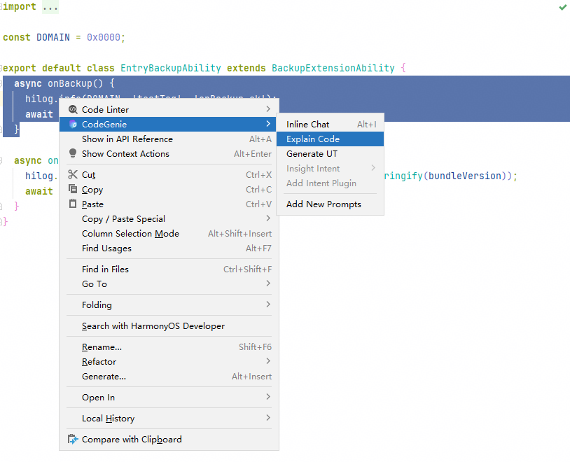

# 代码智能解读

更新时间：2026-04-24 09:16:30

来源：https://developer.huawei.com/consumer/cn/doc/harmonyos-guides/ide-explain-code

CodeGenie提供智能AI能力对框选的代码片段进行逐条解释，总结代码段含义，帮助开发者提升阅读代码的速度和效率。

 **使用约束**

- 该功能最多支持解读30000字符以内的代码片段。
- 代码智能解读时使用HarmonyOS Ask智能体。

 **操作步骤**

 选中.ets文件或者.cpp文件中需要被解释的代码行或代码片段，右键选择**CodeGenie > Explain Code**，开始解读当前代码内容。

 
