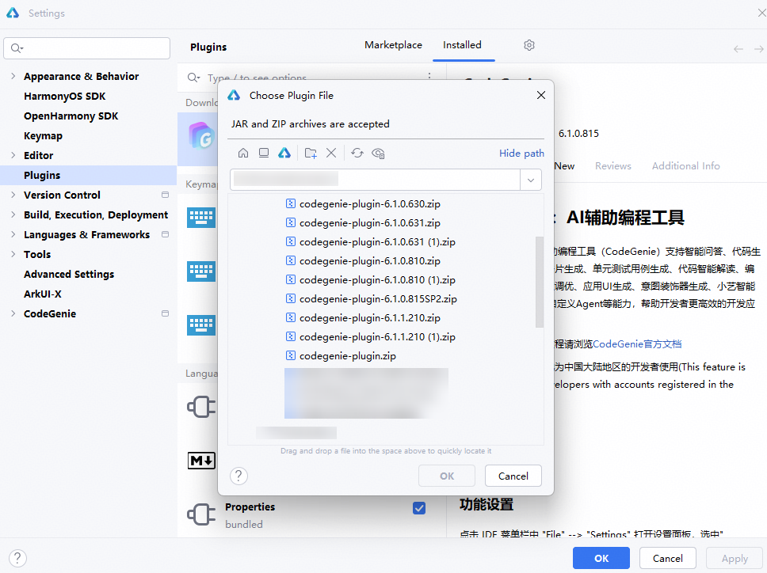
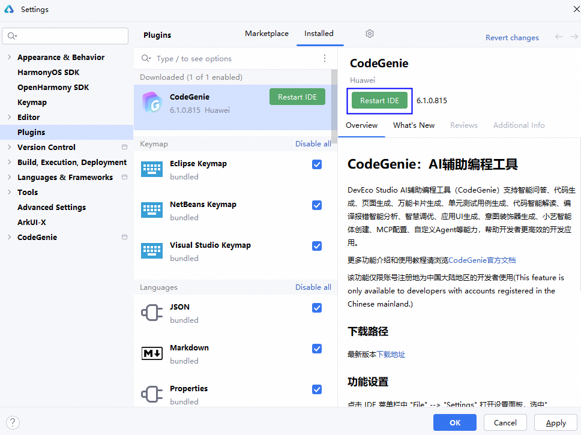

# 工具概述

更新时间：2026-06-12 06:54:33

来源：https://developer.huawei.com/consumer/cn/doc/harmonyos-guides/ide-codegenie

DevEco CodeGenie是DevEco Studio AI辅助编程工具，支持智能问答、代码生成、页面生成、万能卡片生成、单元测试用例生成、代码智能解读、编译报错智能分析、智慧调优、应用UI生成、意图装饰器生成、小艺智能体创建、自定义Agent等能力，帮助开发者更高效地开发应用。
 

#### 使用方式

在DevEco Studio右侧边栏点击**CodeGenie**，26.0.0 Beta1之前版本，可直接进入CodeGenie问答界面；从26.0.0 Beta1版本开始，进入CodeGenie后界面显示如下，点击**View Installation Guide**查看DevEco Code的具体操作指导，点击**Continue with CodeGenie**进入CodeGenie问答界面。
 

 
进入CodeGenie问答界面后，若未登录点击**Sign in**，跳转至华为账号登录页面。授权登录完成后返回DevEco Studio，提示登录成功后点击**Agree**，同意隐私安全政策及使用条款后开始体验。
 
若需使用最新版本的CodeGenie，可通过[下载中心](https://developer.huawei.com/consumer/cn/download/deveco-codegenie)获取并使用相关功能，具体请参考[插件获取及安装](#section18337533718)。
 

 
> [!NOTE]
> 若已经安装DevEco Code，打开CodeGenie后直接进入CodeGenie问答界面。 支持通过快捷键 Alt /Option+U ，进入或隐藏CodeGenie问答界面。

 
 

#### 插件获取及安装

 
若在历史版本的DevEco Studio中使用最新版本的CodeGenie，可通过[下载中心](https://developer.huawei.com/consumer/cn/download/deveco-codegenie)获取最新的CodeGenie插件版本，并根据下载中心页面**工具完整性**指导进行完整性校验。插件安装包的存放路径不能包含中文字符。
 
下载完成后，插件安装包**无需解压**，依照下方步骤进行安装：
 1. 在DevEco Studio菜单栏，点击**File > Settings**（macOS为**DevEco Studio > Preferences****/****Settings**）**> Plugins**，点击

 **> Install Plugin from Disk…**安装本地插件。

2. 在弹出的文件选择窗口中，选择**未解压的插件****包**的存放位置，点击**OK**确认安装插件。

3. 点击**Restart IDE**，重新启动DevEco Studio。

4. 在DevEco Studio右侧边栏点击**CodeGenie**，完成登录并开始体验。
 
> [!NOTE]
> 进入 File > Settings （macOS为 DevEco Studio > Preferences/Settings ） > CodeGenie > General 页面，勾选 Auto Update ，可以自动升级插件配置。 若管理台配置的插件可以静默升级，且系统检测到插件需要更新时，插件会自动升级；不勾选时会有弹框提示用户手动升级。若管理台配置的插件不支持静默升级，均有弹框提示用户手动升级。
