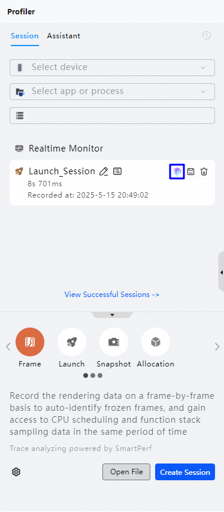
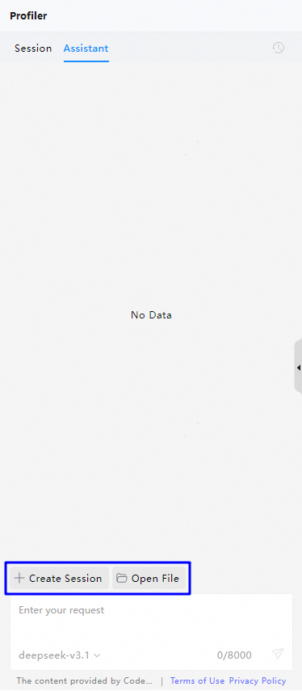
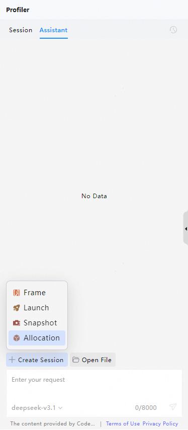
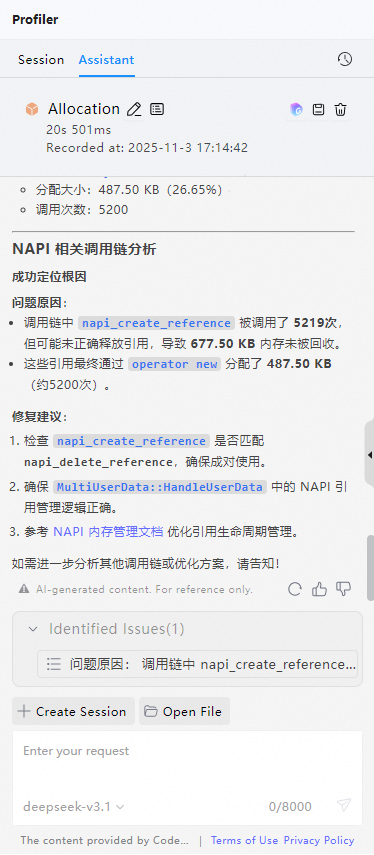

# 智慧调优

更新时间：2026-04-24 09:16:30

来源：https://developer.huawei.com/consumer/cn/doc/harmonyos-guides/ide-ai-profiler

DevEco Studio的Profiler工具中已集成智慧调优能力，支持通过自然语言交互，分析并解释当前实例或项目中存在的性能问题，帮助开发者快速定位影响性能的具体原因。
 
从DevEco Studio 6.0.0 Beta1版本开始，支持对Launch冷启动问题和Frame卡顿丢帧问题进行智慧调优分析。
 
从DevEco Studio 6.0.0 Beta3版本开始，支持对Allocation内存分配问题和Snapshot内存堆快照问题进行智慧调优分析。
 
从DevEco Studio 6.0.2 Beta1版本开始，增加了OOM内存溢出场景的分析能力，主要包括ArkUI组件、NAPI、闭包等内存问题场景。
 
从DevEco Studio 6.1.0 Beta1版本开始，增加了Snapshot对比场景的分析能力，主要包括监听事件、动画资源、泄露次数分析等内存问题场景。
 
从DevEco Studio 6.1.0 Beta2版本开始，支持在智慧调优中使用和切换模型。
 

#### 操作步骤
1. 首次使用请先根据界面提示完成CodeGenie授权登录。当前支持如下两种开启方式：

  **方式一：**若Launch、Frame、Allocation、Snapshot模板已录制完成，点击**Session**窗口中该条会话上的

图标，即可开始智慧调优分析。录制方法具体请参考[性能问题定位：深度录制](https://developer.huawei.com/consumer/cn/doc/harmonyos-guides/deep-recording)。

  

  **方式二：**切换至**Assistant**窗口，点击**Create Session**开始录制调优任务；或点击**Open File**按钮导入已有的调优数据文件，当前支持导入的文件类型包括.insight、.heapsnapshot、.rawheap。

  

2. 对于方式二，在**Assistant**页面，点击**Create Session**按钮，从**Launch**、**Frame**、**Snapshot**、**Allocation**中选择一个分析模板。

  

  
> [!NOTE]
> 使用Snapshot模板对堆快照问题进行分析时，支持在对话框中选择单个Snapshot分析，或选择两个Snapshot进行对比分析。

3. 以Allocation为例，录制新的调优任务或导入本地已有的调优数据模板文件。

  

4. 等待AI完成初步分析。左键点击高亮的泳道名称，点击**Analyze**进一步分析该阶段的具体内存信息，点击**View Lane**在右侧查看具体的泳道信息。

  

5. 点击**Analyze**后，逐步深入挖掘当前异常场景，找到影响性能的可能原因。

  

