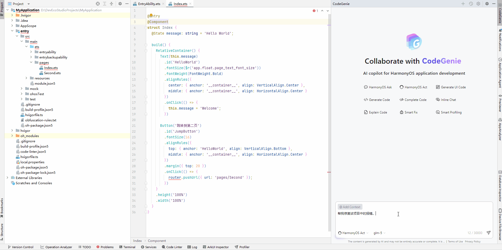

# 代码修改

更新时间：2026-06-12 06:54:33

来源：https://developer.huawei.com/consumer/cn/doc/harmonyos-guides/ide-code-modify

CodeGenie提供代码修改能力，在**对话框内**输入需求描述，生成符合要求的代码，提升代码质量与开发效率。
 
在DevEco Studio 6.0.1 Beta1和Release版本，生成的代码与原文件代码可快速对比和采纳。
 
从DevEco Studio 6.0.2 Beta1开始，生成的内容直接被应用到代码文件中。
 
从DevEco Studio 6.0.2 Release开始，代码修改使用的是HarmonyOS Act智能体。
 

 
**操作步骤**1. 选择HarmonyOS Act智能体，在对话框输入**@**符号选择**Files**，或点击**@****Add Context** > **Files**，或在对话框输入文件路径，指定需要分析的代码文件。未指定代码文件时，分析当前代码文件。
2. 在对话框输入描述，点击

发送。
3. 在问答区域的**Changed Files**可以查看被修改的文件；点击**Accept All****/Reject All**按钮，接受或拒绝所有文件的修改；将鼠标悬浮在文件路径上，点击

可接受或拒绝该文件的修改。
4. 点击问答区域中**Run**，可以编译验证；开启**Auto Run**开关，可以开启自动编译验证。Auto Run更多描述可参考[Agent配置](https://developer.huawei.com/consumer/cn/doc/harmonyos-guides/ide-agent-use#section2075893021715)。
 
 
**示例**
 

